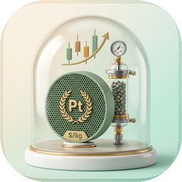

<p align="center">
  
</p>

<h1 align="center">CatTEA</h1>

<p align="center">
  <strong>Estimate what a catalyst costs to make, using live metal prices.</strong>
</p>

<p align="center">
  <a href="https://doi.org/10.5281/zenodo.21451931"></a>
</p>

CatTEA (Catalyst Techno-Economic Analysis) is a Windows desktop app for early-stage catalyst cost screening. You describe a catalyst — composition, support, preparation route — and it returns a manufacturing cost estimate built on current metal prices, published costing methodology, and a curated materials library. Everything runs locally: the app bundles its own calculation backend and database, so there is no server to set up and no account to create.

It is aimed at catalysis researchers who want a quick, defensible answer to questions like:

- How much does a metal price swing change my catalyst cost?
- Which part of the recipe drives the cost — the metal, the support, or the preparation route?
- How does my composition compare against published catalysts for the same reaction?

## Download

Get the installer from the [latest release](https://github.com/hyunjin-kor/CatTEA/releases/latest):

- `CatTEA.Setup.<version>.exe` — recommended for most users
- `CatTEA-win-unpacked.zip` — portable version, runs without installation

The app works offline out of the box, falling back to indexed and manual prices. Live price feeds only need an API key if you want them (see below).

From v1.3.13 the app keeps itself current: it checks GitHub Releases on startup, downloads updates in the background, and offers a restart prompt. The binary is unsigned, so Windows SmartScreen may warn on first install — choose "More info → Run anyway".

## What it does

- Estimates catalyst selling cost with the Step Method for preparation-route costing, following the CatCost methodology published by NREL
- Tracks metal prices with three explicit states — `LIVE`, `INDEXED`, `MANUAL` — and shows the source, quote year, and freshness behind every number
- Ships ten literature benchmark families (ammonia cracking, CO₂ hydrogenation, RWGS, dry reforming, water-gas shift, fuel-cell ORR, electrolyzer OER, and more) that you can load as editable starting points
- Handles both bulk supported catalysts and electrode-stack electrocatalysts
- Runs Monte Carlo uncertainty analysis so you get a cost range, not just a point estimate
- Adds an optional spent-catalyst recovery credit to thermocatalyst runs
- Escalates historical prices to the current year with ChemPPI and CEPCI indices
- Exports the result — cost ledger, price evidence, Monte Carlo range — to Excel-friendly CSV

## How a session goes

Pick thermocatalyst or electrocatalyst, define the composition, choose a preparation route, and run the estimate. The result opens on its own screen with a full cost ledger and the evidence behind each price used. From there you can tweak the recipe and rerun — the draft stays in place, so scenario work is fast.

The Prices page shows every tracked metal with its current quote basis and history. The Benchmarks page compares published routes for a reaction family and lets you load one into the calculator as a starting point.

## Screens

### Cost estimate


Set active metals, promoters, and support balance. Each price shows where it came from.


Build the preparation route from unit operations and pick the campaign scale.

### Live metal prices


### Literature benchmarks


### Result and uncertainty


### Source library


Every price the calculator can use in one place — materials, step rates, and route templates — each with its quote basis, source, and freshness. Filter by category, catalyst domain, or application, and open the public source behind any row.

Screenshots are regenerated from the running app with `scripts/capture_readme_screens.mjs`.

## Building from source

Requires Python 3.11+, Node.js 18+, and Windows for desktop packaging.

```bash
npm install
npm run dev      # development: Electron shell + FastAPI sidecar + Vite renderer
npm run build    # packaged installer under dist-electron\
```

The build produces `dist-electron\CatTEA Setup <version>.exe` and an unpacked app at `dist-electron\win-unpacked\CatTEA.exe`. Running instances are stopped automatically before a rebuild, or manually with `npm run desktop:stop`.

## Tests

```bash
python -m pytest backend/tests -q    # engine + API, includes CatCost validation cases
cd frontend && npm run build         # type-check + build
npm run smoke:desktop                # packaged-app smoke test
```

The engine is validated against the three published CatCost reference cases (2 wt% Pt/C, 21 wt% Ni/Al₂O₃, USY-based FCC) within their documented tolerance bands.

## Optional API keys

CatTEA runs without any keys. Add them only if you want live price feeds:

```env
METALS_DEV_API_KEY=your_key      # metals.dev, free tier available
METALPRICE_API_KEY=your_key      # metalpriceapi.com, free tier available
BLS_API_KEY=your_key             # bls.gov, free with registration
```

## Method basis

CatTEA is an independent implementation. It cites the CatCost methodology academically but does not redistribute CatCost source data, and it is not affiliated with or endorsed by NREL.

- Baddour, F. G., et al. (2018). *Journal of the American Chemical Society*.
- Van Allsburg, K. M., et al. (2022). Early-stage evaluation of catalyst manufacturing cost and environmental impact using CatCost. *Nature Catalysis*.

Benchmark- and route-specific references are attached to the datasets inside the app.

To cite CatTEA itself, use the Zenodo DOI [10.5281/zenodo.21451931](https://doi.org/10.5281/zenodo.21451931) or GitHub's "Cite this repository" button.

## Roadmap

Where the project is headed is tracked in [docs/roadmap.md](docs/roadmap.md).

## License

Source-available, all rights reserved. See [LICENSE](LICENSE).
