<p align="center">
  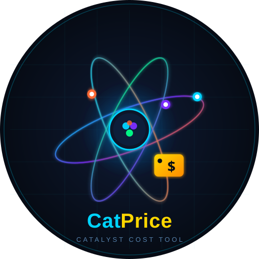
</p>

<h1 align="center">CatPrice</h1>

<p align="center">
  <strong>Windows desktop software for catalyst cost estimation, raw-material price tracking, and source-linked benchmark analysis.</strong>
</p>

<p align="center">
  <code>Windows app</code>
  <code>Local desktop workflow</code>
  <code>Source-linked library</code>
  <code>Benchmark datasets</code>
  <code>Installer download</code>
</p>

CatPrice is an independently developed desktop application for catalyst cost screening across multiple reaction families. It combines a local calculation engine, live and indexed raw-material pricing, preparation-route costing, and source-linked benchmark datasets in one Windows workflow.

This repository contains the Electron application, the local FastAPI backend, the calculation engine, and the curated data files used by the app. The software cites published methodology where appropriate, but the implementation, interface, data assembly, benchmark structure, and desktop workflow in this repository are CatPrice-specific.

The workflow is reaction-agnostic: choose catalyst type, define composition, set the preparation method, sync current metal prices, and review a cost estimate. Literature benchmark families are included as optional reference datasets, not as required inputs.

## Official Links

| Link | Current target |
| --- | --- |
| GitHub repository | [hyunjin-kor/CatPrice](https://github.com/hyunjin-kor/CatPrice) |
| Latest Windows release | [v1.1.13](https://github.com/hyunjin-kor/CatPrice/releases/tag/v1.1.13) |
| Installer download | [CatPrice.Setup.1.1.13.exe](https://github.com/hyunjin-kor/CatPrice/releases/download/v1.1.13/CatPrice.Setup.1.1.13.exe) |
| Portable download | [CatPrice-win-unpacked.zip](https://github.com/hyunjin-kor/CatPrice/releases/download/v1.1.13/CatPrice-win-unpacked.zip) |
| Issues | [GitHub Issues](https://github.com/hyunjin-kor/CatPrice/issues) |

No public blog or website URL is currently configured in the GitHub repository metadata. Add the verified URL to `docs/project-links.md` and the package metadata before publishing external announcements.

## Current Scope

The current repository exposes the following research-facing pieces:

- `broad reaction-family coverage`
  The shipped benchmark library spans ammonia cracking, CO2 hydrogenation and methanation, RWGS, dry reforming, water-gas shift, formic acid dehydrogenation, fuel-cell ORR, and electrolyzer OER families.
- `thermocatalyst and electrocatalyst workflows`
  Bulk supported catalysts and electrode-stack cases are handled separately.
- `source-linked pricing`
  Live feeds, indexed rows, vendor rows, and literature rows carry quote basis, year, scope, and public links when those links exist.
- `preparation-route costing`
  The Step Method remains the main processing-cost layer.
- `recovery-aware thermal screening`
  Thermocatalyst runs can include an optional spent-catalyst recovery proxy.

## Implemented Now vs Planned Next

| Area | Implemented in CatPrice | Still planned, not claimed as done |
| --- | --- | --- |
| Research workflow | Thermocatalyst/electrocatalyst split, preparation templates, result-side evidence review | Structure-editor-first entry surface |
| Chemistry basis | Explicit composition rows, support closure, electrocatalyst area model | RDKit/ChemPy validation microservice |
| Lifecycle economics | Optional spent catalyst recovery proxy | Deactivation kinetics and regeneration-cycle economics |
| Complexity penalty | Route steps, campaign scale, evidence scope | SCScore-style synthesis complexity penalty |
| Validation | Backend pytest suite, desktop smoke test, data validation script, composition-step-template matrix harness | Additional reaction-specific physics models beyond the current cost-screening scope |

In practice, CatPrice helps answer questions like:

- How does a change in metal price affect the estimated catalyst cost?
- Which composition or loading makes the route more expensive?
- How much does the preparation method change the final estimate?
- What is the evidence source behind each price used in the estimate?

## Workflow

| Stage | Screen | What you do | What CatPrice gives back |
| --- | --- | --- | --- |
| 1. Track the market | `Live Metal Prices` | Review live, indexed, and manual price bases with confidence and freshness metadata | A transparent sourcing basis for the catalyst recipe |
| 2. Estimate the cost | `Cost Estimate` | Move through `Catalyst Type -> Composition -> Preparation Method -> Result` and run the estimate | A catalyst preparation estimate grounded in current price data |
| 3. Check published benchmarks | `Literature Benchmarks` | Review optional literature-backed catalyst families and load one as a starting point if useful | A fast reference path without forcing the main workflow |
| 4. Review the output | `Result` | Open the final output on a separate reading surface | A result view optimized for interpretation instead of editing |
| 5. Iterate quickly | `Back to cost estimate` | Return to the cost estimate workspace, adjust pricing or steps, and rerun | The draft stays in place so scenario work remains fast |

## Representative Screens

The captures below focus on one core task per screen. These assets are regenerated from the running desktop stack with `scripts/capture_readme_screens.mjs`.

### Cost Estimate

Choose the catalyst workflow first, then define the recipe, route basis, and result handoff in sequence.

<p>
  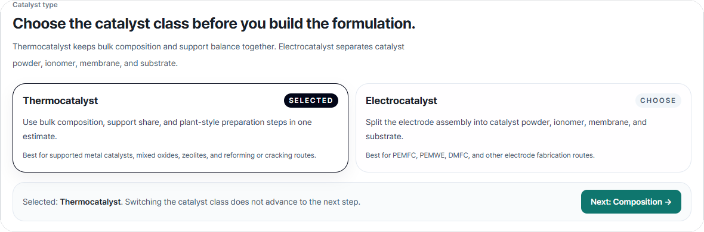
</p>

Select thermocatalyst or electrocatalyst before editing the case.

<p>
  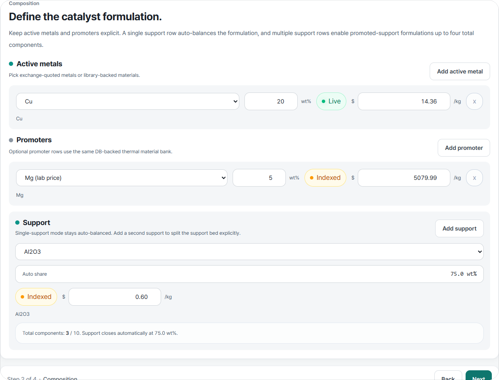
</p>

Set active metals, promoters, and support balance with explicit source-backed price states.

<p>
  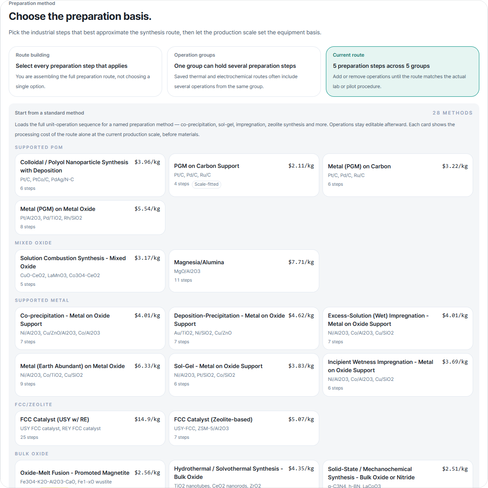
</p>

Build the preparation route from operation buckets and campaign scale.

<p>
  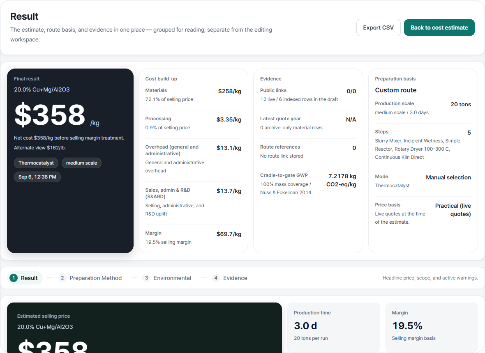
</p>

Run the case, then move into a dedicated result surface.

### Live Metal Prices

Scan tracked symbols and current quote basis first, then move into the trend and source audit for one metal.

<p>
  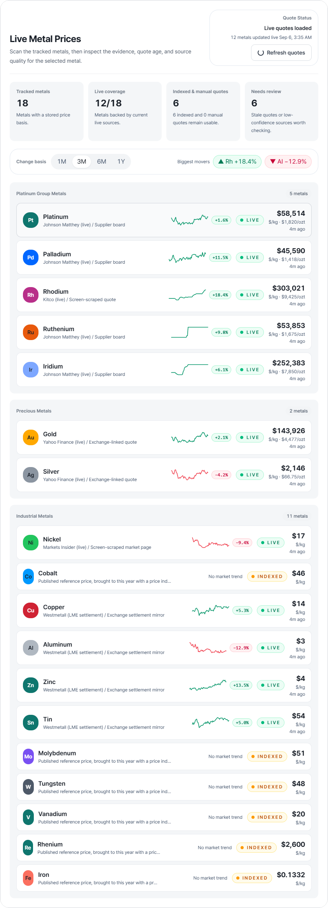
</p>

Review tracked symbols, quote status, and grouped market rows.

<p>
  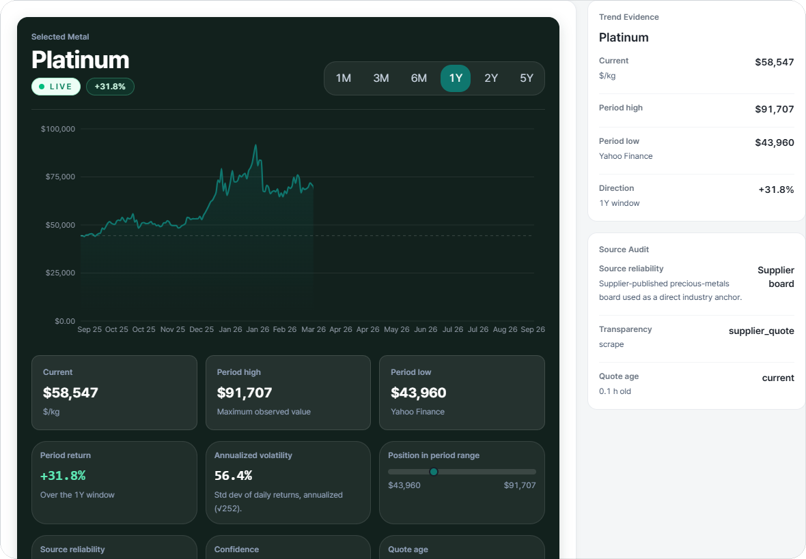
</p>

Read the price curve, period range, evidence tier, and freshness together.

### Literature Benchmarks

Compare the published route candidates first, then open the selected reference route to inspect the full benchmark basis.

<p>
  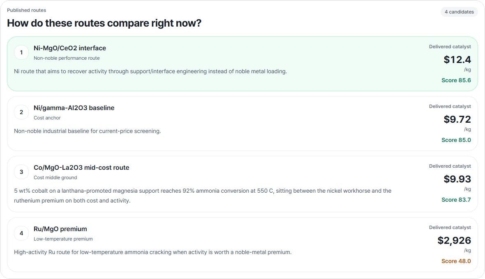
</p>

Compare landed catalyst cost, score, and route position across the active family.

<p>
  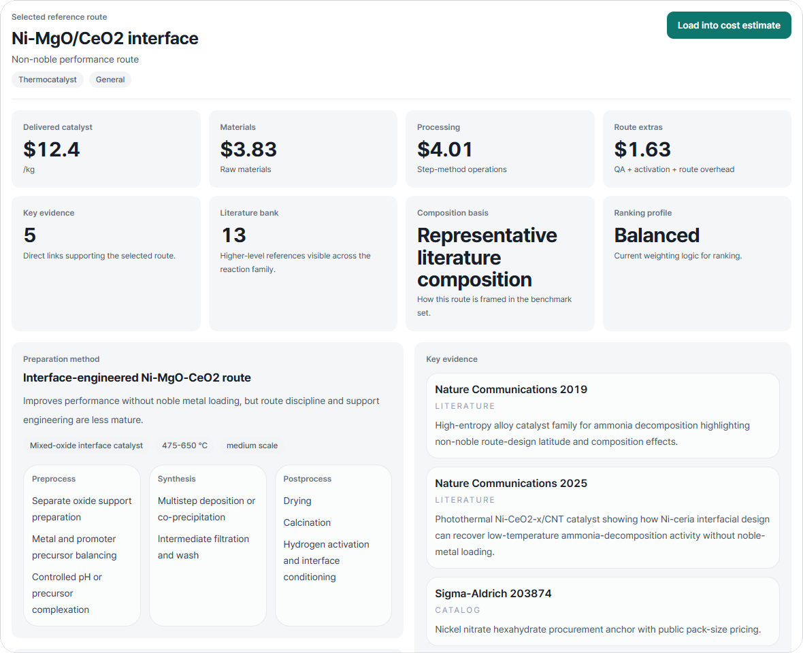
</p>

Inspect materials, processing, evidence anchors, and route basis before loading the case.

### Source Library

<p>
  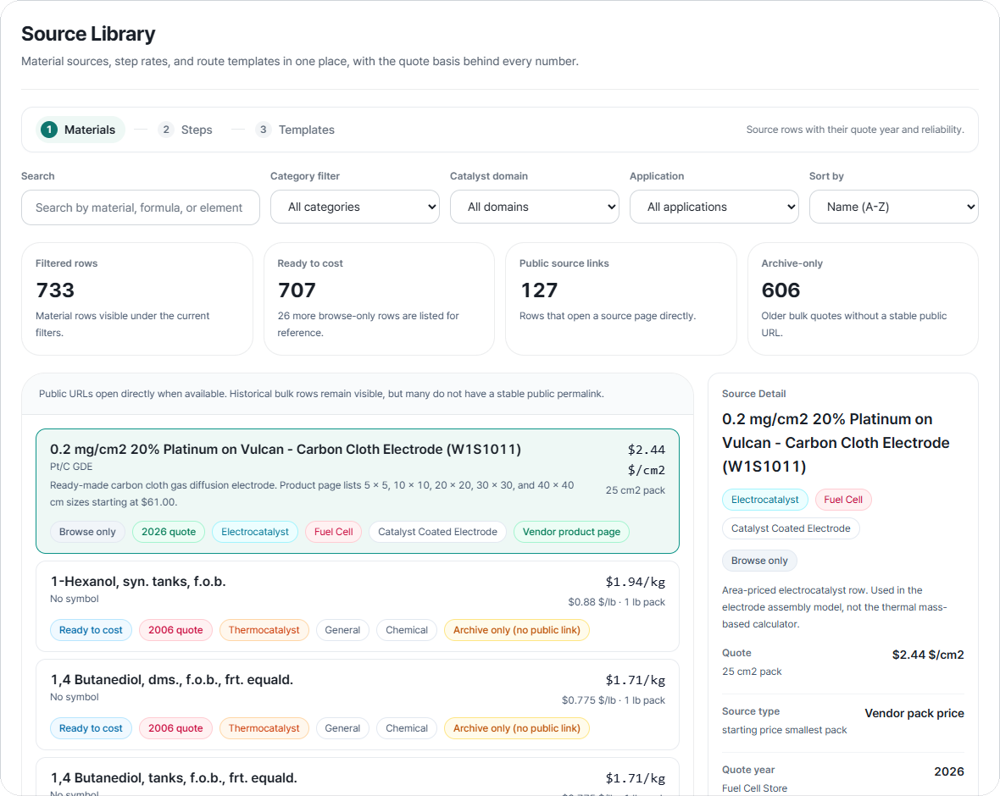
</p>

Search the stored rows, filter by category/domain/application, and inspect quote basis, trust state, and public source links for the selected record.

### Estimate Range

<p>
  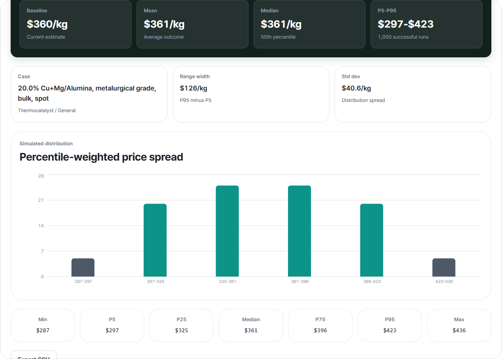
</p>

Run Monte Carlo on the same current draft and read the baseline, mean, median, P5-P95 band, and percentile-weighted spread together.

### Result

<p>
  
</p>

Review the final estimate, cost ledger, evidence summary, and route basis on a separate reading surface.

## Repository Highlights

| Area | What CatPrice emphasizes |
| --- | --- |
| Core estimator | Reaction-agnostic catalyst preparation cost estimation with a separate result view |
| Price clarity | `LIVE`, `INDEXED`, and `MANUAL` states plus evidence confidence, freshness, quote year, and pack basis |
| Workflow | Step-based workspace navigation with back/forward movement instead of long scroll stacks |
| Preparation logic | Step Method, preparation extras, indexed escalation, and named preparation templates |
| Research support | Literature-backed thermocatalyst and electrocatalyst benchmark families with explicit anchor links and family banks |
| Operational trust | Quote-status panels, source-library trust labels, and result-side source records |
| Desktop release | Installer + unpacked app outputs for a clean Windows release path |

## Included Reference Families

CatPrice currently ships ten optional benchmark families.

Thermal families:

- `ammonia-cracking`
- `co2-methanol`
- `co2-methanation`
- `rwgs`
- `dry-reforming`
- `water-gas-shift`
- `formic-acid-dehydrogenation`

Electrocatalyst families:

- `fuel-cell-orr`
- `pem-electrolyzer-oer`
- `aem-electrolyzer-oer`

Each family includes candidate definitions, route templates, literature anchors, and pricing proxies that the app can load and score directly.

## Download

Download the packaged Windows app from [GitHub Releases](https://github.com/hyunjin-kor/CatPrice/releases).

Recommended asset:

<<<<<<< Updated upstream
- `CatPrice Setup 1.2.0.exe`
=======
- `CatPrice.Setup.1.1.13.exe`
>>>>>>> Stashed changes

Portable asset:

- `CatPrice-win-unpacked.zip`

Most users only need the `Setup` installer. Download the portable zip only if you want to run CatPrice without installation.

The packaged desktop app already includes the local backend and the bundled library data used to seed the workspace. CatPrice creates or updates the local SQLite database on startup, so users do not need to download a separate database file.

CatPrice is distributed as a desktop app. The public repository does not require a public server deployment to use the product.

## What It Does

- Estimates catalyst selling cost with a step-based preparation cost model grounded in published catalyst-cost methodology
- Tracks metal inputs with `LIVE`, `INDEXED`, and `MANUAL` price states
- Annotates market feeds with price-evidence confidence, freshness, and acquisition mode
- Loads thermocatalyst and electrocatalyst reference families into the cost estimate workspace as editable starting points
- Attaches source-linked family literature banks built from high-confidence journal references and public vendor pages
- Covers multiple energy-transition reaction families while remaining usable for general catalyst screening
- Opens the final estimate on a dedicated result screen for review
- Re-states the estimate basis through source records, normalization details, and route metadata on the result screen
- Adds an optional spent-catalyst recovery proxy to thermocatalyst screening runs
- Runs Monte Carlo uncertainty analysis
- Applies ChemPPI and CEPCI escalation
- Includes material, step, and process template libraries
- Ships as a packaged Windows desktop app through Electron

## Validation and Harness Engineering

The current repository validates the engine through:

- `pytest` coverage for the calculation engine and API
- `matrix harness` checks across frontend thermal composition choices, saved process templates, and valid step combinations
- `desktop smoke` checks for launch, health, prices, and sample calculation behavior
- `data validation` scripts for library consistency

Additional reaction-specific physics layers are still planned, but the current cost-screening workflow is backed by automated matrix and desktop validation.

## App Mark

The mark combines a catalyst chamber silhouette, internal particles, and an upward signal line. It is meant to read as catalyst preparation and market-aware pricing in a single desktop icon.

## Desktop Release

```bash
npm install
npm run build
```

Main outputs:

- `dist-electron\CatPrice Setup 1.1.13.exe`
- `dist-electron\win-unpacked\CatPrice.exe`

Before rebuilding desktop artifacts, CatPrice stops old desktop processes automatically. You can also stop them manually:

```bash
npm run desktop:stop
```

## Desktop Smoke Test

```bash
npm run smoke:desktop
```

This checks desktop launch, backend readiness, the prices endpoint, a sample calculate request, and re-launch behavior.

## Optional API Keys

CatPrice works without API keys by falling back to indexed or manual prices.

```env
METALS_DEV_API_KEY=your_key
METALPRICE_API_KEY=your_key
BLS_API_KEY=your_key
```

## Validation

```bash
python -m pytest backend/tests -q
cd frontend && npm run build
python scripts/validate_catcost_data.py
```

Desktop packaging validation:

```bash
npm run build
npm run smoke:desktop
```

## Method Basis

CatPrice is an independent implementation of a local catalyst-cost desktop workflow. The repository cites published costing methodology where relevant, but it does not redistribute CatCost source data or third-party product assets.

Method references:

- Baddour, F. G., et al. (2018). Journal of the American Chemical Society.
- Van Allsburg, K. M., et al. (2022). Early-stage evaluation of catalyst manufacturing cost and environmental impact using CatCost. Nature Catalysis.

Benchmark and route-specific literature references are attached inside the application datasets and source library rather than duplicated in the GitHub README.

## License

Source-available, all rights reserved. See `LICENSE`.
