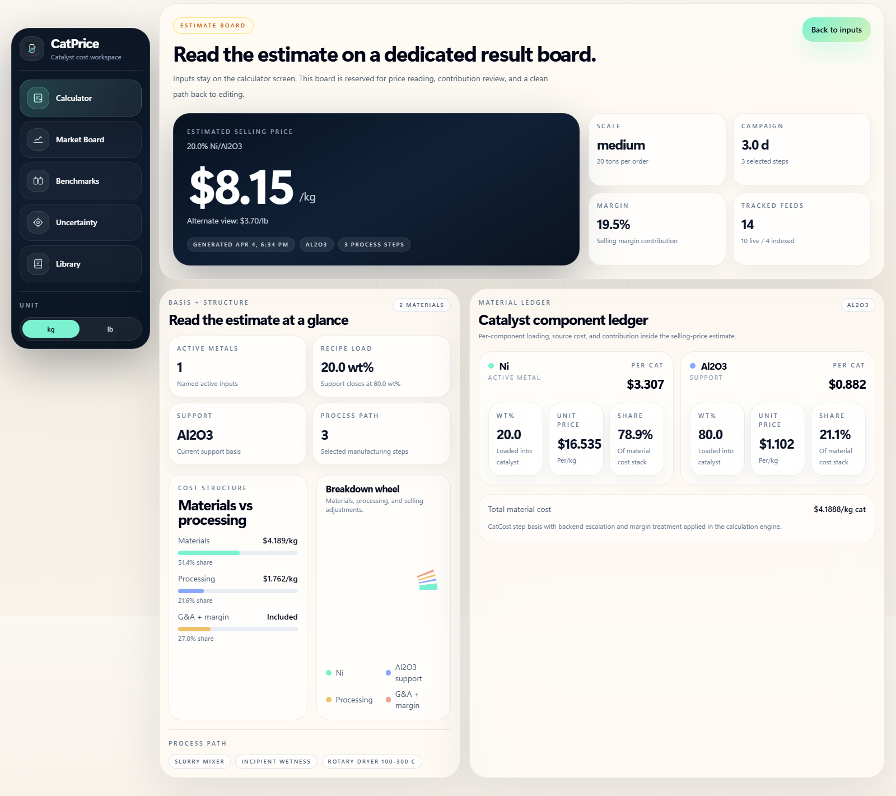

<p align="center">
  
</p>

<p align="center">
  
</p>

<h1 align="center">CatPrice</h1>

<p align="center">
  <strong>Desktop-first catalyst manufacturing cost estimator with live metal feeds, transparent price evidence, and packaged Windows delivery.</strong><br />
  CatCost-based economics, market-aware feed inputs, route-aware manufacturing steps, and a dedicated result board for readable desktop review.
</p>

<p align="center">
  <code>Windows app</code>
  <code>CatCost workflow</code>
  <code>Market evidence</code>
  <code>Result board</code>
  <code>Installer download</code>
</p>

CatPrice is built to feel like shipped desktop software rather than a spreadsheet wrapper. The core workflow is reaction-agnostic: define a catalyst recipe, map the manufacturing route, sync current metal prices, and read a clean selling-cost estimate on a separate result board. Optional benchmark families can be loaded as reference starting points, but they do not define the product scope.

## Workflow Framework

| Stage | Screen | What you do | What CatPrice gives back |
| --- | --- | --- | --- |
| 1. Track the market | `Market Board` | Review live, indexed, and manual price bases with confidence and freshness metadata | A transparent sourcing basis for the catalyst recipe |
| 2. Build the recipe | `Calculator` | Enter active metals, promoters, support, pricing overrides, order size, and process steps | A catalyst manufacturing estimate grounded in current feed data |
| 3. Sanity-check with references | `Benchmarks` | Review optional literature-backed route families and load one as a starting point if useful | A fast reference path without locking the app to one reaction family |
| 4. Review the output | `Estimate Board` | Open the final output on a dedicated reading surface | A clean result board optimized for interpretation instead of editing |
| 5. Iterate quickly | `Back to inputs` | Return to the calculator, adjust pricing or steps, and rerun | The draft stays in place so scenario work remains fast |

## Screen Roles

- `Market Board` shows where each quote came from, how fresh it is, and how much confidence to place in it.
- `Calculator` is the main editing surface for composition, support basis, feed selection, and Step Method setup.
- `Benchmarks` is an optional reference library for literature-backed catalyst families and route scoring.
- `Estimate Board` is the reading surface for selling price, contribution structure, and component-level ledger review.

## Product Highlights

| Area | What CatPrice emphasizes |
| --- | --- |
| Core estimator | Reaction-agnostic catalyst manufacturing cost estimation |
| Price clarity | `LIVE`, `INDEXED`, and `MANUAL` states plus evidence confidence and freshness |
| Workflow | Separate calculator and estimate-board surfaces for better readability |
| Route logic | Step Method, route extras, indexed escalation, and optional reference routes |
| Research support | Literature-backed benchmark families that can be loaded as editable starting points |
| Desktop release | Installer + unpacked app outputs for a clean Windows release path |

## Included Reference Family

CatPrice currently ships one optional benchmark reference family:

- `Ammonia decomposition reference family`
  Includes `Ni/gamma-Al2O3 baseline`, `Ni-MgO/CeO2 interface`, and `Ru/MgO premium` as literature-backed starting routes for sanity-checking catalyst economics under one reaction window.

These routes are examples, not the product boundary. Additional families can be added without changing the main calculator workflow.

## Download

Download the packaged Windows app from [GitHub Releases](https://github.com/hyunjin-kor/CatPrice/releases).

Recommended asset:

- `CatPrice Setup 1.0.1.exe`

Portable asset:

- `CatPrice-win-unpacked.zip`

CatPrice is distributed as a desktop app. The public repository does not require a public server deployment to use the product.

## What It Does

- Estimates catalyst selling cost with the CatCost Step Method
- Tracks metal inputs with `LIVE`, `INDEXED`, and `MANUAL` price states
- Annotates market feeds with price-evidence confidence, freshness, and acquisition mode
- Loads optional reference families into the calculator as editable starting points
- Opens the final estimate on a dedicated result board for review
- Runs Monte Carlo uncertainty analysis
- Applies ChemPPI and CEPCI escalation
- Includes material, step, and process template libraries
- Ships as a packaged Windows desktop app through Electron

## App Mark

The mark combines a catalyst chamber silhouette, internal particles, and an upward signal line. It is meant to read as catalyst manufacturing and market-aware pricing in a single desktop icon.

## Desktop Release

```bash
npm install
npm run build
```

Main outputs:

- `dist-electron\CatPrice Setup 1.0.1.exe`
- `dist-electron\win-unpacked\CatPrice.exe`

Before rebuilding desktop artifacts, CatPrice stops old desktop processes automatically. You can also stop them manually:

```bash
npm run desktop:stop
```

## Desktop Smoke Test

```bash
npm run smoke:desktop
```

This checks desktop launch, backend readiness, the prices endpoint, a sample calculate request, and re-launch behavior.

## Optional API Keys

CatPrice works without API keys by falling back to indexed or manual prices.

```env
METALS_DEV_API_KEY=your_key
METALPRICE_API_KEY=your_key
BLS_API_KEY=your_key
```

## Validation

```bash
python -m pytest backend/tests -q
cd frontend && npm run build
python scripts/validate_catcost_data.py
```

Desktop packaging validation:

```bash
npm run build
npm run smoke:desktop
```

## Academic Basis

> Baddour, F. G., et al. (2018). Journal of the American Chemical Society.
>
> Van Allsburg, K. M., et al. (2022). Early-stage evaluation of catalyst manufacturing cost and environmental impact using CatCost. Nature Catalysis.

Current reference-family anchors included in the benchmark library:

- [Cleaner Energy Systems 2026 ammonia decomposition economic analysis](https://naos-be.zcu.cz/server/api/core/bitstreams/ee92fa23-ea1c-42b4-ad67-e0230bce7552/content)
- [Nature Communications 2023 on Ru ensembles for ammonia decomposition](https://www.nature.com/articles/s41467-023-36339-w)
- [PubMed 2025 on Ni_xMg_1-xO/CeO2 catalyst design](https://pubmed.ncbi.nlm.nih.gov/41452228/)
- [Sigma-Aldrich nickel nitrate catalog page](https://www.sigmaaldrich.com/US/en/product/aldrich/203874)
- [Sigma-Aldrich ruthenium chloride catalog page](https://www.sigmaaldrich.com/US/en/product/aldrich/206229)

## License

All rights reserved.
