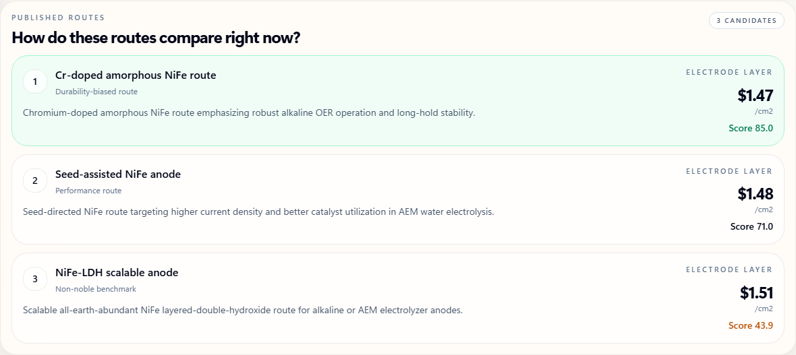

<p align="center">
  
</p>

<h1 align="center">CatPrice</h1>

<p align="center">
  <strong>Windows desktop software for catalyst cost estimation, raw-material price tracking, and source-linked benchmark analysis.</strong>
</p>

<p align="center">
  <code>Windows app</code>
  <code>Local desktop workflow</code>
  <code>Source-linked library</code>
  <code>Benchmark datasets</code>
  <code>Installer download</code>
</p>

CatPrice is an independently developed desktop application for catalyst cost screening across multiple reaction families. It combines a local calculation engine, live and indexed raw-material pricing, preparation-route costing, and source-linked benchmark datasets in one Windows workflow.

This repository contains the Electron application, the local FastAPI backend, the calculation engine, and the curated data files used by the app. The software cites published methodology where appropriate, but the implementation, interface, data assembly, benchmark structure, and desktop workflow in this repository are CatPrice-specific.

The workflow is reaction-agnostic: choose catalyst type, define composition, set the preparation method, sync current metal prices, and review a cost estimate. Literature benchmark families are included as optional reference datasets, not as required inputs.

## Current Scope

The current repository exposes the following research-facing pieces:

- `broad reaction-family coverage`
  The shipped benchmark library spans ammonia cracking, CO2 hydrogenation and methanation, RWGS, dry reforming, water-gas shift, formic acid dehydrogenation, fuel-cell ORR, and electrolyzer OER families.
- `thermocatalyst and electrocatalyst workflows`
  Bulk supported catalysts and electrode-stack cases are handled separately.
- `source-linked pricing`
  Live feeds, indexed rows, vendor rows, and literature rows carry quote basis, year, scope, and public links when those links exist.
- `preparation-route costing`
  The Step Method remains the main processing-cost layer.
- `recovery-aware thermal screening`
  Thermocatalyst runs can include an optional spent-catalyst recovery proxy.

## Implemented Now vs Planned Next

| Area | Implemented in CatPrice | Still planned, not claimed as done |
| --- | --- | --- |
| Research workflow | Thermocatalyst/electrocatalyst split, preparation templates, result-side evidence review | Structure-editor-first entry surface |
| Chemistry basis | Explicit composition rows, support closure, electrocatalyst area model | RDKit/ChemPy validation microservice |
| Lifecycle economics | Optional spent catalyst recovery proxy | Deactivation kinetics and regeneration-cycle economics |
| Complexity penalty | Route steps, campaign scale, evidence scope | SCScore-style synthesis complexity penalty |
| Validation | Backend pytest suite, desktop smoke test, data validation script, composition-step-template matrix harness | Additional reaction-specific physics models beyond the current cost-screening scope |

In practice, CatPrice helps answer questions like:

- How does a change in metal price affect the estimated catalyst cost?
- Which composition or loading makes the route more expensive?
- How much does the preparation method change the final estimate?
- What is the evidence source behind each price used in the estimate?

## Workflow

| Stage | Screen | What you do | What CatPrice gives back |
| --- | --- | --- | --- |
| 1. Track the market | `Live Metal Prices` | Review live, indexed, and manual price bases with confidence and freshness metadata | A transparent sourcing basis for the catalyst recipe |
| 2. Estimate the cost | `Cost Estimate` | Move through `Catalyst Type -> Composition -> Preparation Method -> Result` and run the estimate | A catalyst preparation estimate grounded in current price data |
| 3. Check published benchmarks | `Literature Benchmarks` | Review optional literature-backed catalyst families and load one as a starting point if useful | A fast reference path without forcing the main workflow |
| 4. Review the output | `Result` | Open the final output on a separate reading surface | A result view optimized for interpretation instead of editing |
| 5. Iterate quickly | `Back to cost estimate` | Return to the cost estimate workspace, adjust pricing or steps, and rerun | The draft stays in place so scenario work remains fast |

## Screen Roles

- `Live Metal Prices` shows where each quote came from, how fresh it is, and how much confidence to place in it.
- `Cost Estimate` is the main editing surface for composition, support basis, feed selection, and preparation-step setup across thermocatalyst and electrocatalyst cases.
- `Literature Benchmarks` is an optional reference library for literature-backed catalyst families and route scoring across multiple reaction families.
- `Result` is the reading surface for selling price, contribution structure, and component-level source review.

## Representative Screens

The captures below focus on one core task per screen so the feature surface stays readable on GitHub. These assets are regenerated from the running desktop stack with `scripts/capture_readme_screens.mjs`.

### Cost Estimate

The `Cost Estimate` workspace is structured as a four-step editing flow.

<p>
  
</p>

Select the workflow first so thermal and electrocatalyst cases stay separated before any recipe editing begins.

<p>
  
</p>

Define active metals, promoters, and support balance with explicit mass fractions and source-linked price states.

<p>
  
</p>

Choose the preparation basis as a route, not a one-choice wizard. Each bucket can hold multiple operations when the real workflow requires it.

<p>
  
</p>

Open the final estimate on a separate reading surface so route basis, cost ledger, and evidence stay grouped after the run.

### Live Metal Prices

The `Live Metal Prices` workspace separates quote monitoring from trend inspection.

<p>
  
</p>

Start from the tracked-symbol overview, quote-status panel, and grouped price rows before drilling into one metal.

<p>
  
</p>

Move into the selected-metal trend view to read the history curve, period range, evidence tier, and source audit together.

### Literature Benchmarks

Candidate-to-candidate route comparison for catalyst families, with landed cost and score-based screening.

<p>
  
</p>

### Source Library

Database-facing material records with quote rows, domains, applications, and stored source metadata.

<p>
  
</p>

### Estimate Range

Monte Carlo spread around the same current cost case, without rebuilding a separate input form.

<p>
  
</p>

### Result

Preparation-side readout showing cost structure, material share, and route-level interpretation after the run.

<p>
  
</p>

## Repository Highlights

| Area | What CatPrice emphasizes |
| --- | --- |
| Core estimator | Reaction-agnostic catalyst preparation cost estimation with a separate result view |
| Price clarity | `LIVE`, `INDEXED`, and `MANUAL` states plus evidence confidence, freshness, quote year, and pack basis |
| Workflow | Step-based workspace navigation with back/forward movement instead of long scroll stacks |
| Preparation logic | Step Method, preparation extras, indexed escalation, and named preparation templates |
| Research support | Literature-backed thermocatalyst and electrocatalyst benchmark families with explicit anchor links and family banks |
| Operational trust | Quote-status panels, source-library trust labels, and result-side source records |
| Desktop release | Installer + unpacked app outputs for a clean Windows release path |

## Included Reference Families

CatPrice currently ships ten optional benchmark families.

Thermal families:

- `ammonia-cracking`
- `co2-methanol`
- `co2-methanation`
- `rwgs`
- `dry-reforming`
- `water-gas-shift`
- `formic-acid-dehydrogenation`

Electrocatalyst families:

- `fuel-cell-orr`
- `pem-electrolyzer-oer`
- `aem-electrolyzer-oer`

Each family includes candidate definitions, route templates, literature anchors, and pricing proxies that the app can load and score directly.

## Download

Download the packaged Windows app from [GitHub Releases](https://github.com/hyunjin-kor/CatPrice/releases).

Recommended asset:

- `CatPrice Setup 1.1.9.exe`

Portable asset:

- `CatPrice-win-unpacked-1.1.9.zip`

CatPrice is distributed as a desktop app. The public repository does not require a public server deployment to use the product.

## What It Does

- Estimates catalyst selling cost with a step-based preparation cost model grounded in published catalyst-cost methodology
- Tracks metal inputs with `LIVE`, `INDEXED`, and `MANUAL` price states
- Annotates market feeds with price-evidence confidence, freshness, and acquisition mode
- Loads thermocatalyst and electrocatalyst reference families into the cost estimate workspace as editable starting points
- Attaches source-linked family literature banks built from high-confidence journal references and public vendor pages
- Covers multiple energy-transition reaction families while remaining usable for general catalyst screening
- Opens the final estimate on a dedicated result screen for review
- Re-states the estimate basis through source records, normalization details, and route metadata on the result screen
- Adds an optional spent-catalyst recovery proxy to thermocatalyst screening runs
- Runs Monte Carlo uncertainty analysis
- Applies ChemPPI and CEPCI escalation
- Includes material, step, and process template libraries
- Ships as a packaged Windows desktop app through Electron

## Validation and Harness Engineering

The current repository validates the engine through:

- `pytest` coverage for the calculation engine and API
- `matrix harness` checks across frontend thermal composition choices, saved process templates, and valid step combinations
- `desktop smoke` checks for launch, health, prices, and sample calculation behavior
- `data validation` scripts for library consistency

Additional reaction-specific physics layers are still planned, but the current cost-screening workflow is backed by automated matrix and desktop validation.

## App Mark

The mark combines a catalyst chamber silhouette, internal particles, and an upward signal line. It is meant to read as catalyst preparation and market-aware pricing in a single desktop icon.

## Desktop Release

```bash
npm install
npm run build
```

Main outputs:

- `dist-electron\CatPrice Setup 1.1.9.exe`
- `dist-electron\win-unpacked\CatPrice.exe`

Before rebuilding desktop artifacts, CatPrice stops old desktop processes automatically. You can also stop them manually:

```bash
npm run desktop:stop
```

## Desktop Smoke Test

```bash
npm run smoke:desktop
```

This checks desktop launch, backend readiness, the prices endpoint, a sample calculate request, and re-launch behavior.

## Optional API Keys

CatPrice works without API keys by falling back to indexed or manual prices.

```env
METALS_DEV_API_KEY=your_key
METALPRICE_API_KEY=your_key
BLS_API_KEY=your_key
```

## Validation

```bash
python -m pytest backend/tests -q
cd frontend && npm run build
python scripts/validate_catcost_data.py
```

Desktop packaging validation:

```bash
npm run build
npm run smoke:desktop
```

## Method Basis

CatPrice is an independent implementation of a local catalyst-cost desktop workflow. The repository cites published costing methodology where relevant, but it does not redistribute CatCost source data or third-party product assets.

Method references:

- Baddour, F. G., et al. (2018). Journal of the American Chemical Society.
- Van Allsburg, K. M., et al. (2022). Early-stage evaluation of catalyst manufacturing cost and environmental impact using CatCost. Nature Catalysis.

Benchmark and route-specific literature references are attached inside the application datasets and source library rather than duplicated in the GitHub README.

## License

Source-available, all rights reserved. See `LICENSE`.
