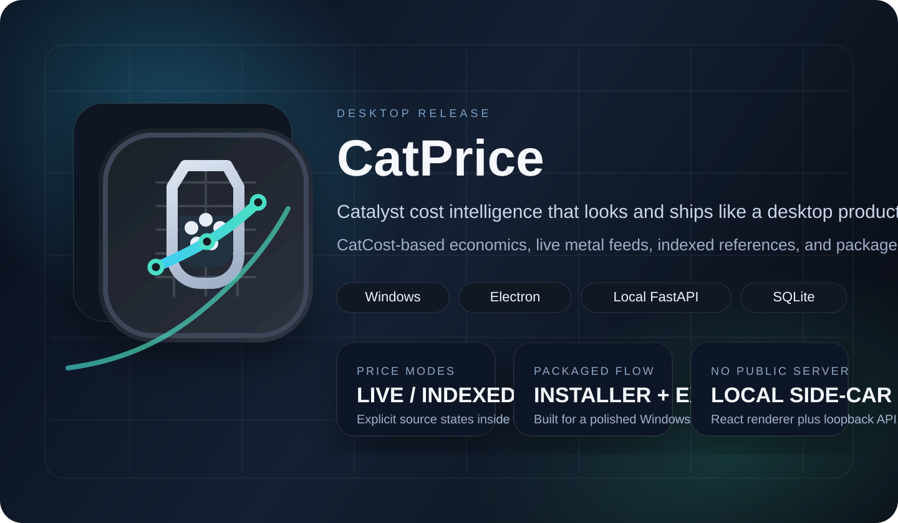

<p align="center">
  
</p>

<p align="center">
  
</p>

<h1 align="center">CatPrice</h1>

<p align="center">
  <strong>Desktop-first catalyst cost intelligence.</strong><br />
  CatCost-based economics, live metal feeds, indexed references, and packaged Windows delivery.
</p>

<p align="center">
  <code>Windows desktop</code>
  <code>Electron shell</code>
  <code>Local FastAPI sidecar</code>
  <code>React renderer</code>
  <code>SQLite</code>
</p>

CatPrice is built to feel like a shipped desktop product rather than a spreadsheet wrapper. It keeps the CatCost methodology, makes price-source states explicit, and packages the full workflow into a local Windows app without relying on a public server deployment.

## Why It Feels Like Product Software

| Area | What CatPrice emphasizes |
| --- | --- |
| Desktop delivery | Installer + unpacked app outputs for a clean Windows release path |
| Cost workflow | Step Method, indexed escalation, comparison, and uncertainty analysis |
| Price clarity | `LIVE`, `INDEXED`, and `MANUAL` states shown directly in the app |
| Local architecture | Electron shell, local FastAPI sidecar, React renderer, SQLite persistence |

## App Mark

<p align="center">
  
</p>

The mark combines a catalyst chamber silhouette, internal particles, and an upward signal line. It is meant to read as both catalyst manufacturing and market-aware pricing in a single desktop icon.

## What It Does

- Estimates catalyst selling cost with the CatCost Step Method
- Tracks metal inputs with `LIVE`, `INDEXED`, and `MANUAL` price states
- Compares multiple catalyst compositions side by side
- Runs Monte Carlo uncertainty analysis
- Applies ChemPPI and CEPCI escalation
- Includes material, step, and process template libraries
- Ships as a packaged Windows desktop app through Electron

## Desktop Release

```bash
npm install
npm run build
```

Main outputs:

- `dist-electron\CatPrice Setup 1.0.1.exe`
- `dist-electron\win-unpacked\CatPrice.exe`

Before rebuilding desktop artifacts, CatPrice stops old desktop processes automatically. You can also stop them manually:

```bash
npm run desktop:stop
```

## Desktop Smoke Test

```bash
npm run smoke:desktop
```

This checks desktop launch, backend readiness, the prices endpoint, a sample calculate request, and re-launch behavior.

## Local Desktop Development

```bash
npm install
npm run dev
```

This starts:

- the FastAPI sidecar on `127.0.0.1:8765`
- the Vite renderer on `http://localhost:5173`
- the Electron desktop shell

The browser URL is only a local renderer development service for the Electron shell. CatPrice is not intended for public server deployment.

## Optional API Keys

CatPrice works without API keys by falling back to indexed or manual prices.

```env
METALS_DEV_API_KEY=your_key
METALPRICE_API_KEY=your_key
BLS_API_KEY=your_key
```

## Validation

```bash
python -m pytest backend/tests -q
cd frontend && npm run build
python scripts/validate_catcost_data.py
```

Desktop packaging validation:

```bash
npm run build
npm run smoke:desktop
```

## Academic Basis

> Baddour, F. G., et al. (2018). Journal of the American Chemical Society.
>
> Van Allsburg, K. M., et al. (2022). Early-stage evaluation of catalyst manufacturing cost and environmental impact using CatCost. Nature Catalysis.

## License

All rights reserved.
