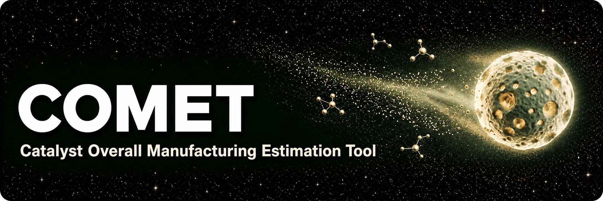
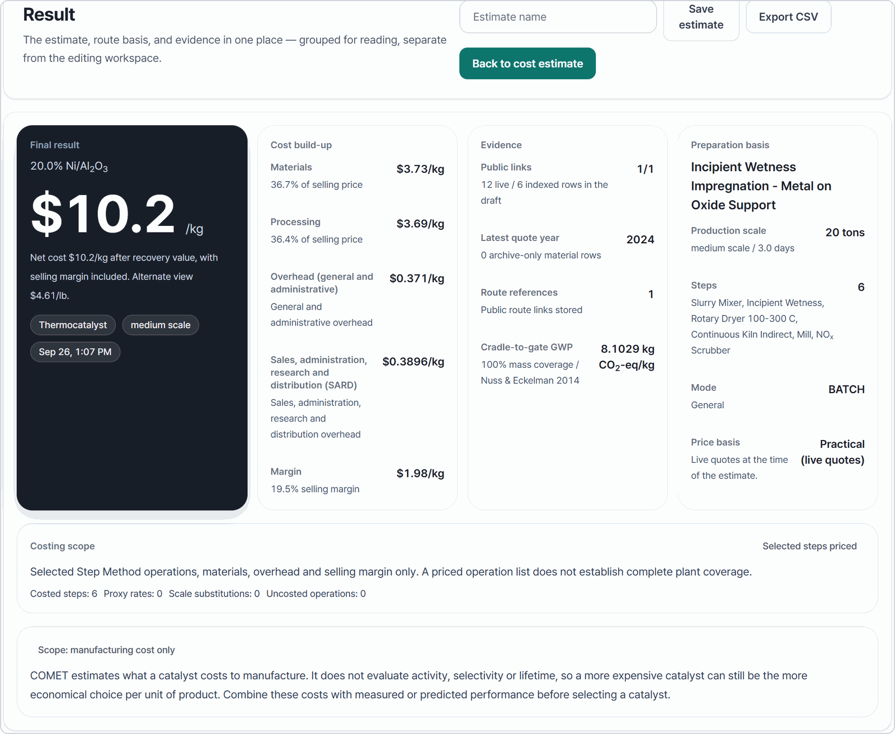

<p align="center">
  
</p>

<p align="center">
  <strong>Estimate what a catalyst costs to make, with the sources and the price date on record.</strong>
</p>

<p align="center">
  <a href="https://github.com/hyunjin-kor/COMET/releases/latest"></a>
  
  <a href="https://doi.org/10.5281/zenodo.21451931"></a>
  
</p>

<p align="center">
  <a href="https://github.com/hyunjin-kor/COMET/releases/latest"><b>Download</b></a> ·
  <a href="#what-it-does">What it does</a> ·
  <a href="#screens">Screens</a> ·
  <a href="#method-basis">Method basis</a> ·
  <a href="docs/roadmap.md">Roadmap</a>
</p>

**COMET** estimates what a catalyst costs to manufacture. Describe the
composition and the support, pick a preparation method and a production scale,
and it prices that recipe with the published Step Method. Every line of the
result carries its source and the date of the metal price behind it. It runs on
your machine. No server, no account.

Built for catalysis researchers with questions like:

- If platinum moves 20%, what does that do to my cost?
- Is the metal driving this number, or the preparation method?
- Would the cheapest candidate still have been the cheapest at last year's prices?
- How does my composition compare to published catalysts for the same reaction?

## Download

Get the installer from the [latest release](https://github.com/hyunjin-kor/COMET/releases/latest):

- `COMET.Setup.<version>.exe` for most people
- `COMET-win-unpacked.zip` if you want a portable copy

It works offline. Without API keys it falls back to indexed and manual prices.

This branch prepares **1.4.0**; the latest verified public release is **v1.3.24**
(published 2026-08-31). A new public release waits on the
[data rights review](docs/commercial/rights-register-2026-09-07.md).

Since v1.3.13 the app updates itself: it checks GitHub Releases at startup,
downloads in the background, and prompts you to restart. The binary is unsigned,
so SmartScreen will warn you the first time. Pick "More info → Run anyway".

## What it does

Costing

- Prices the preparation method with the Step Method: materials, scale-specific processing steps, overheads and the selling margin. The basis is documented under [method basis](#method-basis)
- Tags every price `LIVE`, `INDEXED` or `MANUAL`, and shows the source, quote year and freshness behind it
- Runs on two price bases. The practical basis uses live quotes. The academic basis uses IMF and Johnson Matthey monthly averages, so a screening result can be quoted against a citable month
- Escalates older prices to this year with ChemPPI and CEPCI
- Credits spent-catalyst recovery on thermocatalyst runs, if you want it
- Runs Monte Carlo, so you get a range rather than one number

Preparation records

- Records an ordered manufacturing protocol: temperature ramps and holds, reduction gases, washing, repeated impregnations. Nothing is inferred from a catalyst name
- Loads source-checked preparation records from the literature, each with its DOI and section locator, into an editable protocol
- Costs a laboratory batch from declared inputs (purchases, electricity, equipment time, labor, gases) and divides by the recovered mass. A missing required input stops the calculation instead of taking a default. See [docs/manufacturing-protocol.md](docs/manufacturing-protocol.md)
- Keeps the original source value next to every edited number, and charges an intermediate batch only for the aliquot that was actually used

Comparison

- Ships thirty literature benchmark families you can load and edit: ammonia cracking, CO₂ hydrogenation, RWGS, dry reforming, water-gas shift, fuel-cell ORR, electrolyzer OER and more
- Compares two to four saved estimates under shared prices and production conditions
- Covers bulk supported catalysts on a mass basis and electrode assemblies on an area basis
- Reports partial environmental inventories and says how much of the material mass they cover
- Exports the cost breakdown, price evidence and Monte Carlo range to CSV

The interface is in English and Korean.

## Scope and limitations

COMET estimates what a catalyst costs to manufacture. It does not evaluate
activity, selectivity or lifetime, so a more expensive catalyst can still be the
more economical choice per unit of product. Combine these costs with measured or
predicted performance before selecting a catalyst. Coupling COMET with catalyst
performance-prediction models is planned as future work.

Accuracy against industrial prices is not established. No public price so far
matches a library formulation in grade, scale, date and delivery boundary, so
the engine is verified against the published Step Method examples only.

## How a session goes

Pick thermocatalyst or electrocatalyst, define the composition, choose a
preparation method and a production scale, run it. The result opens on its own
screen with the full cost breakdown and the evidence behind each price. Tweak the
recipe and rerun; the draft stays put. If you have the actual synthesis
conditions, open the detailed manufacturing protocol and enter them, or start
from a literature preparation record.

The Live Metal Prices page tracks every metal with its quote basis and history.
The Literature Benchmarks page lines up published routes for a reaction family
and loads any of them into the calculator. Estimate Range runs the Monte Carlo
sweep, Capital & OpEx screens plant-level costs, and the Source Library lists
every price and rate the calculator can use.

## Screens



The [user guide](docs/user-guide.md) walks through a session in nine short
steps, with a numbered screenshot for each.

## Building from source

Requires Python 3.11+, Node.js 22.12+ (24 LTS recommended), and Windows for desktop packaging.
From the repository root in PowerShell, install both JavaScript dependency sets
and the Python environment before starting:

```powershell
py -3.11 -m venv .venv
.\.venv\Scripts\python.exe -m pip install -e ".[dev]"
$env:Path = (Resolve-Path .venv\Scripts).Path + ';' + $env:Path
$env:COMET_PYTHON = (Resolve-Path .venv\Scripts\python.exe).Path
npm.cmd ci
npm.cmd --prefix frontend ci
npm.cmd run dev      # development: Electron shell + FastAPI sidecar + Vite renderer
npm.cmd run web      # browser mode: build the frontend, then serve the whole app at http://localhost:8765
npm.cmd run build    # packaged installer under dist-electron\
```

Run one of the final three commands at a time. `COMET_PYTHON` keeps the desktop
backend and packager on the environment where dependencies were installed.
The explicit `.cmd` commands avoid depending on PowerShell script execution policy.

The build produces `dist-electron\COMET.Setup.<version>.exe` and an unpacked app
at `dist-electron\win-unpacked\COMET.exe`. Running instances are stopped
automatically before a rebuild, or manually with `npm run desktop:stop`.

## Tests

See the [release checklist](docs/release-checklist.md) and the [Korean getting-started guide](docs/getting-started.ko.md).

```bash
python -m pytest backend/tests -q     # engine + API, includes the Step Method validation cases
npm --prefix frontend run build      # type-check + build, from the repository root
npm run smoke:desktop                 # packaged-app smoke test in a fresh temporary profile
```

The engine reproduces the three published Step Method reference cases (2 wt% Pt/C,
21 wt% Ni/Al₂O₃, USY-based FCC; CatCost User Guide Table 6.2) line by line from
the published inputs. Pt/C matches to the cent. Ni/Al₂O₃ lands within 7%, and
the difference comes from the margin rule. FCC lands within 2% once the
production rate from the table's own footnote is used.
`scripts/reproduce_catcost_table62.py` prints the full comparison.

## Reproduce the paper

The manuscript in preparation is a JCIM Application Note:
[main text](docs/paper/application-note-2026-09-09.md) and
[Supporting Information](docs/paper/supporting-information-2026-09-15.md).
Both are generated from the frozen August 2026 reference basis in
`docs/paper/submission-2026-09-21/` (92 monthly price states, 2019-01 to 2026-08),
together with the [decision robustness](docs/paper/robustness-2026-09-21/),
[price crossover](docs/paper/price-crossovers-2026-09-21/) and
[what-if](docs/paper/whatif-2026-09-21/) studies of the same date. Earlier dated
folders under `docs/paper/` are kept as records of previous runs.

To replay the primary run from the committed inputs, without collecting new
quotes or touching the committed files:

```bash
python scripts/reproduce_paper.py --price-basis reference --month 2026-08 --seed 20260906 --date 2026-09-21 --history docs/paper/submission-2026-09-21/monthly_history_2026-09-21.json --support-history docs/paper/submission-2026-09-21/support_history_2026-09-21.json --live-basis docs/paper/submission-2026-09-21/live_basis_2026-09-21.json --out-dir _local/submission-replay-2026-09-21
```

To check the manuscript, the SI and the what-if study against the frozen files:

```bash
python scripts/build_application_note.py --check
python -m scripts.build_note_si --check
python scripts/note_whatif_study.py --check
```

Use a new or empty output directory. Matplotlib is needed for the figures.
Each run writes a manifest with the exact commands, input and code hashes and the
package versions. Source boundaries are described in
[methodology](docs/methodology.md#reproducing-the-paper). All data acquisition
stays free: no purchased datasets, papers or paid API calls.

## Project and service preparation

The [project portfolio](docs/project-portfolio.ko.md) connects design decisions to
code, experiments and test evidence. The [publication checklist](docs/paper/author-readiness-2026-09-07.ko.md)
lists what the authors still have to confirm before submission.

An opt-in hosted mode exists in the code: account-private calculations,
subscription periods and seats, saved-result export after expiry, and tested
backup and recovery. It is off by default, has no public endpoint and no billing.
See the [service plan](docs/commercial/strategy.ko.md) and the
[operations guide](docs/commercial/hosted-operations.ko.md). Turning it on for
real users needs the commercial data-rights review first.

## Optional API keys

COMET runs without any keys. Add them only if you want live price feeds:

```env
METALS_DEV_API_KEY=your_key      # metals.dev, free tier available
METALPRICE_API_KEY=your_key      # metalpriceapi.com, free tier available
BLS_API_KEY=your_key             # bls.gov, free with registration
COMTRADE_API_KEY=your_key        # optional scheduled collection; the shipped support-material observations work offline without a key
```

## Method basis

COMET is an independent implementation. It adopts the thermal step costs,
overheads and margin rule of the published Step Method, checks that
implementation against the published reference cases, and cites the method and
CatCost academically. It does not redistribute CatCost source data and is not
affiliated with or endorsed by NREL. COMET's own contribution is the workflow
around those equations: source-linked preparation records, dated price bases and
the sensitivity analyses. The [contribution map](docs/research-contribution.md)
links each part to its implementation, evidence and limits.

A source audit found legacy bundled files that declare CatCost workbook origins.
Their reuse permissions are unresolved; the original workbook is excluded, but
that alone does not clear the extracted data. See the
[data rights register](docs/commercial/rights-register-2026-09-07.md). New public
releases are held by an exact-file rights check until that review is complete.

- Baddour, F. G., et al. (2018). Estimating Precommercial Heterogeneous Catalyst Price: A Simple Step-Based Method. *Organic Process Research & Development*. [DOI](https://doi.org/10.1021/acs.oprd.8b00245).
- Van Allsburg, K. M., et al. (2022). Early-stage evaluation of catalyst manufacturing cost and environmental impact using CatCost. *Nature Catalysis*.

Benchmark- and route-specific references are attached to the datasets inside the app.

To cite COMET itself, use the Zenodo DOI
[10.5281/zenodo.21451931](https://doi.org/10.5281/zenodo.21451931) or GitHub's
"Cite this repository" button.

## The name

A comet nucleus is a pitted, porous sphere, which is roughly what a catalyst
pellet looks like. The acronym came afterwards.

## License

[PolyForm Noncommercial License 1.0.0](LICENSE) (`PolyForm-Noncommercial-1.0.0`).

Free to use, modify and redistribute for any noncommercial purpose: research,
education, personal study. Use by universities, public research organizations and
government institutions is permitted regardless of funding source. Commercial use
requires a separate license from the copyright holder. The license is not OSI
approved.

Third-party data and dependencies keep their own terms; the code license does not
grant their redistribution. Company subscription preparation is tracked in the
[commercialization plan](docs/commercial/strategy.ko.md). No hosted sale or
commercial data clearance is claimed.
