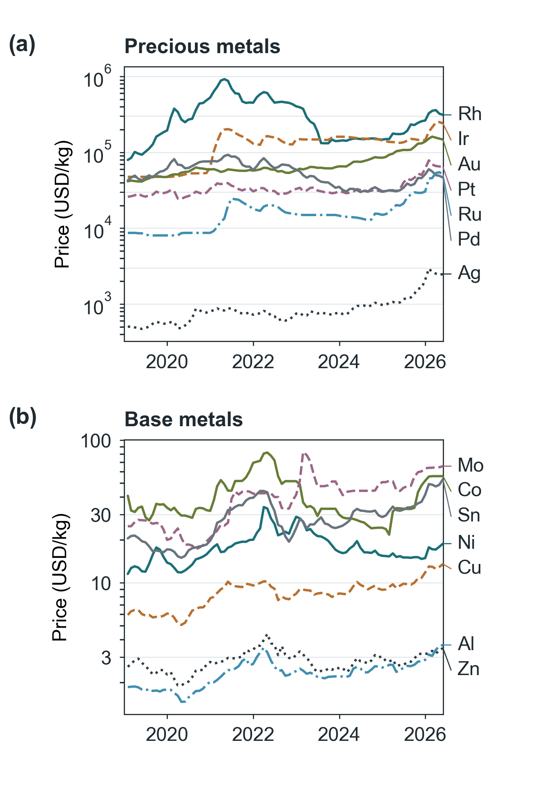

# COMET: Catalyst Overall Manufacturing Estimation Tool

Authors, affiliations and corresponding-author contact: [to be supplied by the authors].

## Abstract

COMET (Catalyst Overall Manufacturing Estimation Tool) integrates catalyst manufacturing cost estimation, price-data management, and candidate ranking through desktop and browser interfaces. A library of 116<!-- robustness-2026-09-08/decision_robustness.json:summary.candidates --> formulations in 30<!-- robustness-2026-09-08/decision_robustness.json:summary.families --> reaction families supports comparisons of cost contributions and selected environmental impacts under consistent assumptions. Source-linked current and historical prices, saved inputs, and software records support reproducible sensitivity analyses of prices, production scale, weights, scores, and candidate availability. Three literature examples verify the cost calculations without adjusting reported inputs; independent validation against industrial cost data remains necessary.

Keywords: catalyst manufacturing cost; cost estimation; sensitivity analysis; multicriteria decision analysis; software.

## Introduction

Catalyst selection requires evaluating manufacturing cost alongside performance and environmental impacts. The Step Method estimates precommercial catalyst selling prices from material requirements, unit operations, overheads, and a profit margin.1 CatCost integrated manufacturing cost estimation with environmental impact assessment and demonstrated how synthesis methods and production scale affect catalyst costs.2 Studies of individual synthesis routes provide further cost analyses,3,4 while BioSTEAM integrates process design, techno-economic analysis, and uncertainty analysis in a programmable environment.5

Applying cost estimates to candidate selection also requires consistent price dates, process boundaries, and functional units. A preferred candidate can change with market prices, criterion weights, assigned scores, or the alternatives included in a comparison.

COMET links price updates and historical recalculation to multicriteria sensitivity analysis. Records identify price sources, calculation assumptions, uncosted operations, and environmental inventory gaps. Comparisons use catalyst mass or electrode area and vary prices, weights, scores, and candidate sets. Published examples verify the implementation; ammonia cracking illustrates candidate-set sensitivity.

## Software implementation

Figure 1 connects formulation, prices, cost estimation, and ranking. Users select a thermal catalyst or electrode assembly, enter or load a formulation, and edit its route and scale. Results link costs to operation coverage, inventory gaps, and sources. Saved inputs support recalculation; CSV exports preserve results and sources. Analysis files retain boundaries, functional units, checksums, software versions, and random seeds.

SQLite stores prices, estimates, and preparation records. The bilingual React/TypeScript interface connects to FastAPI; source builds require Python 3.11 and Node.js 22 or later. Electron packages Windows builds with PyInstaller. Windows workflows and Linux backend/interface builds were tested. Stored or user-supplied prices enable offline calculation.

An audit covers all 116<!-- manufacturing-2026-09-14/review_summary.json:candidates --> candidates and flags 26<!-- manufacturing-2026-09-14/review_summary.json:source_mismatches --> composition/source discrepancies. Crossref verified 388<!-- manufacturing-2026-09-14/review_summary.json:crossref_dois --> DOIs; public Methods and supplements yielded 70<!-- manufacturing-2026-09-14/review_summary.json:profiles --> specimen-specific preparation records from 57<!-- manufacturing-2026-09-14/review_summary.json:primary_sources --> sources. Records preserve ordered operations, temperature programs, atmosphere, pressure, mixing and separation conditions. Each numeric input retains its DOI, locator and recorded value; edits remain distinguishable from published values. Unreported conditions remain blank. Imports distinguish powder preparation, activation and electrode fabrication and retain the selected cost model. Supporting Information provides candidate assessments, preparation records and dated operating references. Frozen screening calculations retain their declared assumptions; source links do not validate those recipes.

For a saved 20 wt% Ni/Al₂O₃ impregnation scenario at 18,143.7<!-- figures-note-2026-09-09/screen_result_ni_al2o3.json:request.order_size_tons --> kg, the estimated selling price is 11.49<!-- figures-note-2026-09-09/screen_result_ni_al2o3.json:step_method.estimated_price_per_lb --> USD/kg; nickel and processing contribute 3.33<!-- figures-note-2026-09-09/screen_result_ni_al2o3.json:materials.components[0].cost_per_lb_cat --> and 3.69<!-- figures-note-2026-09-09/screen_result_ni_al2o3.json:step_method.processing_cost_per_lb --> USD/kg. Figure 2(b) shows the least expensive screening candidate in each of 23 thermal families at May 2026 prices, including route allowances. Bars total 100%, are ordered by materials share, and show absolute prices alongside. They distinguish cost contributions without implying equivalent catalytic performance across reactions.

## Cost estimation and environmental screening

In Figure 2(a), materials cost is Cₘ = Σiwici, where wi is component mass fraction and ci is price per kg. Alternatively, purchased precursor requirements are $w/(f\,p\,y)$ kg per kg of catalyst: $w$ is the component fraction in the product, $f$ its fraction in pure precursor, $p$ precursor purity, and $y$ retention in the product. Precursor and consumable costs use purchase prices and required quantities. Users supply these quantities and sources; stoichiometry, losses, and recycling are not inferred.

Processing cost follows the Step Method, Cₚ = 24TIH/M: campaign duration T in days, price-index factor I, summed hourly operation costs H, and catalyst mass M in kg. The 28<!-- submission-2026-09-08/paper_summary_2026-09-08.json:manufacturing.20.template_count --> editable procedures retain repeated operations. Order size determines equipment scale, production rate, and cleaning allowance; a documented effective rate can replace the nominal rate. Substituted and uncosted operations are identified. Hourly rates use the 2017 equipment basis adjusted by a chemical-manufacturing producer price index. Selling price is P = (Cₘ + Cₚ)(1 + g)(1 + s)/(1 − m), where g and s are general and administrative (G&A) and sales, administrative, research, and distribution (SARD) fractions. Margin m follows the published order-size correlation. Figure 2(a) illustrates operations rather than prescribing a route. Optional recovery subtracts the specified spent-metal value. A separate module estimates capital investment and annual operating costs; these are not automatically added to the Step Method price.

Alternatively, batch purchases and operating inputs replace composition-based materials and Step Method processing. Electricity uses measured kWh or mean power times ramp/hold durations; gas, attended labor and equipment occupancy are costed separately. Gas time can follow operations or holds. Intermediate costs use successive transfer fractions or whole-batch charges. Costs per final dry kg receive overheads and explicit margin. Missing required inputs block calculation. Saved estimates and exports preserve sources, formulas and contributions. Batch repetition assumes no scale economy; electrodes exclude powder costing.

Electrode estimates combine catalyst, ionomer, membrane, and substrate costs per area. Optional manufacturing scenarios add equipment, labor, and facility costs. Powder routes and complete stack assembly remain separate.

Environmental screening estimates global warming potential and cumulative energy demand per kg using cradle-to-gate metal factors.6 Calculator and batch results cover materials; benchmark analyses additionally model route fuel and electricity. Missing impacts remain unknown. Element-based mappings for compounds are approximations; mass coverage, even 100%, does not establish a complete life-cycle inventory.

## Price data and sources

Current quotations include Johnson Matthey base prices for platinum and palladium7 and Westmetall settlement prices for copper and aluminum.8 Other prices follow a documented source hierarchy, with retrieval times recorded. The monthly price basis uses the International Monetary Fund (IMF) Primary Commodity Price System (PCPS)9 and monthly averages of Johnson Matthey daily quotations. Support prices use U.S. import unit values10 for 10<!-- submission_metadata_2026-09-08.json:support_series --> Harmonized System (HS) commodity codes, comprising 28<!-- submission_metadata_2026-09-08.json:support_observations --> verified observations. Figure 3 separates precious and base metals on logarithmic axes: equal vertical intervals represent equal price ratios. The unsmoothed monthly series provide historical inputs for sensitivity analysis, not forecasts. From January 2019 to May 2026, maximum-to-minimum price ratios are 2.3 for zinc, 2.9 for nickel, 6.8 for ruthenium, and 11.6 for rhodium.

Price-source grades are weighted by materials-cost contributions. This criterion, termed evidence in COMET, concerns pricing provenance, not performance or preparation verification; prices can change both cost and reliability scores. Cost observations require matched currency, date, composition, grade, scale, operations, and boundary.

## Candidate ranking and sensitivity analysis

The library contains 116<!-- robustness-2026-09-08/decision_robustness.json:summary.candidates --> screening formulations in 30<!-- robustness-2026-09-08/decision_robustness.json:summary.families --> reaction families, including 83<!-- submission-2026-09-08/paper_summary_2026-09-08.json:screening_basis_counts.literature_architecture_proxy --> literature-architecture proxies and 29<!-- submission-2026-09-08/paper_summary_2026-09-08.json:screening_basis_counts.engineering_proxy --> engineering proxies. These labels do not establish exact experimental compositions. Candidates are ranked by a weighted sum of four criteria: cost, reliability of price data, preparation route, and performance. The cost criterion is scaled from 100 for the lowest cost to 0 for the highest cost within each family; all candidates receive 100 when their costs are equal. Route scores average preparation, manufacturing readiness, and agreement between formulation and supporting evidence. Route and performance scores are assigned by the authors for screening; they are not experimental measurements. The interface offers balanced, cost-first, and reliability-first profiles; analysis scripts support custom weights. Baseline rankings use May 2026 prices, balanced weights, and the complete candidate set. Ties are resolved by lower cost using a common functional unit. Families with incomplete electrode inputs are compared using catalyst powder costs.

Companion scripts evaluate weight sensitivity using 286<!-- submission-2026-09-08/paper_summary_2026-09-08.json:weight_sensitivity.grid_points --> nonnegative weight combinations summing to one. Across reaction families, the median frequency with which the candidate ranked first at baseline remains first is 57.17<!-- submission-2026-09-08/paper_summary_2026-09-08.json:weight_sensitivity.median_balanced_winner_share_pct -->%. They also recalculate costs and rankings for 89<!-- submission-2026-09-08/paper_summary_2026-09-08.json:volatility.window.states --> monthly sets of metal prices from 2019-01-31<!-- submission-2026-09-08/paper_summary_2026-09-08.json:volatility.window.first --> to 2026-05-31<!-- submission-2026-09-08/paper_summary_2026-09-08.json:volatility.window.last -->, with support prices held at their baseline values. Individual-metal thresholds identify where the highest-ranked candidate changes. Monte Carlo samples uniform price and order multipliers and selected manufacturing inputs within independent absolute bounds. Endpoint tests vary one manufacturing input at a time. The default range for active components is 0.70–1.30 times the input price, and components with the same role share a multiplier in each trial. Analysis outputs retain failed trials and sampling seeds for reproducibility. These ranges describe assumed input variation, not statistical confidence intervals for industrial costs.

The combined sensitivity analysis evaluates 89<!-- robustness-2026-09-08/decision_robustness.json:summary.months --> monthly price datasets and 1771<!-- robustness-2026-09-08/decision_robustness.json:summary.weight_points["0.05"] --> weight combinations at increments of 0.05, giving 4,728,570<!-- robustness-2026-09-08/decision_robustness.json:summary.joint_scenarios_all_families["0.05"] --> scenarios across all reaction families (Figure 4(a,b)). First-rank frequency measures ranking stability; regret measures the score-point deficit from the highest score in each scenario. Figure 4(a) separates the baseline candidate, the most frequently first-ranked alternative, and others. Baseline shares below 50% indicate that alternatives collectively rank first more often than the baseline candidate. Across families, the median frequency of retaining the baseline candidate at rank 1 is 60.50<!-- robustness-2026-09-08/decision_robustness.json:summary.reference_winner_joint_share_median_pct -->%. Each nonleading candidate is removed in turn, with the cost normalization range recalculated or retained. Score tests lower the baseline candidate’s route and performance scores and raise those of alternatives by 2, 5, or 10 points within the 0–100 scale. Candidate removal changes the highest-ranked candidate in 9<!-- robustness-2026-09-08/decision_robustness.json:summary.candidate_removal_winner_changes --> of 86<!-- robustness-2026-09-08/decision_robustness.json:summary.candidate_removal_cases --> tests, and 10<!-- robustness-2026-09-08/decision_robustness.json:summary.rubric_robust_family_counts["5"] --> families retain the same candidate under the 5-point score variation. Figure 4(b) counts families retaining the baseline candidate in at least half the combined scenarios, after every single-candidate removal, or under each score variation. These tests address different vulnerabilities; passing one does not establish robustness to the others. Scenario frequencies are not future probabilities.

Two to four saved cases can be compared as recorded, at common prices, and at common prices and operating conditions. Each retains its formulation and operation sequence. The latter comparison controls order size and overhead assumptions, helping separate price and scale effects from formulation and route differences. Changes in software versions can also affect recalculation, so historical differences are not necessarily market effects alone.

## Verification and reproducibility

The implementation was checked against three published examples using their reported materials costs, operation sequences, and order sizes without adjustment. COMET estimates 60.3394<!-- submission-2026-09-08/paper_summary_2026-09-08.json:table62[0].comet_usd_per_lb --> USD/kg for Pt/C, compared with the published value of 60.34<!-- submission-2026-09-08/paper_summary_2026-09-08.json:table62[0].published_usd_per_lb --> USD/kg; both exclude platinum metal value as specified in the source. For Ni/Al₂O₃, the estimate is 42.3742<!-- submission-2026-09-08/paper_summary_2026-09-08.json:table62[1].comet_usd_per_lb --> versus 45.39<!-- submission-2026-09-08/paper_summary_2026-09-08.json:table62[1].published_usd_per_lb --> USD/kg, a difference of -6.65<!-- submission-2026-09-08/paper_summary_2026-09-08.json:table62[1].residual_pct -->%. This difference results from using the published correlation between order size and margin instead of the fixed margin in the table footnote. For the ultrastable zeolite Y (USY) catalyst used in fluid catalytic cracking (FCC), the estimate is 5.3749<!-- submission-2026-09-08/paper_summary_2026-09-08.json:table62[2].comet_usd_per_lb --> versus 5.31<!-- submission-2026-09-08/paper_summary_2026-09-08.json:table62[2].published_usd_per_lb --> USD/kg, a difference of +1.16<!-- submission-2026-09-08/paper_summary_2026-09-08.json:table62[2].residual_pct -->%, at the effective production rate of 60,781.4<!-- submission-2026-09-08/paper_summary_2026-09-08.json:table62[2].effective_rate_ton_per_day --> kg/day specified in the footnote. Intermediate processing and overhead calculations agree with the tabulated values at the reported precision.

The same study reports market prices for the three catalysts.1 Using 100 × (estimated price − market price)/market price, COMET estimates differ by -19.7<!-- submission-2026-09-08/table62_reproduction_2026-09-08.json:[0].market.comet_vs_market_pct -->% for Pt/C and -9.9<!-- submission-2026-09-08/table62_reproduction_2026-09-08.json:[1].market.comet_vs_market_pct -->% for Ni/Al₂O₃. The estimate for the FCC catalyst is 5.3749<!-- submission-2026-09-08/table62_reproduction_2026-09-08.json:[2].with_published_rate.estimated_price_per_lb --> USD/kg, compared with a reported market price of 6.02<!-- submission-2026-09-08/table62_reproduction_2026-09-08.json:[2].market.market_price_per_lb --> USD/kg (Figure 2(c)). Both COMET and the published estimates are below the reported market prices. The original study obtained these prices from industry experts and reported agreement within ±20%; COMET also falls within that range. Accuracy for other formulations remains unvalidated. The analysis files also contain a comparison with U.S. import unit values for HS 3815 catalyst categories.10 These aggregated data combine different grades, loadings, formulations, and order sizes, precluding validation of individual formulations.

Automated tests cover cost arithmetic, incomplete preparation records, electrode boundaries, API, price retrieval, and candidate coverage; Windows packaging was also tested. SHA-256 checksums and software versions document analysis inputs, code, and outputs. Calculations use reference month 2026-05<!-- submission-2026-09-08/paper_summary_2026-09-08.json:basis_month --> and sampling seed 20260906<!-- submission-2026-09-08/reproduction_manifest_2026-09-08.json:seed -->; exhaustive sensitivity analyses require no sampling.

## Application to ammonia cracking

Four assumed ammonia-cracking formulations illustrate candidate-set sensitivity. At baseline prices, estimated costs are 10.4523<!-- methods-2026-09-09/methods_study.json:normalization.example.rows[0].cost --> USD/kg for Co/MgO-La₂O₃, 12.8157<!-- methods-2026-09-09/methods_study.json:normalization.example.rows[1].cost --> for Ni-MgO/CeO₂, 9.6062<!-- methods-2026-09-09/methods_study.json:normalization.example.rows[2].cost --> for Ni/Al₂O₃, and 2790.9583<!-- methods-2026-09-09/methods_study.json:normalization.example.removed_cost --> for Ru/MgO. The balanced weights are 0.45<!-- methods-2026-09-09/methods_study.json:normalization.example.weights.economics --> for cost, 0.2<!-- methods-2026-09-09/methods_study.json:normalization.example.weights.evidence --> for reliability of price data, 0.2<!-- methods-2026-09-09/methods_study.json:normalization.example.weights.route --> for preparation route, and 0.15<!-- methods-2026-09-09/methods_study.json:normalization.example.weights.performance --> for performance. Co/MgO-La₂O₃ ranks first with a composite score of 89.3<!-- methods-2026-09-09/methods_study.json:normalization.example.rows[0].total_before -->, compared with 87.3<!-- methods-2026-09-09/methods_study.json:normalization.example.rows[2].total_before --> for Ni/Al₂O₃. The cobalt formulation ranks first in 41.56<!-- robustness-2026-09-08/decision_robustness.json:families[1].joint_grids["0.05"].candidates["co-mgo-la2o3"].first_rank_share_pct -->% of the combined scenarios and has a maximum regret of 20.0<!-- robustness-2026-09-08/decision_robustness.json:families[1].joint_grids["0.05"].candidates["co-mgo-la2o3"].worst_regret_score_points --> score points.

Removing Ru/MgO leaves the other cost estimates unchanged but reduces their range from approximately 2,781 to 3.2 USD/kg. With min–max normalization, the 0.85 USD/kg difference between Co/MgO-La₂O₃ and Ni/Al₂O₃ then produces a larger difference in their cost scores. The composite score for Co/MgO-La₂O₃ decreases to 77.4<!-- methods-2026-09-09/methods_study.json:normalization.example.rows[0].total_after -->, whereas that for Ni/Al₂O₃ remains 87.3<!-- methods-2026-09-09/methods_study.json:normalization.example.rows[2].total_after -->, reversing their ranking. If the original normalization range is retained, Co/MgO-La₂O₃ remains first. This result is consistent with rank reversal in normalized weighted-sum methods.11,12 Figure 4(c) reports 100 × (C₁ − C₀)/C₀ for the nine affected families. C₀ and C₁ are the costs of the candidates ranked first before and after removal, respectively, under identical prices and manufacturing assumptions. Negative values indicate a less expensive replacement; remaining candidate costs do not change. These diagnostics identify choices requiring further assessment of weights, candidate availability, and performance evidence before experimental prioritization.

## Limitations

COMET estimates manufacturing costs empirically; industrial accuracy remains unvalidated because available observations did not match formulation, grade, order size, date, and process boundary. Consequently, mean absolute percentage error was not calculated. Rankings depend on assumed formulations and assigned route and performance scores. Environmental data cover a mean of 62.79<!-- submission-2026-09-08/paper_summary_2026-09-08.json:lca.coverage_mean_pct -->% of catalyst mass, with coverage below 50% for 47<!-- submission-2026-09-08/paper_summary_2026-09-08.json:lca.candidates_coverage_below_50_pct --> candidates. Solvent supply, wastewater treatment, and equipment manufacture are excluded from the process inventory. Processing costs use the published 2017 equipment basis with index adjustment; substituted and uncosted operations are identified. Catalyst activity, deactivation, and impacts during use are outside the model's scope. Related studies address cost optimization of synthesis and the economic effects of catalyst lifetime.13,14 The resulting rankings therefore support screening within the stated assumptions and do not establish overall catalyst performance.

## Supporting Information

Candidate-by-candidate preparation assessment, source-specific conditions, DOI and section locators, and unresolved inputs (manufacturing-literature-2026-09-14.md).

## Data and Software Availability

COMET is distributed under the PolyForm Noncommercial License 1.0.0, which permits noncommercial use and requires a separate license for commercial use; it is not an OSI-approved open-source license. The project repository is https://github.com/hyunjin-kor/COMET, and its concept DOI is 10.5281/zenodo.21451931. This study uses version 1.4.0<!-- submission-2026-09-08/reproduction_manifest_2026-09-08.json:project_version -->. [Access to this version and its associated analysis files is to be confirmed by the authors before submission.] The analysis files contain the input price datasets, numerical results, checksums, and scripts used to generate the manuscript and figures. Third-party data remain subject to their respective source terms. Instructions for installation, data collection, and regeneration accompany the software and analysis files.

## Acknowledgments

Funding and other acknowledgments: [to be supplied by the authors].

## Competing interests

Competing interests: [declaration to be supplied by the authors before submission].

## References

1. Baddour, F. G.; Snowden-Swan, L.; Super, J. D.; Van Allsburg, K. M. Estimating Precommercial Heterogeneous Catalyst Price: A Simple Step-Based Method. *Organic Process Research & Development* **2018**, *22* (12), 1599–1605. [DOI](https://doi.org/10.1021/acs.oprd.8b00245).
2. Van Allsburg, K. M.; Tan, E. C. D.; Super, J. D.; Schaidle, J. A.; Baddour, F. G. Early-stage evaluation of catalyst manufacturing cost and environmental impact using CatCost. *Nature Catalysis* **2022**, *5* (4), 342–353. [DOI](https://doi.org/10.1038/s41929-022-00759-6).
3. Gkika, D. A.; Kyzas, G. Z. Cost Evidence Yields the Viability of Metal Oxides Synthesis Routes. *ACS Sustainable Chemistry & Engineering* **2025**, *13* (41), 17370–17379. [DOI](https://doi.org/10.1021/acssuschemeng.5c06752).
4. Ferdous, S.; Gracida-Alvarez, U. R.; Ferrandon, M.; Delferro, M.; Benavides, P. T.; Urgun-Demirtas, M. Techno-economic and life cycle analyses of the synthesis of a platinum–strontium titanate catalyst. *Catalysis Science & Technology* **2025**, *15* (15), 4419–4429. [DOI](https://doi.org/10.1039/d5cy00189g).
5. Cortes-Peña, Y.; Kumar, D.; Singh, V.; Guest, J. S. BioSTEAM: A Fast and Flexible Platform for the Design, Simulation, and Techno-Economic Analysis of Biorefineries under Uncertainty. *ACS Sustainable Chemistry & Engineering* **2020**, *8* (8), 3302–3310. [DOI](https://doi.org/10.1021/acssuschemeng.9b07040).
6. Nuss, P.; Eckelman, M. J. Life Cycle Assessment of Metals: A Scientific Synthesis. *PLoS ONE* **2014**, *9* (7), e101298. [DOI](https://doi.org/10.1371/journal.pone.0101298).
7. Johnson Matthey. PGM Prices and Trading. https://matthey.com/products-and-markets/pgms-and-circularity/pgm-management (accessed September 11, 2026).
8. Westmetall. Market Data: Prices and LME Stocks. https://www.westmetall.com/en/markdaten.php (accessed September 11, 2026).
9. International Monetary Fund. Primary Commodity Price System (PCPS), SDMX 2.1 data service. https://api.imf.org/external/sdmx/2.1/dataflow/IMF.RES/PCPS (accessed September 11, 2026).
10. United Nations. UN Comtrade Database. https://comtradeplus.un.org (accessed September 11, 2026).
11. Mohammadi, M.; Rezaei, J. Ratio product model: A rank-preserving normalization-agnostic multi-criteria decision-making method. *Journal of Multi-Criteria Decision Analysis* **2023**, *30*, 163–172. [DOI](https://doi.org/10.1002/mcda.1806).
12. OECD; European Union; Joint Research Centre - European Commission. *Handbook on Constructing Composite Indicators: Methodology and User Guide*. OECD, 2008. [DOI](https://doi.org/10.1787/9789264043466-en).
13. Petel, B. E.; Van Allsburg, K. M.; Baddour, F. G. Cost-Responsive Optimization of Nickel Nanoparticle Synthesis. *Advanced Sustainable Systems* **2024**, *8* (10), 2300030. [DOI](https://doi.org/10.1002/adsu.202300030).
14. Mendoza Suarez, F.; Tatarchuk, B. Comparative economic analysis of batch vs. continuous manufacturing in catalytic heterogeneous processes: impact of catalyst activity maintenance and materials costs on total costs of manufacturing in the production of fine chemicals and pharmaceuticals. *Journal of Flow Chemistry* **2025**, *15*, 21–38. [DOI](https://doi.org/10.1007/s41981-024-00342-z).
