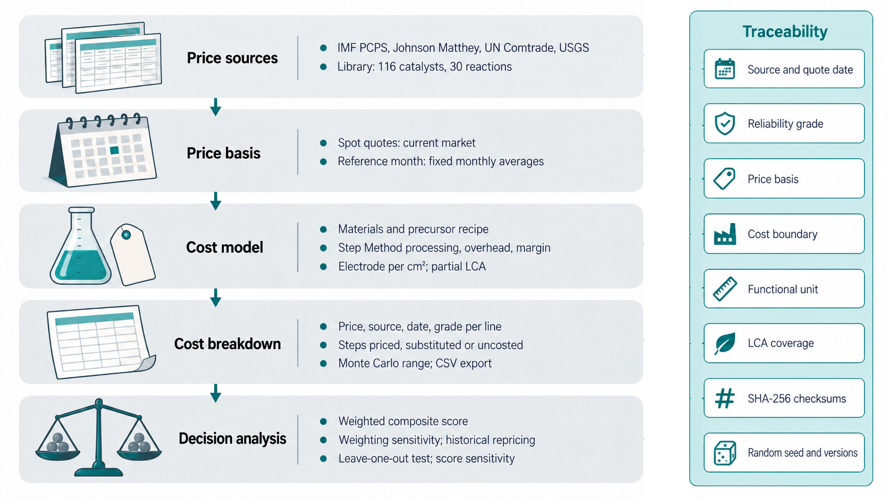

# COMET: Catalyst Overall Manufacturing Estimation Tool

Authors, affiliations and corresponding-author contact: [to be supplied by the authors].

## Abstract

Early-stage catalyst cost estimates depend on operating inputs that preparation reports seldom state and on metal prices that change over time. COMET (Catalyst Overall Manufacturing Estimation Tool) links source-traceable preparation records, batch costing from declared operating inputs, dated price histories, and ranking diagnostics for 116<!-- robustness-2026-09-08/decision_robustness.json:summary.candidates --> catalyst formulations in 30<!-- robustness-2026-09-08/decision_robustness.json:summary.families --> reaction families. It reproduces three published Step Method estimates within 6.65<!-- submission-2026-09-08/paper_summary_2026-09-08.json:table62[1].residual_pct -->%, and an illustrative batch shows how treatment duration and recovered mass set the cost per kilogram. Across 89<!-- robustness-2026-09-08/decision_robustness.json:summary.months --> monthly metal-price states, the lowest-cost candidate changes in 6<!-- price-crossovers-2026-09-13/price_crossovers.json:summary.monthly.cost_winner --> of 30<!-- price-crossovers-2026-09-13/price_crossovers.json:summary.monthly.families --> families, and recommendations also shift with price-source reliability and the candidate set. Cost comparisons should therefore state price basis, date, candidate set, and assumed inputs.

Keywords: catalyst manufacturing cost; preparation provenance; sensitivity analysis; multicriteria decision analysis; software.

## Introduction

Catalyst development decisions depend on manufacturing cost as well as on activity, selectivity, and stability. In biomass-conversion design reports summarized by Baddour et al., catalyst cost accounted for 3–9% of installed equipment cost and moved the minimum fuel selling price by up to ±10%, yet researchers outside catalyst companies have few resources for estimating the manufacturing cost of their materials.1

Published methods address parts of this problem. The Step Method maps a laboratory synthesis onto priced industrial processing steps at an order-size-dependent scale and margin; for three commercial catalysts, its estimates agreed with market prices within ±20%.1 CatCost combined manufacturing cost with environmental impact across synthesis methods and scales.2 Route-specific studies have costed laboratory metal-oxide syntheses3 and a scaled-up platinum–strontium titanate synthesis,4 and BioSTEAM propagates parameter uncertainty through techno-economic analyses.5

Applying these methods to literature candidates raises three problems. First, reported conditions do not map onto cost inputs: a furnace temperature does not specify electricity use, a precursor charge does not establish recovered mass, and treatment time differs from attended labor; estimates that fill such gaps silently cannot be audited. Second, metal prices move, so a cost ordering obtained at one date may not hold at another, and quotations differ in reliability. Third, when cost is combined with other criteria, min–max normalized scores depend on which candidates are compared.6,7

COMET was developed to make these conditions explicit. It extends Step Method and CatCost accounting with source-linked preparation records, batch costing from declared operating inputs, dated prices, and ranking diagnostics. We verify it against the published Step Method examples and apply it to 116<!-- robustness-2026-09-08/decision_robustness.json:summary.candidates --> formulations in 30<!-- robustness-2026-09-08/decision_robustness.json:summary.families --> reaction families to examine how operating inputs, price movements, price sources, and candidate sets affect estimates and recommendations.

## Implementation

### Software design

In the workflow of Figure 1, a user enters a formulation, edits its route and scale, selects a price basis, and obtains an estimate listing its sources and missing inputs; saved estimates can be recalculated, compared, and ranked. A FastAPI (Python) backend stores prices and estimates in SQLite, and a bilingual React/TypeScript interface is packaged for Windows with Electron and PyInstaller; Linux backend and interface builds were also tested. Exports and analysis records keep provenance, checksums, software versions, and seeds.

### Cost models

Screening estimates follow the Step Method (Figure 2a).1 Materials cost is Cₘ = Σiwici, with component mass fraction wi and price ci per kg; a precursor requires $w/(f\,p\,y)$ kg per kg of catalyst (component fraction $w$, fraction in the pure precursor $f$, purity $p$, retention $y$). Processing cost is Cₚ = 24TIH/M, with campaign duration T in days, price-index factor I, summed hourly cost H of the selected operations, and catalyst mass M in kg. Order size sets the scale, rate, and cleaning time; documented effective rates can replace nominal ones. Hourly rates use the published 2017 basis escalated by a producer price index; 28<!-- submission-2026-09-08/paper_summary_2026-09-08.json:manufacturing.20.template_count --> editable procedures are provided, with substituted or uncosted steps flagged. The selling price is P = (Cₘ + Cₚ)(1 + g)(1 + s)/(1 − m), with general and administrative (G&A) fraction g, sales, administrative, research, and distribution (SARD) fraction s, and margin m from the published order-size correlation. In rankings, cost denotes P per kilogram.

For a laboratory preparation, batch costing replaces these terms with purchases and operating inputs (Supporting Information, eqs S1–S6): electricity from measured kWh or mean power over ramp and hold times, equipment occupancy, attended labor, gases, and transfers allocated by recovered mass or solution volume. Costs are divided by the dry output mass before overheads and margin, and a missing required input stops the calculation.

### Preparation records

Preparation records trace these inputs to their sources. An audit of the 116<!-- manufacturing-2026-09-14/review_summary.json:candidates --> candidates verified 401<!-- manufacturing-2026-09-14/review_summary.json:crossref_dois --> digital object identifiers (DOIs) with Crossref and transcribed 92<!-- manufacturing-2026-09-14/review_summary.json:profiles --> specimen-specific records from 71<!-- manufacturing-2026-09-14/review_summary.json:primary_sources --> sources, linked to 75<!-- manufacturing-2026-09-14/review_summary.json:candidates_with_profile --> candidates; 26<!-- manufacturing-2026-09-14/review_summary.json:source_mismatches --> candidates carry composition or source discrepancies. Each value keeps its DOI, locator, and original value, user edits are stored separately, and unreported conditions stay blank. A linked specimen does not validate the catalog formulation (Supporting Information, Section S6).

### Prices and ranking

Each price keeps its source, date, and retrieval time. Current quotations include Johnson Matthey platinum and palladium8 and Westmetall copper and aluminum;9 historical metal prices come from the International Monetary Fund (IMF) Primary Commodity Price System10 and Johnson Matthey monthly averages, and support prices from U.S. import unit values11. A price-source grade, weighted by each price's share of materials cost, rates provenance only. Environmental screening uses cradle-to-gate metal factors.12

The library comprises 83<!-- submission-2026-09-08/paper_summary_2026-09-08.json:screening_basis_counts.literature_architecture_proxy --> literature-architecture proxies, 29<!-- submission-2026-09-08/paper_summary_2026-09-08.json:screening_basis_counts.engineering_proxy --> engineering proxies, and 4 candidates with documented vendor or market bases. Rankings combine cost, price-data reliability, and author-assigned route and performance scores; within each family, cost scores run from 100 (least expensive) to 0 (most expensive), and lower cost breaks ties. Baseline rankings use May 2026 prices, balanced weights, and all candidates; electrochemical families lacking electrode data are compared on powder cost.

## Results and Discussion

### Verification

The three Step Method examples, which report estimates and market prices, serve as an external reference; inputs were entered unadjusted.1 COMET gives 60.3394<!-- submission-2026-09-08/paper_summary_2026-09-08.json:table62[0].comet_usd_per_lb --> USD/kg for Pt/C against 60.341<!-- submission-2026-09-08/paper_summary_2026-09-08.json:table62[0].published_usd_per_lb --> USD/kg reported, both excluding platinum value. For Ni/Al₂O₃, the −6.65<!-- submission-2026-09-08/paper_summary_2026-09-08.json:table62[1].residual_pct -->% difference (42.3742<!-- submission-2026-09-08/paper_summary_2026-09-08.json:table62[1].comet_usd_per_lb --> versus 45.393<!-- submission-2026-09-08/paper_summary_2026-09-08.json:table62[1].published_usd_per_lb --> USD/kg) arises because COMET applies the published margin correlation instead of the table's fixed margin. For a fluid catalytic cracking (FCC) catalyst based on ultrastable zeolite Y, COMET gives 5.3749<!-- submission-2026-09-08/paper_summary_2026-09-08.json:table62[2].comet_usd_per_lb --> versus 5.313<!-- submission-2026-09-08/paper_summary_2026-09-08.json:table62[2].published_usd_per_lb --> USD/kg (+1.16<!-- submission-2026-09-08/paper_summary_2026-09-08.json:table62[2].residual_pct -->%) at the reported effective rate of 60,781.4<!-- submission-2026-09-08/paper_summary_2026-09-08.json:table62[2].effective_rate_ton_per_day --> kg/day. Values convert the published per-pound prices; intermediate values agree at the reported precision. Relative to the source's market prices (Figure 2c), 100 × (estimate − market price)/market price is −19.7<!-- submission-2026-09-08/table62_reproduction_2026-09-08.json:[0].market.comet_vs_market_pct -->% for Pt/C, −9.9<!-- submission-2026-09-08/table62_reproduction_2026-09-08.json:[1].market.comet_vs_market_pct -->% for Ni/Al₂O₃, and −10.7% for FCC (5.3749<!-- submission-2026-09-08/table62_reproduction_2026-09-08.json:[2].with_published_rate.estimated_price_per_lb --> versus 6.02<!-- submission-2026-09-08/table62_reproduction_2026-09-08.json:[2].market.market_price_per_lb --> USD/kg). Like the published estimates, all three lie below market and within the original ±20% agreement. The agreement covers three catalysts at mid-2017 prices.

### Screening cost structure

Figure 2(b) decomposes the selling price of the lowest-cost candidate in each of the 23 thermal families at May 2026 prices. Materials exceed half of the price in only 3 families, processing exceeds materials in 10, and G&A, SARD, margin, and assumed route allowances take 24–42%. For base-metal catalysts, the estimate thus depends as much on processing and overhead assumptions as on materials prices. A 20 wt% Ni/Al₂O₃ catalyst prepared by incipient wetness impregnation and ordered at 18,143.7<!-- figures-note-2026-09-09/reference_example_ni_al2o3.json:request.order_size_tons --> kg sells for 10.89<!-- figures-note-2026-09-09/reference_example_ni_al2o3.json:step_method.estimated_price_per_lb --> USD/kg, of which nickel, alumina (import unit value), and processing contribute 3.76<!-- figures-note-2026-09-09/reference_example_ni_al2o3.json:materials.components[0].cost_per_lb_cat -->, 0.50<!-- figures-note-2026-09-09/reference_example_ni_al2o3.json:materials.components[1].cost_per_lb_cat -->, and 3.69<!-- figures-note-2026-09-09/reference_example_ni_al2o3.json:step_method.processing_cost_per_lb --> USD/kg. Cross-reaction comparisons do not imply equal performance.

### Laboratory batch costs

Processing costs rest on operating inputs that published preparations rarely report: in the records, all 272 heating segments state a target temperature, 208 a hold time, and 52 a ramp rate, but none states the electrical input, and only 1 of 92<!-- manufacturing-2026-09-14/review_summary.json:profiles --> records reports the recovered batch mass. Figure 3 follows such inputs through an illustrative 0.030<!-- manufacturing-study-2026-09-15/manufacturing_study.json:sensitivity[0].value --> kg dry batch (impregnation, drying, calcination, reduction) whose inputs are all declared assumptions. Of the baseline selling price of 2,130.25<!-- manufacturing-study-2026-09-15/manufacturing_study.json:baseline.summary.estimated_price_per_kg --> USD/kg, operating contributions (Figure 3b) account for 62.5<!-- manufacturing-study-2026-09-15/manufacturing_study.json:baseline.summary.processing_pct -->% and purchases for 19.1<!-- manufacturing-study-2026-09-15/manufacturing_study.json:baseline.summary.materials_pct -->%. Each additional calcination hour adds 127.40<!-- manufacturing-study-2026-09-15/manufacturing_study.json:marginal_calcination_hour_usd_kg --> USD/kg through electricity and equipment occupancy; attendance is entered separately, so labor is unchanged. Under the assumed tariff and occupancy rate, duration outweighs power: 1<!-- manufacturing-study-2026-09-15/manufacturing_study.json:sensitivity[4].low -->–6<!-- manufacturing-study-2026-09-15/manufacturing_study.json:sensitivity[4].high --> h holds span 1,875.45<!-- manufacturing-study-2026-09-15/manufacturing_study.json:sensitivity[4].low_usd_kg -->–2,512.45<!-- manufacturing-study-2026-09-15/manufacturing_study.json:sensitivity[4].high_usd_kg --> USD/kg, whereas hold powers of 0.6<!-- manufacturing-study-2026-09-15/manufacturing_study.json:sensitivity[5].low -->–2.4<!-- manufacturing-study-2026-09-15/manufacturing_study.json:sensitivity[5].high --> kW span 2,122.90<!-- manufacturing-study-2026-09-15/manufacturing_study.json:sensitivity[5].low_usd_kg -->–2,144.95<!-- manufacturing-study-2026-09-15/manufacturing_study.json:sensitivity[5].high_usd_kg --> USD/kg (Table S5). Recovered mass scales every cost (Figure 3c): halving the dry output doubles the price to 4,260.50<!-- manufacturing-study-2026-09-15/manufacturing_study.json:sensitivity[0].low_usd_kg --> USD/kg at unchanged batch expenditure. The curves allocate cost and predict neither yields nor scale-up. Supporting Information adds 1,000<!-- manufacturing-study-2026-09-15/manufacturing_study.json:monte_carlo.n_simulations --> seeded Monte Carlo trials and arithmetic checks.

### Observed price crossovers

To test whether screening orderings persist beyond one price date, every family was recalculated for 89<!-- price-crossovers-2026-09-13/price_crossovers.json:families[1].periods.monthly.summary.observations --> monthly metal-price states with formulations, order sizes, route assumptions, support prices, and non-cost scores fixed. The lowest-cost candidate changes in 6<!-- price-crossovers-2026-09-13/price_crossovers.json:summary.monthly.cost_winner --> of 30<!-- price-crossovers-2026-09-13/price_crossovers.json:summary.monthly.families --> families, and the balanced leader in 6<!-- price-crossovers-2026-09-13/price_crossovers.json:summary.monthly.app_winner -->. In ammonia cracking (ammonia decomposition; Figure 4a), Co/MgO–La₂O₃ is least expensive in 50<!-- price-crossovers-2026-09-13/price_crossovers.json:families[1].periods.monthly.summary.winner_counts.cost_winner.co-mgo-la2o3 --> states and Ni/γ-Al₂O₃ in 39<!-- price-crossovers-2026-09-13/price_crossovers.json:families[1].periods.monthly.summary.winner_counts.cost_winner.ni-alumina-baseline -->. Between September and October 2025, cobalt rose from 33.48<!-- price-crossovers-2026-09-13/crossover_mechanisms.json:cases[0].metal_effects.Co.price_before --> to 43.15<!-- price-crossovers-2026-09-13/crossover_mechanisms.json:cases[0].metal_effects.Co.price_after --> USD/kg with nickel nearly unchanged, and Ni/γ-Al₂O₃ (8.89<!-- price-crossovers-2026-09-13/crossover_mechanisms.json:cases[0].costs_after.ni-alumina-baseline --> USD/kg) became cheaper than Co/MgO–La₂O₃ (9.50<!-- price-crossovers-2026-09-13/crossover_mechanisms.json:cases[0].costs_after.co-mgo-la2o3 --> USD/kg). Monthly states cluster near the conditional equal-cost boundary in the nickel–cobalt price plane (Figure 4b), so modest cobalt movements change the cost leader. The balanced recommendation nevertheless stays Co/MgO–La₂O₃ in all 89<!-- price-crossovers-2026-09-13/price_crossovers.json:families[1].periods.monthly.summary.winner_counts.app_winner.co-mgo-la2o3 --> states: the far costlier Ru/MgO fixes the top of the cost scale, so the two cost leaders keep cost scores of at least 99.7. A cost crossover therefore need not change the recommendation.

### Recommendation sensitivity

Recommendations also respond to factors other than cost. Replacing the May 2026 reference with stored live quotations collected on September 6, 2026<!-- submission-2026-09-08/live_basis_2026-09-08.json:observation_started_at_utc --> changes the balanced leader in 5<!-- submission-2026-09-08/paper_summary_2026-09-08.json:live_reference_comparison.changed_by_profile.balanced --> of 30<!-- price-crossovers-2026-09-13/price_crossovers.json:summary.monthly.families --> families (Table S7). In ammonia cracking, cobalt lacks a live quotation and falls back to an annual reference price; the price-reliability score of Co/MgO–La₂O₃ drops from 84.7<!-- submission-2026-09-08/all_families_2026-09-08.json:families[1].candidates[0].scores.evidence --> to 56.7<!-- submission-2026-09-08/all_families_live_2026-09-08.json:families[1].candidates[2].scores.evidence -->, cost scores stay near 100, and the Ni–MgO/CeO₂ interface leads.

Varying 89<!-- robustness-2026-09-08/decision_robustness.json:summary.months --> monthly price datasets jointly with 1,771<!-- robustness-2026-09-08/decision_robustness.json:summary.weight_points["0.05"] --> weight combinations gives 4,728,570<!-- robustness-2026-09-08/decision_robustness.json:summary.joint_scenarios_all_families["0.05"] --> scenarios. In Figure 4(c), the baseline candidate ranks first with a median frequency of 60.50<!-- robustness-2026-09-08/decision_robustness.json:summary.reference_winner_joint_share_median_pct -->%, and 10<!-- robustness-2026-09-08/decision_robustness.json:summary.rubric_robust_family_counts["5"] --> families keep their leader under 5-point changes in route and performance scores. These frequencies describe stability over stated scenarios, not future probabilities.

The candidate set acts through normalization. Baseline ammonia-cracking costs are 10.45<!-- methods-2026-09-09/methods_study.json:normalization.example.rows[0].cost --> USD/kg for Co/MgO–La₂O₃, 12.82<!-- methods-2026-09-09/methods_study.json:normalization.example.rows[1].cost --> for the Ni–MgO/CeO₂ interface, 9.61<!-- methods-2026-09-09/methods_study.json:normalization.example.rows[2].cost --> for Ni/γ-Al₂O₃, and 2,790.96<!-- methods-2026-09-09/methods_study.json:normalization.example.removed_cost --> for Ru/MgO; Co/MgO–La₂O₃ leads with 89.3<!-- methods-2026-09-09/methods_study.json:normalization.example.rows[0].total_before --> against 87.3<!-- methods-2026-09-09/methods_study.json:normalization.example.rows[2].total_before --> for Ni/γ-Al₂O₃. Removing Ru/MgO undoes the compression noted above: costs are unchanged, but their range contracts from about 2,781 to 3.2 USD/kg. Renormalization magnifies the 0.85 USD/kg difference, changes the scores to 77.4<!-- methods-2026-09-09/methods_study.json:normalization.example.rows[0].total_after --> and 87.3<!-- methods-2026-09-09/methods_study.json:normalization.example.rows[2].total_after -->, and reverses the ranking; retaining the original range prevents this.6,7 Across families, removal changes the leader in 9<!-- robustness-2026-09-08/decision_robustness.json:summary.candidate_removal_winner_changes --> of 86<!-- robustness-2026-09-08/decision_robustness.json:summary.candidate_removal_cases --> tests; Figure 4(d) gives 100 × (C₁ − C₀)/C₀ for the leaders' costs before (C₀) and after (C₁) removal.

![Figure 4. Observed-price crossovers and ranking sensitivity. (a) Costs (modeled selling prices) of the ammonia-cracking candidates that attain the lowest cost under 89 monthly price states; lines connect observed states. (b) Conditional equal-cost boundary between Co/MgO–La₂O₃ and Ni/γ-Al₂O₃ in the nickel–cobalt price plane; points are monthly states, diamonds mark September and October 2025, and shading identifies the cheaper candidate. (c) First-rank frequencies; dashed line, 50%. (d) Cost differences between leaders before and after candidate removal; negative values indicate less expensive replacements. PEM, proton exchange membrane; AEM, anion exchange membrane; OER, oxygen evolution reaction; ORR, oxygen reduction reaction; SCR, selective catalytic reduction.](figures-note-2026-09-09/fig4_decision_diagnostics.png)

### Limitations

Results are conditional on declared inputs and screening judgments. Industrial accuracy remains unvalidated because observations did not jointly match formulation, grade, scale, date, and boundary; mean absolute percentage error was not calculated. Environmental coverage averages 62.79<!-- submission-2026-09-08/paper_summary_2026-09-08.json:lca.coverage_mean_pct -->% of catalyst mass (47<!-- submission-2026-09-08/paper_summary_2026-09-08.json:lca.candidates_coverage_below_50_pct --> candidates below 50%) and excludes solvents, wastewater treatment, and equipment manufacture. Activity, deactivation, and use-phase impacts are outside scope.

## Conclusions

COMET makes explicit the conditions behind early-stage catalyst cost estimates: input sources and completeness, price dates and origins, and the candidates and weights behind a ranking. Its arithmetic reproduces the published Step Method examples within 6.65<!-- submission-2026-09-08/paper_summary_2026-09-08.json:table62[1].residual_pct -->%. Published preparations seldom state recovered mass, which, with treatment duration, changed the laboratory batch cost far more than calcination power did. Observed prices changed the lowest-cost candidate in 6<!-- price-crossovers-2026-09-13/price_crossovers.json:summary.monthly.cost_winner --> of 30<!-- price-crossovers-2026-09-13/price_crossovers.json:summary.monthly.families --> families, and price sources and candidate sets changed recommendations. Comparisons should therefore report price basis, date, candidate set, and assumed inputs. Next steps are validation against condition-matched industrial prices and links to cost-responsive synthesis optimization13 and catalyst lifetime.14

## Supporting Information

Calculation methods, declared inputs, arithmetic verification, sensitivity analyses, price histories, cost crossovers, live-quotation leaders, candidate prices, preparation evidence, and application views (PDF); data and reproduction files (ZIP).

## Data and Software Availability

COMET version 1.4.0<!-- submission-2026-09-08/reproduction_manifest_2026-09-08.json:project_version --> uses the PolyForm Noncommercial License 1.0.0; commercial use requires a separate license. [Authors must state how a commercial license can be obtained.] Repository: https://github.com/hyunjin-kor/COMET. Concept DOI: 10.5281/zenodo.21451931. [Authors must confirm access to this version and analysis files before submission.] Selected analysis inputs, outputs, checksums, and reproduction instructions accompany the study; the final distribution scope remains subject to author confirmation. Third-party data retain their source terms.

## Acknowledgments

OpenAI Codex and GPT tools and Anthropic Claude assisted software development, analysis scripts, and manuscript drafting and editing. OpenAI's image-generation tool produced conceptual artwork in Figures 1–3, and Google Gemini produced conceptual artwork in Supporting Information Figures S1 and S8, in September 2026. Numerical plots were generated from the reported calculations. The authors reviewed all AI-assisted content and are responsible for the final content. [Authors must confirm the tools, versions, and periods of AI assistance.] Funding: [author statement required].

## Competing interests

Competing interests: [author declaration required].

## References

1. Baddour, F. G.; Snowden-Swan, L.; Super, J. D.; Van Allsburg, K. M. Estimating Precommercial Heterogeneous Catalyst Price: A Simple Step-Based Method. *Organic Process Research & Development* **2018**, *22* (12), 1599–1605. [DOI](https://doi.org/10.1021/acs.oprd.8b00245).
2. Van Allsburg, K. M.; Tan, E. C. D.; Super, J. D.; Schaidle, J. A.; Baddour, F. G. Early-stage evaluation of catalyst manufacturing cost and environmental impact using CatCost. *Nature Catalysis* **2022**, *5* (4), 342–353. [DOI](https://doi.org/10.1038/s41929-022-00759-6).
3. Gkika, D. A.; Kyzas, G. Z. Cost Evidence Yields the Viability of Metal Oxides Synthesis Routes. *ACS Sustainable Chemistry & Engineering* **2025**, *13* (41), 17370–17379. [DOI](https://doi.org/10.1021/acssuschemeng.5c06752).
4. Ferdous, S.; Gracida-Alvarez, U. R.; Ferrandon, M.; Delferro, M.; Benavides, P. T.; Urgun-Demirtas, M. Techno-economic and life cycle analyses of the synthesis of a platinum–strontium titanate catalyst. *Catalysis Science & Technology* **2025**, *15* (15), 4419–4429. [DOI](https://doi.org/10.1039/d5cy00189g).
5. Cortes-Peña, Y.; Kumar, D.; Singh, V.; Guest, J. S. BioSTEAM: A Fast and Flexible Platform for the Design, Simulation, and Techno-Economic Analysis of Biorefineries under Uncertainty. *ACS Sustainable Chemistry & Engineering* **2020**, *8* (8), 3302–3310. [DOI](https://doi.org/10.1021/acssuschemeng.9b07040).
6. Mohammadi, M.; Rezaei, J. Ratio product model: A rank-preserving normalization-agnostic multi-criteria decision-making method. *Journal of Multi-Criteria Decision Analysis* **2023**, *30* (5–6), 163–172. [DOI](https://doi.org/10.1002/mcda.1806).
7. OECD; European Union; Joint Research Centre - European Commission. *Handbook on Constructing Composite Indicators: Methodology and User Guide*. OECD, 2008. [DOI](https://doi.org/10.1787/9789264043466-en).
8. Johnson Matthey. PGM Prices and Trading. https://matthey.com/products-and-markets/pgms-and-circularity/pgm-management (accessed September 11, 2026).
9. Westmetall. Market Data: Prices and LME Stocks. https://www.westmetall.com/en/markdaten.php (accessed September 11, 2026).
10. International Monetary Fund. Primary Commodity Price System (PCPS), SDMX 2.1 data service. https://api.imf.org/external/sdmx/2.1/dataflow/IMF.RES/PCPS (accessed September 11, 2026).
11. United Nations. UN Comtrade Database. https://comtradeplus.un.org (accessed September 11, 2026).
12. Nuss, P.; Eckelman, M. J. Life Cycle Assessment of Metals: A Scientific Synthesis. *PLoS ONE* **2014**, *9* (7), e101298. [DOI](https://doi.org/10.1371/journal.pone.0101298).
13. Petel, B. E.; Van Allsburg, K. M.; Baddour, F. G. Cost-Responsive Optimization of Nickel Nanoparticle Synthesis. *Advanced Sustainable Systems* **2024**, *8* (10), 2300030. [DOI](https://doi.org/10.1002/adsu.202300030).
14. Mendoza Suarez, F.; Tatarchuk, B. Comparative economic analysis of batch vs. continuous manufacturing in catalytic heterogeneous processes: impact of catalyst activity maintenance and materials costs on total costs of manufacturing in the production of fine chemicals and pharmaceuticals. *Journal of Flow Chemistry* **2025**, *15* (1), 21–38. [DOI](https://doi.org/10.1007/s41981-024-00342-z).
