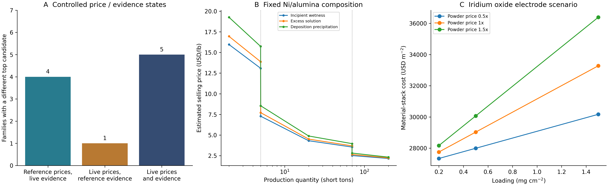

# Controlled catalyst-cost case studies

These are deterministic **model scenarios**, not observed manufacturing costs. The existing engine and source datasets were not modified. Inputs are the unified manuscript's frozen May reference basis and its separately collected live snapshot; their different dates and support-price bases preclude a same-date market-causality claim. Input/code hashes and package versions are in [provenance.json](provenance.json).

```bash
python scripts/run_controlled_cases.py --reference-basis docs/paper/submission-2026-09-07/reference_basis_2026-09-07.json --live-basis docs/paper/submission-2026-09-07/live_basis_2026-09-07.json --out-dir _local/controlled-replay --seed 20260906
```

The command uses an in-memory SQLite library and no network or application database. It writes numerical JSON, a PNG/SVG figure and provenance. The seed is retained as part of the paper command contract; this analysis enumerates conditions and does not sample a random distribution.



## Price states and source-confidence annotations

All30<!-- controlled_cases.json:summary.family_count --> reaction families use the same candidate sets, composition, decision-profile weights and route/performance scores across the crossed design. Numeric cost and cost shares are taken from either reference or live evaluation. Component source-confidence annotations independently come from reference or live evaluation. The evidence score is then recomputed with the selected cost shares. These hybrid states are labelled counterfactuals; they are not presented as genuine quotations from the other source.

Relative to the fully reference state:

| Controlled change | Families with a different top candidate |
|---|---:|
| Evidence annotations only, reference prices retained | 4<!-- controlled_cases.json:summary.changed_winner_counts.evidence_only --> |
| Numeric price state only, reference annotations retained | 1<!-- controlled_cases.json:summary.changed_winner_counts.price_only --> |
| Both channels changed | 5<!-- controlled_cases.json:summary.changed_winner_counts.combined --> |

The evidence-only changes occur in ammonia cracking, ammonia synthesis, CO PROX and dry reforming. The numeric-price-only change occurs in nitrogen reduction. The combined state changes those same families. Thus the combined recommendation count cannot be attributed entirely to market-price movement. Source-confidence scores themselves remain an author-assigned rubric; no calibrated probability of correctness is claimed. The price channel includes changes to cost-weighted evidence and the difference between fixed support proxies and reference series.

For each candidate, let F(P,E) be the application's rounded composite score. The reported price-channel contribution averages F(L,R)−F(R,R) and F(L,L)−F(R,L); the evidence-channel contribution averages F(R,L)−F(R,R) and F(L,L)−F(L,R). Their sum exactly reproduces the endpoint score difference, including allocated interaction. This decomposition applies to scores; winner-count changes are not additive causal effects. Same-basis corners are checked against native engine rankings and scores. Ties retain the current application rule: composite score, landed powder cost and slug. No cross-family or cross-unit ranking is computed.

## Manufacturing route and scale

The existing Ni/alumina baseline is held at one finished composition and reference price state. Incipient wetness, excess-solution impregnation and deposition precipitation are evaluated across the Small/Medium/Large scale boundaries, using the same scale substitution logic as the catalog. These are process scenarios; equal activity, retention yield and precursor consumption across routes have not been demonstrated.

For incipient wetness, the model changes from13.0874<!-- controlled_cases.json:manufacturing.rows[1].selling_usd_per_lb --> to7.2813<!-- controlled_cases.json:manufacturing.rows[2].selling_usd_per_lb --> USD/lb across the adjacent4.99<!-- controlled_cases.json:manufacturing.rows[1].order_short_tons --> and5<!-- controlled_cases.json:manufacturing.rows[2].order_short_tons --> short-ton scenarios. This discontinuity comes from discrete scale classes and nominal throughput assumptions; it is not an observed factory discount. The fitted substitutions and omitted operations are retained in each output row. Material LCA coverage is not a complete process inventory, even when all finished-material mass has a mapped factor.

## Electrode material-stack sensitivity

The iridium-oxide baseline uses its actual catalog-resolved powder/ionomer/membrane/substrate inputs. With the baseline powder price, the model returns27750.85<!-- controlled_cases.json:electrode.rows[3].cost_usd_per_m2 --> and33281.38<!-- controlled_cases.json:electrode.rows[5].cost_usd_per_m2 --> USD/m² at0.2<!-- controlled_cases.json:electrode.rows[3].loading_mg_cm2 --> and1.5<!-- controlled_cases.json:electrode.rows[5].loading_mg_cm2 --> mg/cm², respectively. These are area-normalized catalog material-stack scenarios derived from a25<!-- controlled_cases.json:electrode.rows[3].area_cm2 --> cm² active area, not industrial production quotations. The large substrate contribution must remain visible. Hypothetical powder-price multipliers do not alter the other material prices.

No powder Step Method processing charge, complete stack assembly, manufacturing throughput or activity/lifetime equivalence is added to this area total. Cost changes with loading therefore do not establish an optimal electrode design. The baseline-price/baseline-loading point is tested against the native electrode calculation, including dry-solids ionomer pricing when present.

## Verification and use limits

Two runs produced byte-identical numerical JSON, PNG, SVG and provenance; [hash comparison](../../audit/commercial-c05-replay-comparison-2026-09-07.json). Numerical SHA-256:`495b0fe9c5a60476bb29143082d745575976339aab5db4a3aca9c4c9fbd902ee`. The figure was visually inspected. Calculation-method reproduction remains separate from these model scenarios and from the still-missing matched independent observations. Source reuse conditions and the [distribution hold](../../commercial/rights-register-2026-09-07.md) still apply; this analysis does not clear input data for a commercial service.
