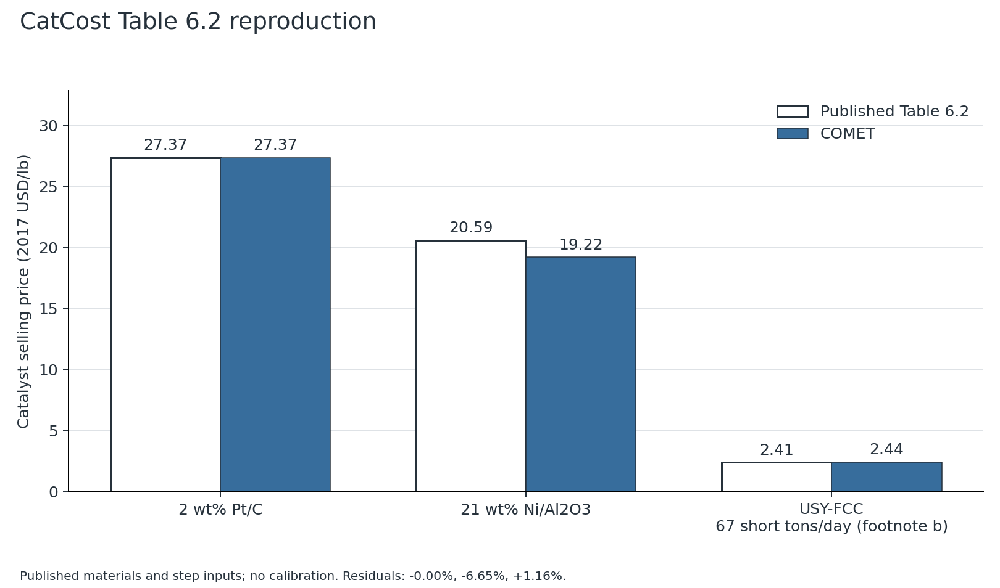
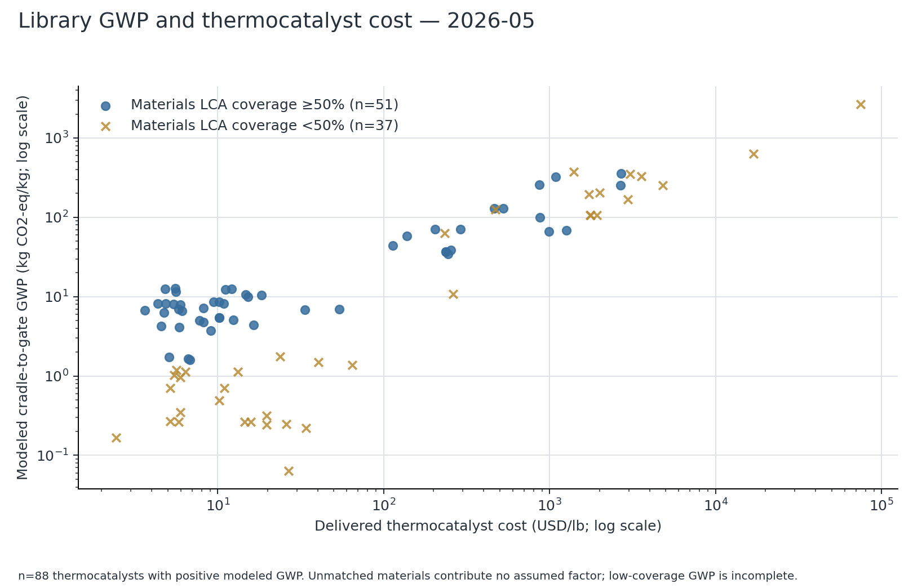
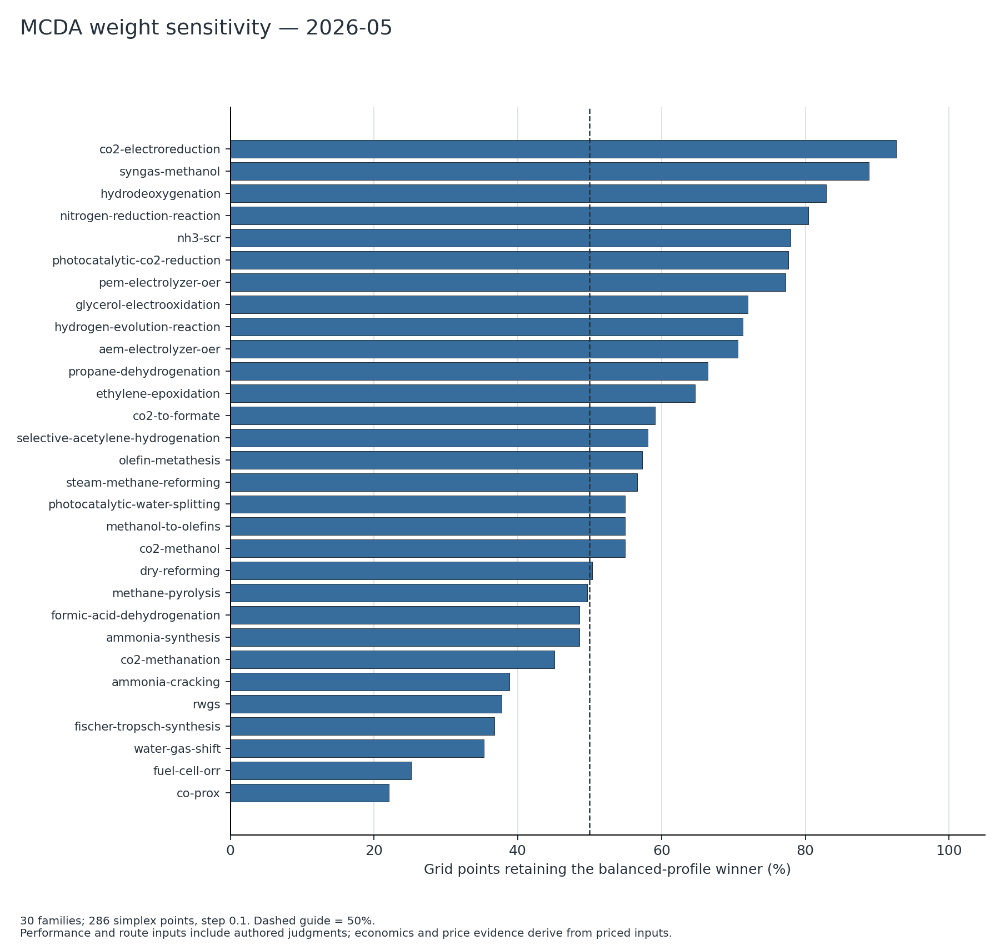
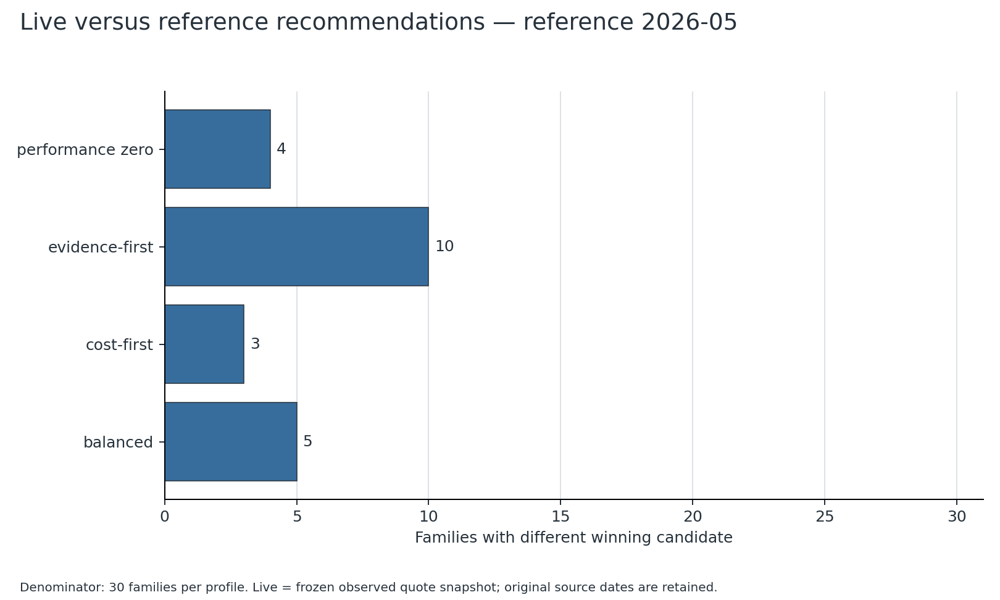
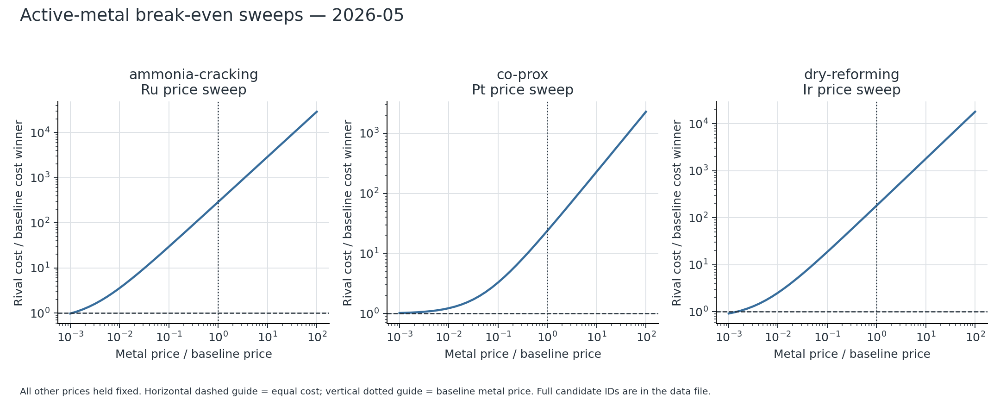
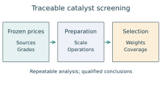

# Catalyst manufacturing costs and environmental screening across traceable price states

Authors, affiliations and corresponding-author contact: [to be supplied by the authors].

## Abstract

Catalyst recommendations depend on prices, manufacturing assumptions and the evidence attached to their inputs. We present the Catalyst Overall Manufacturing Estimation Tool (COMET), an independent implementation of published Step Method costing with frozen inputs and reproducible screening analysis. Published CatCost cases are reproduced without fitting material inputs; platinum on carbon agrees to the cent. The reference library connects 116<!-- submission-2026-09-07/paper_summary_2026-09-07.json:candidates --> candidates across 30<!-- submission-2026-09-07/paper_summary_2026-09-07.json:families --> reaction families to declared metal and support-price states. In a controlled balanced-profile comparison, changing source-confidence annotations alone changes 4<!-- controlled-2026-09-07/controlled_cases.json:summary.changed_winner_counts.evidence_only --> winners, changing numeric prices alone changes 1<!-- controlled-2026-09-07/controlled_cases.json:summary.changed_winner_counts.price_only -->, and changing both changes 5<!-- controlled-2026-09-07/controlled_cases.json:summary.changed_winner_counts.combined -->. Combined recommendation changes therefore cannot all be attributed to market movement. Fixed-composition manufacturing scenarios expose discrete scale-class boundaries, while electrode scenarios preserve the distinct area-based cost boundary. Among candidates meeting inventory-coverage conditions, preparation energy contributes a median 2.45<!-- submission-2026-09-07/paper_summary_2026-09-07.json:lca.route_share_median_pct -->% of reported global warming potential. This is a partial inventory result, not complete environmental superiority. Public procurement evidence remains unmatched for independent full-cost validation, so empirical predictive accuracy is unestimated. The study establishes inspectable, conditional screening decisions and identifies which evidence is needed to support stronger manufacturing or sustainability claims.

Keywords: techno-economic analysis; preparation routes; commodity prices; life cycle assessment; multicriteria decision analysis; reproducibility.

## Introduction

Catalyst selection combines composition and preparation with quantities rarely measured on the same basis: manufacturing cost, activity and environmental impact. A literature formulation does not specify its industrial procurement cost. Scale, material grade, delivery terms and the price state can change its apparent economic advantage. A composite recommendation also depends on preferences that must be distinguished from observed catalyst properties.

Published Step Method costing estimates precommercial catalyst prices from materials and unit operations.<sup>1</sup> CatCost subsequently connected early-stage manufacturing cost and environmental assessment.<sup>2</sup> COMET implements this methodology independently, without distributing the original workbook or claiming NREL endorsement. Uncertainty-aware process platforms such as BioSTEAM provide related prior art.<sup>3</sup> The contribution here is a reproducible comparison of catalyst choices under explicit price, route and coverage assumptions, rather than a claim to the first integrated cost-and-environmental model.

We examine whether recommendation changes arise from weighting, historical price states or single-metal cost crossings. An accompanying evidence audit asks which public purchasing observations are actually comparable to the model. Environmental findings concern manufacturing inputs; reaction productivity, lifetime and use-phase benefits remain outside the comparison.

## Methods

### Manufacturing and environmental boundaries

COMET combines materials, scale-appropriate preparation steps, overhead and the published selling-margin correlation. Repeated operations remain repeated; scale fitting substitutes listed equipment without deriving missing hourly rates. Thermal outputs use mass-based catalyst costs. Electrode assemblies use area-based catalyst, ionomer, membrane and substrate ledgers; their powder cost is labelled separately. Figure 1 connects frozen observations to resolved inputs and analysis outputs.


The published-case calculations retain the original units: one pound corresponds to 0.453592<!-- submission_metadata_2026-09-07.json:kg_per_lb --> kg and one short ton to 907.184<!-- submission_metadata_2026-09-07.json:kg_per_short_ton --> kg under the model's conversion constants. Published materials totals, multiplicities and order sizes are used without target fitting. The FCC effective rate is 67<!-- submission-2026-09-07/paper_summary_2026-09-07.json:table62[2].effective_rate_ton_per_day --> short tons/day, following the validation table's footnote. Materials global warming potential (GWP) and cumulative energy demand use the documented metal factors;<sup>4</sup> oxide mappings remain approximations. Modelled route energy is added separately. Missing support factors, solvent supply, wastewater, equipment manufacture and unmodelled coating energy prevent treating these totals as complete inventories.

### Frozen prices and evidence rules

All primary results use reference month 2026-05<!-- submission-2026-09-07/paper_summary_2026-09-07.json:basis_month -->, the latest common completed month among the combined retained series, not an assertion about the latest observation available anywhere upstream. IMF monthly observations and Johnson Matthey daily-to-monthly averages provide the institutional metal history. Uncovered metals retain labelled anchors. The support snapshot contains 10<!-- submission_metadata_2026-09-07.json:support_series --> HS-code series and 28<!-- submission_metadata_2026-09-07.json:support_observations --> observations over 2026-04<!-- submission_metadata_2026-09-07.json:support_first_month -->–2026-06<!-- submission_metadata_2026-09-07.json:support_last_month -->. These U.S. import unit values combine all grades and are not catalyst-grade quotations. Only positively weighted, exactly matched public records are accepted; missing observations are neither zero-filled nor interpolated. SI reports each series' availability.

The live comparison reuses a frozen collection made at 2026-09-06T03:04:51.569590+00:00<!-- submission-2026-09-07/reproduction_manifest_2026-09-07.json:live_snapshot.observation_finished_at_utc -->, including its original source times and anchors. It is not a contemporaneous exchange settlement. Changing price basis can change both nominal costs and cost-weighted price-evidence scores. Literature architecture, author-assigned performance/readiness judgements and price-source confidence are distinct inputs. DOI identity or URL reachability alone does not validate a formulation, grade premium or measured performance.

### Sensitivity and external comparison

Balanced, cost-first and evidence-first profiles are accompanied by a composite with performance weight removed. Evidence and route rubrics remain in that composite; it is not a purely measured-cost ranking. The weighting grid contains 286<!-- submission-2026-09-07/paper_summary_2026-09-07.json:weight_sensitivity.grid_points --> combinations. Ties resolve by lower mass cost and then candidate slug. The historical replay spans 2019-01-31<!-- submission-2026-09-07/paper_summary_2026-09-07.json:volatility.window.first -->–2026-05-31<!-- submission-2026-09-07/paper_summary_2026-09-07.json:volatility.window.last -->; series-covered metals move together by calendar month, while short support histories remain fixed at the reference baseline. It therefore measures metal-price sensitivity conditional on the stated support prices.

Single-metal sweeps hold all other prices fixed and identify cost and composite crossings separately. Seed 20260906<!-- submission-2026-09-07/reproduction_manifest_2026-09-07.json:seed --> is recorded for reproducibility; these analyses use deterministic enumeration, not Monte Carlo sampling. Public procurement and manufacturing evidence is screened for material identity, grade, currency/date, quantity and cost boundary. Ineligible records remain evidence gaps instead of being forced into an error metric.

A controlled follow-up crosses numeric reference/live costs with independently selected reference/live source-confidence annotations for the balanced profile. Composition, route/performance rubrics and decision weights remain fixed. The source-evidence score is recomputed using the selected cost shares. These hybrid states are counterfactual model inputs, not newly observed quotations. Averaging each channel's marginal score change across the other channel's states allocates their interaction and reproduces the endpoint score change; winner counts are not additive causal effects. Further controlled scenarios hold the finished Ni/alumina composition fixed across manufacturing routes and scale boundaries, and vary loading and a hypothetical powder-price multiplier in a catalog-resolved iridium-oxide electrode stack (SI Figure S1).

## Results and discussion

### Published-method reproduction and external validity

Table 1. Published Step Method cases; costs in USD/lb and residuals relative to the published value.

| Case | COMET | Published | Residual (%) |
|---|---:|---:|---:|
| Pt/C | 27.3695<!-- submission-2026-09-07/paper_summary_2026-09-07.json:table62[0].comet_usd_per_lb --> | 27.37<!-- submission-2026-09-07/paper_summary_2026-09-07.json:table62[0].published_usd_per_lb --> | -0.00183<!-- submission-2026-09-07/paper_summary_2026-09-07.json:table62[0].residual_pct --> |
| Ni/Al2O3 | 19.2206<!-- submission-2026-09-07/paper_summary_2026-09-07.json:table62[1].comet_usd_per_lb --> | 20.59<!-- submission-2026-09-07/paper_summary_2026-09-07.json:table62[1].published_usd_per_lb --> | -6.65<!-- submission-2026-09-07/paper_summary_2026-09-07.json:table62[1].residual_pct --> |
| USY-FCC, effective throughput | 2.4380<!-- submission-2026-09-07/paper_summary_2026-09-07.json:table62[2].comet_usd_per_lb --> | 2.41<!-- submission-2026-09-07/paper_summary_2026-09-07.json:table62[2].published_usd_per_lb --> | +1.16<!-- submission-2026-09-07/paper_summary_2026-09-07.json:table62[2].residual_pct --> |

Pt/C rounds to the published cent. The Ni residual follows the published size-dependent margin correlation rather than the validation table's exceptional margin treatment. FCC uses the declared effective throughput. These checks validate reproduction of the method, not manufacturing-price accuracy for a new formulation.



The separate [external evidence audit](../audit/external-cost-validation-2026-09-07.md) screened 10<!-- ../audit/external-cost-validation-2026-09-07.json:summary.candidate_case_count --> cases, including 1<!-- ../audit/external-cost-validation-2026-09-07.json:summary.contract_price_count --> signed contract-price schedule and 3<!-- ../audit/external-cost-validation-2026-09-07.json:summary.catalog_pack_price_count --> verified catalog pack offers. The contract states 16.50<!-- ../sources/external-cost-evidence-2026-09-07.json:cases[0].observation.price --> EUR/kg on a 2007-06<!-- ../sources/external-cost-evidence-2026-09-07.json:cases[0].observation.basis_month --> basis, but does not disclose a matched formulation, catalyst order mass or settled invoice. Catalog pack prices are not bulk quotes. The number of eligible full-cost matches is 0<!-- ../audit/external-cost-validation-2026-09-07.json:summary.matched_full_cost_case_count -->; empirical mean absolute percentage error remains unestimated. These findings distinguish accessible purchasing evidence from validated manufacturing accuracy (SI Table S5).

An extension screened 2<!-- submission_metadata_2026-09-07.json:additional_primary_papers --> further primary papers, bringing the bounded evidence inventory to 12<!-- submission_metadata_2026-09-07.json:screened_evidence_total -->. Laboratory activity-based costing of oxide synthesis provides independent methodological context;<sup>5</sup> a separate platinum–strontium titanate TEA explicitly applies CatCost.<sup>6</sup> Neither supplies a matched, independently observed industrial full-cost ledger. The [source review](../sources/independent-evidence-extension-2026-09-07.md) records Crossref identity checks, the retrieved DOE author copy and publisher/SI access limitations. No new prices or empirical error estimate were imported.

### Environmental contribution and coverage

Among 54<!-- submission-2026-09-07/paper_summary_2026-09-07.json:lca.route_share_eligible_candidates --> eligible candidates with positive reported GWP, modelled route energy contributes a median 2.45<!-- submission-2026-09-07/paper_summary_2026-09-07.json:lca.route_share_median_pct -->%, an upper-decile value of 5.55<!-- submission-2026-09-07/paper_summary_2026-09-07.json:lca.route_share_p90_pct -->% and a maximum of 15.19<!-- submission-2026-09-07/paper_summary_2026-09-07.json:lca.route_share_max_pct -->%. Eligibility requires at least half the materials mass to have factors and a reported process contribution. This finding supports inspecting raw materials first within that covered subset; it cannot be transferred to support-dominated cases with missing factors.

Mean materials coverage is 62.79<!-- submission-2026-09-07/paper_summary_2026-09-07.json:lca.coverage_mean_pct -->%, median coverage is 99.83<!-- submission-2026-09-07/paper_summary_2026-09-07.json:lca.coverage_median_pct -->%, and 47<!-- submission-2026-09-07/paper_summary_2026-09-07.json:lca.candidates_coverage_below_50_pct --> candidates fall below half coverage. Figure 3 marks this divided completeness and uses thermal mass costs. It does not define a complete environmental Pareto frontier.



### Weight sensitivity

The balanced winner remains first on a median 56.99<!-- submission-2026-09-07/paper_summary_2026-09-07.json:weight_sensitivity.median_balanced_winner_share_pct -->% of grid points, ranging from 22.03<!-- submission-2026-09-07/paper_summary_2026-09-07.json:weight_sensitivity.min_balanced_winner_share_pct -->% to 92.66<!-- submission-2026-09-07/paper_summary_2026-09-07.json:weight_sensitivity.max_balanced_winner_share_pct -->%. In 10<!-- submission-2026-09-07/paper_summary_2026-09-07.json:weight_sensitivity.families_below_50_pct --> families retention is below half. Removing performance weight changes 6<!-- submission-2026-09-07/paper_summary_2026-09-07.json:weight_sensitivity.performance_zero_changes --> reference-state winners. These results quantify sensitivity to declared preferences, not experimentally estimated utility or catalyst activity.



### Historical and live-versus-reference changes

Across 89<!-- submission-2026-09-07/paper_summary_2026-09-07.json:volatility.window.states --> monthly states, the balanced recommendation changes in 6<!-- submission-2026-09-07/paper_summary_2026-09-07.json:volatility.families_flipping_balanced --> families and the performance-free composite in 5<!-- submission-2026-09-07/paper_summary_2026-09-07.json:volatility.families_flipping_performance_zero -->. The latter families are ammonia-synthesis, co2-to-formate, co-prox, nitrogen-reduction-reaction, photocatalytic-water-splitting<!-- submission-2026-09-07/paper_summary_2026-09-07.json:volatility.flipping_families_performance_zero -->. Composition, route and author-assigned screening judgements remain fixed; the monthly sequence is a response to price states, not evidence of changes in catalyst performance or availability.

Switching from the monthly reference state to the frozen live tier changes 5<!-- submission-2026-09-07/paper_summary_2026-09-07.json:live_reference_comparison.changed_by_profile.balanced --> balanced, 3<!-- submission-2026-09-07/paper_summary_2026-09-07.json:live_reference_comparison.changed_by_profile.cost-first --> cost-first, 10<!-- submission-2026-09-07/paper_summary_2026-09-07.json:live_reference_comparison.changed_by_profile.evidence-first --> evidence-first and 4<!-- submission-2026-09-07/paper_summary_2026-09-07.json:live_reference_comparison.changed_by_profile.performance_zero --> performance-free winners. The evidence-first changes include the effect of source-confidence categories and cost weighting. Consequently, these counts cannot be attributed solely to metal-price movement.

The controlled balanced-profile comparison identifies 4<!-- controlled-2026-09-07/controlled_cases.json:summary.changed_winner_counts.evidence_only --> changed winners when only source annotations change, 1<!-- controlled-2026-09-07/controlled_cases.json:summary.changed_winner_counts.price_only --> when only numeric prices change, and 5<!-- controlled-2026-09-07/controlled_cases.json:summary.changed_winner_counts.combined --> when both change. Evidence-only changes occur in ammonia-cracking, ammonia-synthesis, co-prox, dry-reforming<!-- controlled-2026-09-07/controlled_cases.json:summary.changed_winners.evidence_only -->; the price-only change occurs in nitrogen-reduction-reaction<!-- controlled-2026-09-07/controlled_cases.json:summary.changed_winners.price_only -->. This decomposition separates the two channels within the model. The reference and live states differ in dates and support-price basis, so it is not a same-date causal estimate of market movement. These counts are distinct from the historical metal-series replay above.



### Cost and composite-score break-even

The analysis evaluates 120<!-- submission-2026-09-07/paper_summary_2026-09-07.json:breakeven.contests --> distinguishing-metal contests. Of 28<!-- submission-2026-09-07/paper_summary_2026-09-07.json:breakeven.precious_vs_base_sweeps --> precious-versus-base sweeps, 12<!-- submission-2026-09-07/paper_summary_2026-09-07.json:breakeven.precious_cost_crossings --> contain a cost crossing; the median multiplier is 0.00380<!-- submission-2026-09-07/paper_summary_2026-09-07.json:breakeven.precious_cost_crossing_median_factor --> relative to the reference metal price. Only 3<!-- submission-2026-09-07/paper_summary_2026-09-07.json:breakeven.precious_cost_crossings_between_0_1_and_10 --> crossings lie within the one-tenth-to-tenfold interval; 16<!-- submission-2026-09-07/paper_summary_2026-09-07.json:breakeven.precious_without_cost_crossing_in_scan --> have no crossing within the recorded scan. Absence within a finite scan is not universal dominance.

Composite crossings describe when cost outweighs other normalized criteria. They can occur without changing cost ordering, or remain absent after cost ordering changes. Activity, selectivity and lifetime may justify a manufacturing premium, but this model does not predict them. Figure 6 and the complete sweep ledger distinguish these questions.



### Manufacturing-method processing ranges

The catalog contains 28<!-- submission-2026-09-07/paper_summary_2026-09-07.json:manufacturing.20.template_count --> thermal methods evaluated at target year 2026<!-- submission-2026-09-07/paper_summary_2026-09-07.json:manufacturing.20.target_year -->. Table 2 reports processing-only catalog extremes, excluding materials, overhead, selling margin and omitted operations. These ranges are not confidence intervals for an individual route.

Table 2. Scale-specific processing-cost ranges.

| Order size (short tons) | Processing cost (USD/lb) |
|---|---:|
| 2.0<!-- submission-2026-09-07/manufacturing_costs_2026-09-07.json:scales.2.order_size_tons --> | 2.4937<!-- submission-2026-09-07/paper_summary_2026-09-07.json:manufacturing.2.min_processing_cost_per_lb -->–32.3183<!-- submission-2026-09-07/paper_summary_2026-09-07.json:manufacturing.2.max_processing_cost_per_lb --> |
| 20.0<!-- submission-2026-09-07/manufacturing_costs_2026-09-07.json:scales.20.order_size_tons --> | 0.5985<!-- submission-2026-09-07/paper_summary_2026-09-07.json:manufacturing.20.min_processing_cost_per_lb -->–6.7390<!-- submission-2026-09-07/paper_summary_2026-09-07.json:manufacturing.20.max_processing_cost_per_lb --> |
| 200.0<!-- submission-2026-09-07/manufacturing_costs_2026-09-07.json:scales.200.order_size_tons --> | 0.0884<!-- submission-2026-09-07/paper_summary_2026-09-07.json:manufacturing.200.min_processing_cost_per_lb -->–1.3546<!-- submission-2026-09-07/paper_summary_2026-09-07.json:manufacturing.200.max_processing_cost_per_lb --> |

Fusion, hydrothermal synthesis, hydrogen reduction, sulfiding and washcoating retain explicit equipment-proxy or missing-operation notes. No new autoclave, reduction-furnace, centrifuge, sieve, coating, freeze-drying, CVD or ALD rate was derived. SI preserves method sources, repeated operations and scale-specific costs.

The controlled route/scale study contains 21<!-- submission_metadata_2026-09-07.json:controlled_manufacturing_cases --> scenarios. Incipient-wetness selling price changes from 13.0874<!-- controlled-2026-09-07/controlled_cases.json:manufacturing.rows[1].selling_usd_per_lb --> to 7.2813<!-- controlled-2026-09-07/controlled_cases.json:manufacturing.rows[2].selling_usd_per_lb --> USD/lb between 4.99<!-- controlled-2026-09-07/controlled_cases.json:manufacturing.rows[1].order_short_tons --> and 5<!-- controlled-2026-09-07/controlled_cases.json:manufacturing.rows[2].order_short_tons --> short tons with the finished-material cost held fixed. This step arises from discrete scale classes and nominal production rates, not a measured factory discount or an independently validated economy of scale. Equal activity, precursor retention and yield across routes are not demonstrated.

The 9<!-- submission_metadata_2026-09-07.json:controlled_electrode_cases --> controlled electrode scenarios retain their area unit. At the baseline powder price, catalog-resolved costs increase from 27750.85<!-- controlled-2026-09-07/controlled_cases.json:electrode.rows[3].cost_usd_per_m2 --> to 33281.38<!-- controlled-2026-09-07/controlled_cases.json:electrode.rows[5].cost_usd_per_m2 --> USD/m² as loading increases from 0.2<!-- controlled-2026-09-07/controlled_cases.json:electrode.rows[3].loading_mg_cm2 --> to 1.5<!-- controlled-2026-09-07/controlled_cases.json:electrode.rows[5].loading_mg_cm2 --> mg/cm². These are mixed catalog material-stack scenarios, not industrial assembly quotations or designs matched for activity, lifetime or plant throughput. They illustrate the boundary required when interpreting high electrode-area costs alongside powder mass costs.

## Limitations

The library contains 83<!-- submission-2026-09-07/paper_summary_2026-09-07.json:screening_basis_counts.literature_architecture_proxy --> literature-architecture proxies and 29<!-- submission-2026-09-07/paper_summary_2026-09-07.json:screening_basis_counts.engineering_proxy --> engineering proxies, alongside explicitly labelled specialised bases. Source verification is not uniform validation of all compositions. Public contract or catalog observations do not automatically match the model's grade, order size and delivery boundary. All-grade support unit values can differ substantially from catalyst-grade purchases; their short history cannot establish long-run support volatility.

No generic carbon, silica or zeolite LCA factor was inferred from a chemically or geographically different inventory. Missing impacts, scale substitution, throughput, partial inflation indices and recovery scenarios are reported separately rather than combined into an unsupported universal error bar. The analysis excludes deactivation, regeneration, lifetime productivity and use-phase impacts. Monte Carlo bounds elsewhere in the software are user-defined scenarios; deterministic repetition does not establish their empirical distributions.

Controlled model scenarios do not replace independent observations. A prepared external-researcher evaluation protocol has not yet produced participant results; automated browser checks establish software behavior only. Commercial access controls, test counts and repeatable calculations do not establish customer adoption or an empirical accuracy bound. Source-data reuse permissions remain separate from scientific citation and code licensing.

## Conclusions

COMET enables inspectable catalyst screening under fixed sources, preparation assumptions and decision profiles. Materials dominate reported GWP in the sufficiently covered subset, while weights and price basis can change recommendations. Cost crossings require separate interpretation from composite-score crossings. Publishing the selected candidate together with its snapshot, coverage and uncosted operations makes those conclusions reproducible without overstating environmental or procurement accuracy.

## Data and code availability

The [COMET repository](https://github.com/hyunjin-kor/COMET) uses PolyForm Noncommercial 1.0.0, which is not an OSI-approved open-source license. The prepared version is 1.4.0<!-- submission-2026-09-07/reproduction_manifest_2026-09-07.json:project_version -->; tag `v1.4.0` is planned, not asserted as published. The project concept DOI [10.5281/zenodo.21451931](https://doi.org/10.5281/zenodo.21451931) identifies the existing deposit, not a newly deposited submission version. No original CatCost workbook or commercial life-cycle database is redistributed.

The existing library nevertheless includes legacy records declaring CatCost workbook/sheet origins. Their presence is disclosed in the [rights register](../commercial/rights-register-2026-09-07.md); exclusion of the original workbook does not clear derived-record redistribution. A new release and commercial hosted startup remain gated on data-origin review. Free access to IMF, Comtrade or market websites does not itself confer commercial reuse permission. The retained research artifacts are not a blanket license to redistribute source data or a claim that the proposed company has acquired rights.

The metal-history SHA-256 is 84888f60f59d4a21a47945f1f98576c1824bc20babbde678c7419cf3806d4c69<!-- submission-2026-09-07/reproduction_manifest_2026-09-07.json:history.sha256 -->; the support-history SHA-256 is b6ac7e3f3309d73c8cfe6c0a61547c576e68d522d5f25e94312a6d992a01fa29<!-- submission-2026-09-07/reproduction_manifest_2026-09-07.json:support_history.sha256 -->. The [manifest](submission-2026-09-07/reproduction_manifest_2026-09-07.json) records source snapshots, code/data hashes, package versions and commands. Reproduce this price month and all six analysis figures offline with:

```bash
python scripts/reproduce_paper.py --price-basis reference --month 2026-05 --seed 20260906 --date 2026-09-07 --out-dir _local/submission-replay-2026-09-07 --history docs/paper/submission-2026-09-07/price_history_2026-09-07.json --support-history docs/paper/submission-2026-09-07/support_history_2026-09-07.json --live-basis docs/paper/submission-2026-09-07/live_basis_2026-09-07.json
```

Rebuild the manuscript and SI with `python scripts/build_submission_manuscript.py --directory docs/paper/submission-2026-09-07`; append `--check` to verify retained documents against their JSON inputs. All computed claims carry file/key references in HTML comments. The original earlier-month manuscript remains a historical artifact; this manuscript, SI and figure set consistently use the run above.

The controlled numerical output SHA-256 is 495b0fe9c5a60476bb29143082d745575976339aab5db4a3aca9c4c9fbd902ee<!-- submission_metadata_2026-09-07.json:controlled_output_sha256 -->; its [provenance](controlled-2026-09-07/provenance.json) records the original analysis code/data hashes and environment. Re-run its additional SI figure using the same frozen states:

```bash
python scripts/run_controlled_cases.py --reference-basis docs/paper/submission-2026-09-07/reference_basis_2026-09-07.json --live-basis docs/paper/submission-2026-09-07/live_basis_2026-09-07.json --out-dir _local/controlled-replay --seed 20260906
```

The publication format follows the provisional journal review in [the target record](journal-targets-2026-09-07.md). Exact JIF year, JCR category/quartile, publication-cost coverage and author approval remain unconfirmed; no submission has occurred.

## Supporting information

Candidate formulations and screening bases, manufacturing methods and scale-specific costs, source/reuse register and support observation availability, error-budget evidence, external procurement comparison eligibility (Markdown); complete analytical outputs, input hashes and environment manifest (JSON); vector and raster analysis figures (SVG and PNG).

## Acknowledgments

Funding, contributions and acknowledgments: [to be supplied by the authors].

OpenAI Codex assisted with software development, source-audit organization and manuscript drafting. Human authors retain responsibility for reviewing the evidence, calculations and submitted text; no AI system is listed as an author.

## Competing interests

Subscription commercialization through a professor-associated company is proposed. The authors must confirm the actual company relationship, ownership, financial interests, institutional permissions and disclosure wording before submission. This draft does not assert an executed license, commercial revenue or an absence of competing interests.

## References

1. Baddour, F. G.; Snowden-Swan, L.; Super, J. D.; Van Allsburg, K. M. Estimating Precommercial Heterogeneous Catalyst Price: A Simple Step-Based Method. *Organic Process Research & Development* **2018**, *22* (12), 1599–1605. [DOI](https://doi.org/10.1021/acs.oprd.8b00245).
2. Van Allsburg, K. M.; Tan, E. C. D.; Super, J. D.; Schaidle, J. A.; Baddour, F. G. Early-stage evaluation of catalyst manufacturing cost and environmental impact using CatCost. *Nature Catalysis* **2022**, *5* (4), 342–353. [DOI](https://doi.org/10.1038/s41929-022-00759-6).
3. Cortes-Peña, Y.; Kumar, D.; Singh, V.; Guest, J. S. BioSTEAM: A Fast and Flexible Platform for the Design, Simulation, and Techno-Economic Analysis of Biorefineries under Uncertainty. *ACS Sustainable Chemistry & Engineering* **2020**, *8* (8), 3302–3310. [DOI](https://doi.org/10.1021/acssuschemeng.9b07040).
4. Nuss, P.; Eckelman, M. J. Life Cycle Assessment of Metals: A Scientific Synthesis. *PLoS ONE* **2014**, *9* (7), e101298. [DOI](https://doi.org/10.1371/journal.pone.0101298).
5. Gkika, D. A.; Kyzas, G. Z. Cost Evidence Yields the Viability of Metal Oxides Synthesis Routes. *ACS Sustainable Chemistry & Engineering* **2025**, *13* (41), 17370–17379. [DOI](https://doi.org/10.1021/acssuschemeng.5c06752).
6. Ferdous, S.; Gracida-Alvarez, U. R.; Ferrandon, M.; Delferro, M.; Benavides, P. T.; Urgun-Demirtas, M. Techno-economic and life cycle analyses of the synthesis of a platinum–strontium titanate catalyst. *Catalysis Science & Technology* **2025**, *15* (15), 4419–4429. [DOI](https://doi.org/10.1039/d5cy00189g).

## TOC graphic

For Table of Contents Only. The editable preview below has a companion RGB TIFF at the specified submission size.


