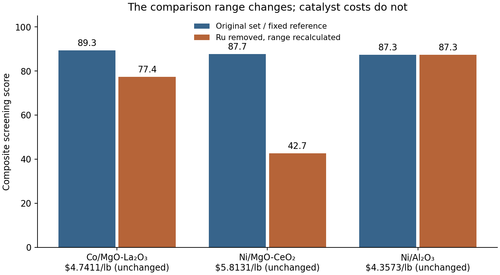

# 비교 후보가 달라지면 추천이 바뀌는 이유

현재 COMET은 같은 반응군에서 가장 싼 후보를 경제성 100점, 가장 비싼 후보를 0점으로 환산한다. 따라서 비교 범위가 넓을수록 작은 가격 차이는 점수에서 작게 나타난다.

```text
경제성 점수 = 100 × (가장 높은 원가 − 해당 후보 원가) / (가장 높은 원가 − 가장 낮은 원가)
```

경제성 점수와 종합 점수는 소수점 첫째 자리로 반올림한다. 원가가 모두 같으면 같은 경제성 점수를 부여한다. 종합 점수는 경제성·근거·제조 경로·성능 평가의 가중합이며, 동점일 때는 같은 기능 단위의 원가와 고정된 후보 ID로 순서를 정한다.

## 실제 고정 데이터에서의 사례

암모니아 분해 반응군의 reference 가격으로 계산한 결과다. Ru/MgO 후보의 원가는 1,265.9574 USD/lb라서, 나머지 세 후보의 원가 차이가 전체 비교 범위에서 작게 보인다. Ru 후보를 제외하면 최고 원가는 Ni/MgO-CeO₂의 5.8131 USD/lb가 된다.

| 후보 | 계산 원가 (USD/lb, 동일) | 경제성 점수: 전 → 후 | 종합 점수: 전 → 후 |
|---|---:|---:|---:|
| Co/MgO-La₂O₃ | 4.7411 | 100.0 → 73.6 | 89.3 → 77.4 |
| Ni/MgO-CeO₂ | 5.8131 | 99.9 → 0.0 | 87.7 → 42.7 |
| Ni/Al₂O₃ | 4.3573 | 100.0 → 100.0 | 87.3 → 87.3 |

이 반응군의 가중치는 경제성 45%, 근거 20%, 제조 경로 20%, 성능 평가 15%다. 다른 점수와 가격은 고정했지만, Co 후보와 Ni/Al₂O₃ 후보의 추천 순서가 바뀐다. Co 후보의 **제조원가가 올라간 것이 아니라 가격 차이를 점수로 표현하는 기준이 바뀐 것**이다.



## 고정 기준 대조가 보여주는 것

Ru 후보를 제외해도 원래의 가격 범위로 점수를 유지하면 살아남은 후보들의 점수와 순서는 유지된다. 전체 86개 후보 제외 사례 중 상대 범위를 다시 계산하면 9건에서 추천이 바뀌었고, 원래 기준을 고정하면 0건이었다. 이는 후보 목록을 변경해 재평가하는 분석 실험이다. 화면에서 후보를 단순히 숨기는 모든 동작이 이 실험처럼 재계산된다는 주장은 아니다.

이 상대 점수 방식은 현재 비교 목록에서 저렴한 정도를 표현한다. 다른 목록·시점의 점수까지 절대 경제성으로 비교하면 안 된다. 고정 기준도 기준 가격을 누가 어떻게 정할지 결정해야 하므로 자동으로 객관적인 척도가 되지는 않는다. 이번에는 원래 추천식을 유지하고, 이 성질과 대조 결과를 원고·SI에 공개했다.

## 논문에서의 의미

순위 역전은 기존 다기준 의사결정 연구에 알려진 현상이다. COMET이 이를 처음 발견했다는 주장을 하지 않는다. 이 연구는 촉매 후보군에서 실제 원가와 다른 점수를 고정한 상태로 영향을 재현하고, 추천 해석에 필요한 조건을 함께 남긴다.

모든 수치는 [추가 분석 JSON](methods-2026-09-09/methods_study.json)의 `normalization`에 있다. 기존 [전체 분석](robustness-2026-09-08/decision_robustness.json), [선행연구 대조](../sources/paper-methods-prior-work-2026-09-09.md), SI S11·그림 S3와 대응한다. 후보의 성능 평가는 연구자가 정한 선별 점수이며, 위 표가 실제 반응 성능이나 산업 납품 가격을 측정한 것은 아니다.
