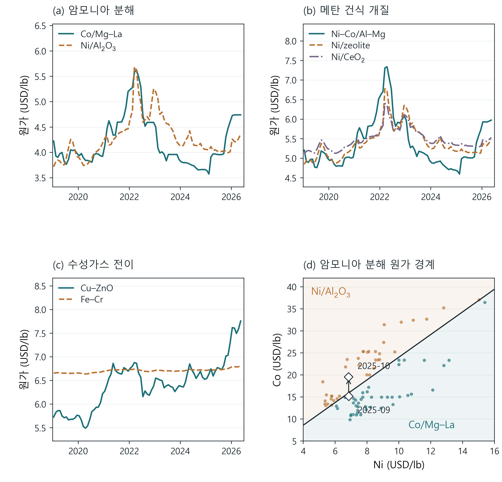
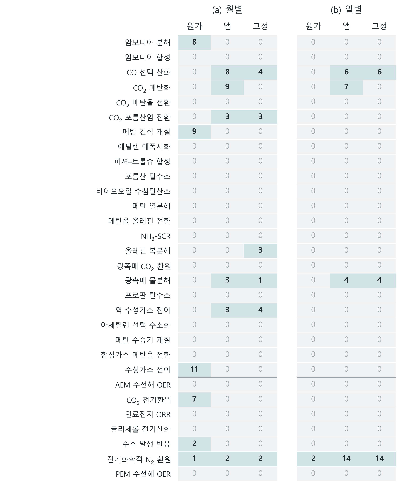
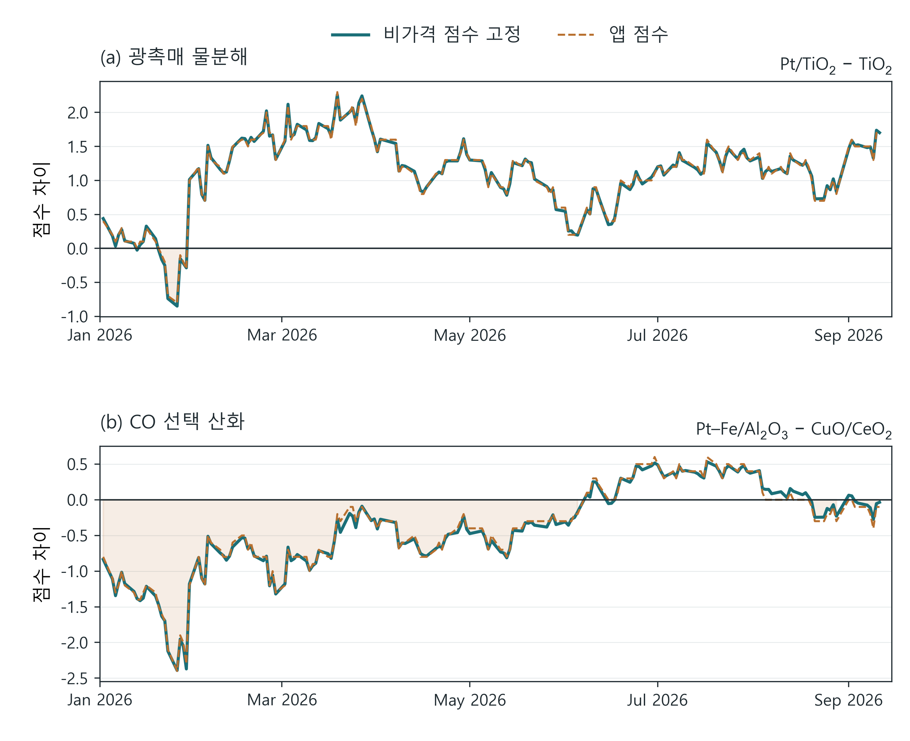

# 가격 변화에 따른 촉매 원가·순위 역전

2026-09-13 · COMET 1.4.0 전수 재계산 결과. 이번 분석 그림은 기존 원고의 네 그림과 별도로 만든 연구 결과이며, v36 영문·한글 원고 본문은 아직 바꾸지 않았다. [영문 방법·캡션·재현 절차](README.md).

## 논문에서 제시할 수 있는 결과

가장 설명력이 좋은 결과는 **같은 코발트 가격 변화가 두 수소 생산 반응군의 최저 원가 후보를 함께 바꾼다**는 것이다. 2025년 9월과 10월의 관측 금속 가격을 같은 제조 조건에 넣으면 다음과 같이 바뀐다.

| 후보의 추정 조달 원가, USD/lb | 9월 가격 적용 | 10월 가격 적용 |
|---|---:|---:|
| 암모니아 분해 Co/Mg–La | 3.9770 | 4.3070 |
| 암모니아 분해 Ni/알루미나 | 4.0329 | 4.0319 |
| 건식개질 Ni–Co/Al–Mg | 5.0329 | 5.3957 |
| 건식개질 Ni/제올라이트 | 5.1535 | 5.1525 |

두 반응군 모두 9월에는 Co를 포함한 후보가 저렴하지만 10월에는 Ni 대안이 저렴하다. 10월의 Ni 대안은 각각 Co 후보보다 약 6.4%, 4.5% 저렴하다. 이는 당시 실제 촉매 판매가가 아니라 **현재의 고정된 제조 가정에 당시 금속 가격만 적용한 결과**다. 원가에는 간접비·마진이 포함된 추정 판매 단가와 경로별 추가비용이 들어간다.

원인도 분리했다. Co는 15.1872→19.5706 USD/lb로 오르고 Ni는 6.8507→6.8457 USD/lb로 거의 유지된다. 다른 가격을 고정하고 Co만 바꾸면 암모니아 후보 간 원가 차이 변화 0.3310 USD/lb 중 0.3300을 설명한다. 건식개질에서는 0.3638 중 0.3631을 설명한다. 두 사례 모두 네 후보 전체를 계산했고, 이 대안들이 실제로 해당 상태의 최저 원가 후보인지 확인했다.

89개월 전체에서는 최저 원가 후보가 암모니아 분해에서 8회, 건식개질에서 9회, 수성가스 전환에서 11회 바뀐다. 그동안 세 반응군의 종합 추천 1위는 바뀌지 않는다. 따라서 이 결과의 의미는 **금속 가격을 갱신하면 어떤 후보를 경제성 측면에서 다시 검토해야 하는지 알 수 있다**는 데 있다. 최저 원가와 종합 추천을 같은 결과로 표현하면 안 된다.

## 빠짐없이 계산한 범위

23개 열촉매 반응군과 7개 전기화학 반응군, 총 **30개 반응군·116개 후보·168개 후보쌍**을 계산했다. 월별 89개와 일별 176개 가격 상태를 적용한 후보 계산은 총 30,740건이다. 역전이 잘 나타나는 후보만 남기거나 가중치를 조정하지 않았다. 대표 그림은 전수 분석 후 원인을 설명하기 좋은 사례를 골랐으며, 역전이 없는 결과도 모두 보존했다.

| 결과 | 월별 | 일별 |
|---|---:|---:|
| 관측 기간 | 2019-01~2026-05 | 2026-01-02~2026-09-11 |
| 공통 가격 상태 수 | 89 | 176 |
| 바뀌는 금속 가격 수 | 14 | 10 |
| 최저 원가 후보가 바뀐 반응군 | 6 | 1 |
| 양쪽 상태에서 차순위 대비 1% 초과 우위를 갖는 최저 원가 변경 반응군 | 5 | 0 |
| 어떤 후보쌍이든 원가 순서가 바뀐 반응군 | 10 | 4 |
| 원가 순서가 바뀐 후보쌍 | 14/168 | 4/168 |
| 앱 추천 1위가 바뀐 반응군 | 6 | 4 |
| 비가격 점수와 반올림 영향을 제거해도 1위가 바뀐 반응군 | 6 | 3 |

월별 최저 원가 변경 반응군은 암모니아 분해, 건식개질, 수성가스 전환, CO₂ 전기환원, 수소 발생, 전기화학적 질소 환원이다. 관측 기간·주기·가격 범위가 다른 월별과 일별의 변경 횟수를 변화율이나 확률처럼 비교하지 않는다. 1%는 작은 차이를 구별하기 위한 기술적 기준이며 원가 모델의 불확실성 범위가 아니다.

그림의 ‘원가’는 최저 원가 후보 변경, ‘앱’은 반올림과 원가 동점 규칙을 포함한 앱의 1위 변경이다. ‘고정’은 기준 시점의 출처·공정·성능 점수를 고정하고 경제성 점수와 총점의 반올림을 제거한 결과다. 이 경우에도 각 날짜의 동일한 전체 후보군으로 경제성 점수를 정규화한다. 정규화 범위까지 기준 시점에 고정한 추가 대조 결과는 JSON에 있다. 표의 0은 누락이 아니라 해당 조건에서 변경을 관측하지 못했다는 뜻이다.

## 일별 가격으로 확인한 사례

광촉매 물분해군에서 Pt/TiO₂와 TiO₂의 비가격 고정 점수 차이는 2026년 1월 19일 +0.1418에서 20일 −0.0274로 바뀐다. Pt는 2,375→2,428 USD/troy oz로 올랐다. 19일의 다른 가격을 고정하면 점수 역전 경계는 Pt 약 **2,419 USD/troy oz**다. 이때 Rh는 10,100 USD/troy oz이며, 다른 가격이나 정규화 조건을 바꾸면 경계도 달라진다.

20일의 실제 앱 총점은 82.0 대 82.0으로 동점이어서 ‘엄격한 앱 점수 역전’으로 세지 않는다. 21일에는 Pt/TiO₂ 81.9, TiO₂ 82.0으로 차이가 생기며 30일 다시 뒤집힌다. 전체 일별 기간에서 비가격 점수 고정·반올림 제거 후 광촉매군은 4회, CO 선택 산화는 6회 변경된다. 두 반응군 모두 최저 원가 후보는 그대로다. 점수 차이가 작으므로 산업적 우열이 확실하다고 해석할 수 없고, 선택되지 않은 Rh 포함 후보도 경제성 정규화 범위를 통해 결과에 영향을 준다.

CO₂ 메탄화는 앱 1위가 7회 바뀌지만 비가격 점수를 고정하면 변경이 사라진다. 가격 변화에 따라 재료비 비중과 그 비중으로 계산한 가격 출처 점수가 달라진 결과다. 따라서 이를 최저 원가 역전이나 성능 개선으로 보고하지 않는다.

일별 최저 원가 변경이 있는 질소 환원군은 수계 Cu 후보와 플라스마 비교 경로 사이에서 두 번 바뀐다. 그러나 수계 Cu 쪽 최대 우위는 0.70%이고, 양쪽에서 차순위보다 1% 넘게 저렴한 상태 사이의 변경은 없다. 이 후보들은 플라스마·리튬 매개·수계 경로를 포함하며 질소 고정 생산량 기준의 동등한 촉매 비교가 아니다. 이번 결과를 ‘현재 실시간으로 더 좋은 질소 환원 촉매를 발견했다’고 쓰지 않는다.

## 가격 자료와 해석 조건

- 월별 자료는 기존 논문의 동결된 14개 금속 가격을 사용했다. 지지체와 공학적 고정 가격은 2026년 5월 기준값이다.
- 일별은 [Johnson Matthey 뉴욕 기준](https://matthey.com/products-and-markets/pgms-and-circularity/pgm-management)의 Pt·Pd·Rh·Ir·Ru와 [Westmetall LME 현물](https://www.westmetall.com/en/markdaten.php)의 Al·Cu·Ni·Sn·Zn이다. **Co·Mo·Au·Ag 등 나머지 가격은 5월 기준값으로 고정**했다. 따라서 모든 재료를 실시간으로 재평가한 결과는 아니다.
- JM에는 2025년부터 436개 일별 날짜가 있었지만 이번에 받은 LME 표는 2026년부터였다. 열 금속이 모두 존재하는 176개 날짜만 사용했다. 보간·결측일 채움은 하지 않았다. 최종 관측일은 9월 11일이고 다운로드 날짜 9월 13일과 구분한다.
- 조성·제조 공정·주문량·경로별 추가비용·가격 출처 표기·반응군별 균형 가중치를 고정했다. AEM·PEM OER는 USD/cm², 나머지 28개 반응군은 USD/lb이며 반응군 사이의 원가 순위는 매기지 않는다. 분말 질량당 값은 전극 면적이나 제품 생산량당 경제성과 다르다. 월별 분석에서 PEM 네 후보와 AEM 네 후보 중 세 후보의 면적당 원가는 고정된 전극 라이브러리·기본 가격 때문에 일정하다. 따라서 이들의 역전 횟수 0을 실제 전극 원가가 금속 시세에 민감하지 않다는 증거로 해석하면 안 된다.
- 원가 동점 허용치는 0.0002 USD/lb 또는 0.000002 USD/cm²다. 동점 구간은 양쪽의 엄격한 우위 관측일로 감싸서 기록하며, 그 사이의 정확한 역전 날짜를 지어내지 않는다.
- 현재 엔진으로 기준 후보 116개와 월별 반응군 계산 2,670개를 다시 수행하여 기존 동결 원장과 일치함을 확인했다. 앱의 실제 DB 대신 메모리 DB를 사용했다.

열촉매 후보도 같은 조건에서 검증된 대체재는 아니다. Co/Mg–La의 지지체 배합은 문헌 조성을 그대로 재현한 값이 아니라 저자가 설정한 근사값이다. 수성가스 전환의 고온·저온 촉매는 운전 구간이 다르고, CO₂ 전기환원 후보들은 생성물이 다를 수 있다. 광촉매 수소 발생 예시가 모두 동일한 전체 물분해 성능을 입증한 것도 아니다. 활성·선택도·수명·재생·실제 전구체 구매·공정 통합 비용은 새로 검증하지 않았다. 이번 논문 결과는 새로운 촉매 실험 발견이 아니라 가격 갱신에 따른 후보 재검토를 재현 가능하게 보여준다.

JM의 기본 차트 API는 긴 기간에서 월평균을 반환했다. 새 수집기는 명시적인 DAILY CSV와 뉴욕 지역을 사용한다. 귀금속을 역순으로 요청했을 때 CSV 제목과 값의 순서가 맞지 않는 응답도 발견해 제외했다. 최종 Pt·Pd·Rh·Ir·Ru 순서의 다섯 열은 9월 11일 별도 현재 시세와 각각 대조했다. 잘못된 탐색 응답은 분석에서 사용하지 않았다. 원자료는 `_local/price-crossovers-2026-09-13/`에 두었고, 공개 접근 가능성이 재배포 권리를 뜻한다고 해석하지 않는다. 유료 API·결제·외부 게시·푸시는 없었다.

## 캡션과 전체 결과

**그림 R1. 원가 역전.** (a) 암모니아 분해, (b) 메탄 건식개질, (c) 수성가스 전환의 월별 가격 적용 원가. 89개월 중 한 번이라도 최저 원가가 된 후보를 표시했으며 실제 계산에는 모든 후보를 유지했다. 선은 관측 가격 상태를 연결하며 월중 정확한 역전 시점을 뜻하지 않는다. (d) Co/Mg–La와 Ni/알루미나의 원가가 같은 조건부 Ni–Co 경계. 51개 Ni 가격에서 엔진 재계산과 이분법으로 구했다. 점은 월별 가격, 마름모와 화살표는 2025년 9→10월이다. 두 영역의 이름은 두 후보 중 더 저렴한 후보를 뜻하며 통계적 신뢰구간은 아니다.

**그림 R2. 일별 순위 변화.** (a) 광촉매군과 (b) CO 선택 산화군의 후보 점수 차이. 양수이면 각 패널 위에 먼저 쓴 후보가 우세하다. 실선은 비가격 점수를 고정하고 반올림을 제거한 계산, 점선은 앱 총점이다. 0은 동점 경계, 음영은 실선 점수 차이가 음수인 구간이다. 두 반응군의 최저 원가 후보는 바뀌지 않는다. 작은 점수 차이를 촉매 반응 성능이나 산업적 대체 가능성으로 해석하지 않는다.

**그림 R3. 전수 변경 횟수.** 30개 반응군의 월별·일별 첫 순위 변경 횟수. ‘원가’, ‘앱’, ‘고정’의 정의는 앞 절과 같다. 가로선 위는 열촉매 23개, 아래는 전기화학 7개 반응군이다. 두 관측 기간의 횟수를 같은 확률이나 변화율로 비교하지 않는다.

**전체 후보 원가 곡선:** [한글 30쪽 PDF](figures/all_candidate_costs.ko.pdf), [영문 30쪽 PDF](figures/all_candidate_costs.pdf). 모든 후보를 고유 카탈로그 식별자로 구분해 반응군당 한 쪽에 표시했으며 원가 축은 로그 축이다. 상세 원가 패널에서 제외한 고가 후보와 1위를 하지 못한 후보도 모두 포함한다. [후보별 30,740개 계산 CSV](candidate_costs.csv), [전수 집계 CSV](family_summary.csv), [전체 JSON](price_crossovers.json), [기작·경계 JSON](crossover_mechanisms.json)에 원값·점수·역전 구간·대조 조건을 보관했다.

본문 후보는 Co 가격 변화에 따른 두 열촉매 반응군의 동시 원가 역전을 중심으로 구성하는 것이 타당하다. 일별 추천 점수 그림과 전수 결과는 그 결론의 적용 범위와 한계를 뒷받침한다. 추가 그림은 기존 5,000 word-equivalent 원고에 아직 삽입하지 않았으므로, 현재 원고는 4,964·그림 4개 상태를 유지한다.
