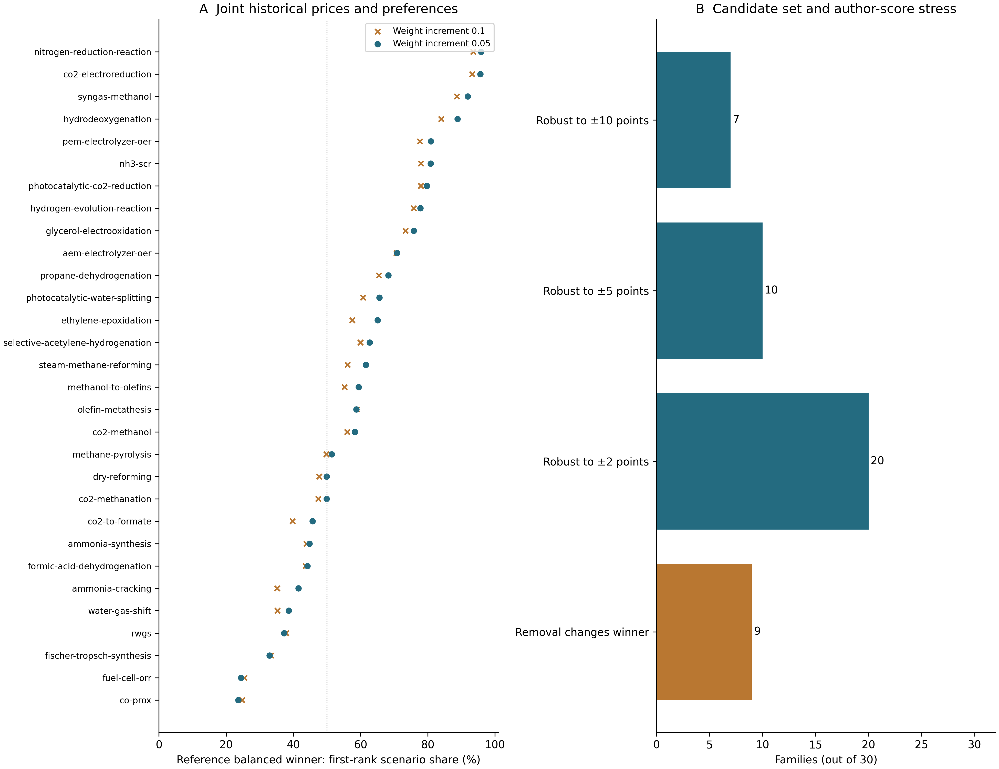

# Decision robustness study — 2026-09-08

This package adds a reproducible scientific question to COMET: which recommendations survive joint price/preference changes, and which depend on the candidate set or author-assigned scores? It extends the methods paper without asserting independent industrial accuracy.

## Reproduce

```bash
python scripts/run_decision_robustness.py --out-dir _local/robustness-replay-new --seed 20260906
```

Defaults read the preserved May 2026 reference and normalized monthly history in `docs/paper/submission-2026-09-07/`. No network or user database is used. The output directory must be new or empty. NumPy/SQLModel and the existing Matplotlib figure runtime are used; no dependency was added.

## Results

| Result | Value | JSON key in decision_robustness.json |
|---|---:|---|
| Reaction families | 30 | `summary.families` |
| Candidates | 116 | `summary.candidates` |
| Synchronous monthly states | 89 | `summary.months` |
| Median reference-choice first-rank share (%) | 60.4977825 | `summary.reference_winner_joint_share_median_pct` |
| Families below 50% reference-choice share | 11 | `summary.families_reference_winner_below_half_joint` |
| Nonwinner-removal cases | 86 | `summary.candidate_removal_cases` |
| Removal cases changing winner | 9 | `summary.candidate_removal_winner_changes` |
| Families changing winner after removal | 9 | `summary.candidate_removal_families_changed` |
| Maximum grid-refinement share difference (percentage points) | 7.589943 | `summary.grid_refinement_max_share_change_pp` |

The fine grid contains 1,771 preference vectors and 4,728,570 family–month–weight scenarios. The coarser grid contains 286 vectors. The score-box analysis leaves 20, 10 and 7 families robust at ±2, ±5 and ±10 route/performance points, respectively. These values are stored in `summary.weight_points`, `summary.joint_scenarios_all_families` and `summary.rubric_robust_family_counts`.



## What these results mean

- Frequency means the fraction of explicitly enumerated scenarios. It is not a probability of future success or an empirically elicited preference distribution. Grid refinement still changes some candidate shares by 7.59 percentage points; continuous-grid convergence is not claimed.
- Regret is a rounded composite-score gap, not dollars, production yield or measured catalytic utility. Full rank counts, score ledgers, weight vectors and worst-case corners permit independent recomputation.
- Historical states change numeric metal prices synchronously and retain reference source annotations, support prices and anchors. This preserves observed metal co-movement but is not an as-of forecast backtest. Recomputed evidence cost shares still contribute to score changes.
- Four families lacking complete assembly inputs (CO2 electroreduction, glycerol electrooxidation, HER and NRR) explicitly compare catalyst powder cost throughout. Remaining complete electrode families use area cost. No new assembly defaults or activity equivalence was invented.
- Removing a candidate rescales min–max economics. The original winner always survives when the original economic scale is retained, isolating the normalization mechanism. The app retains its documented within-family normalization.
- Route/performance boxes are analyst-selected adverse scenarios; they are not confidence intervals or calibrated distributions.

## Evidence and writing package

The [updated manuscript](../manuscript_2026-09-08.md) and [SI](../si_2026-09-08.md) include the new methods/results and per-family Table S8. [The claim map](../research-claims-2026-09-08.ko.md) separates supported conclusions from missing external evidence. The [numerical-difference ledger](../../audit/research-numerical-delta-2026-09-08.json) explains changes to earlier price/weight screens; old dated artifacts remain untouched.

`provenance.json` records input/source SHA-256, output hashes and Python/package versions. The numerical JSON, CSV, PNG, SVG and provenance were byte-identical in a second execution. These checks establish computational reproducibility, not industrial procurement accuracy.
