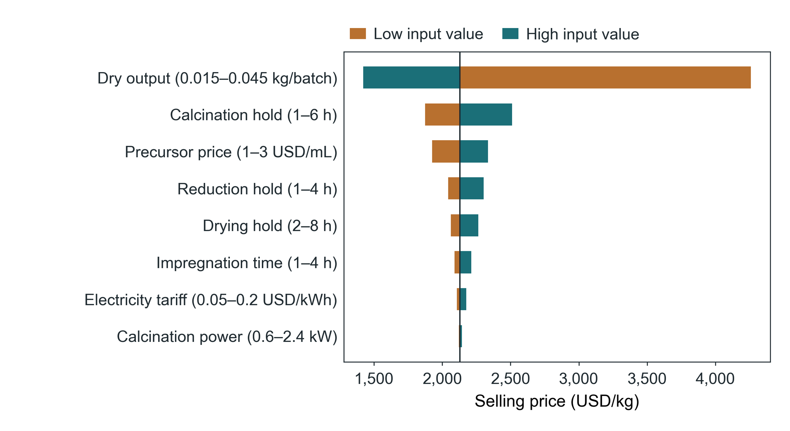
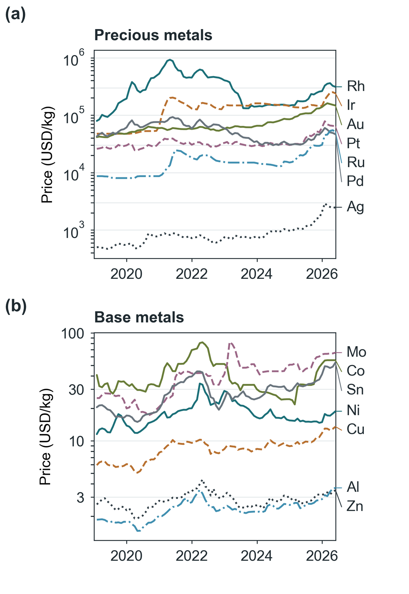

# Supporting Information

COMET: Catalyst Overall Manufacturing Estimation Tool

## S1. Calculation methods and boundaries

This Supporting Information describes the manufacturing calculation, declared inputs, numerical verification, screening results, observed-price cost crossovers, preparation-evidence coverage and application views. The May 2026 screening results retain their original formulations and assumptions. The later preparation review does not retrospectively validate those formulations. The new manufacturing example is a hypothetical software demonstration, not an experimental catalyst cost or a comparison of matched catalytic performance.

The screening calculations use the published Step Method and its cost-accounting framework.1,2 In the batch calculation, purchases replace composition-based materials costs and operation costs replace Step Method processing costs. For each operation, electricity is measured kWh or the sum of mean power multiplied by ramp, hold and additional durations. For temperatures in °C and a ramp rate in °C/min, eq S1 gives the ramp duration in hours. Equipment occupancy is charged for the full entered operation duration; attended labor is a separate input. Gas volume is flow multiplied by its selected duration, using matching reference conditions for flow and price. Temperature, stirring speed and pressure are retained as preparation conditions; they do not infer equipment power, staffing, chemical yield or performance.

Intermediate charges are allocated by used/recovered mass or used/prepared volume of a homogeneous solution, with successive fractions multiplied along a chain. An explicit whole-batch option assigns the full incurred expenditure to its destination before subsequent transfers. Actual operation times and incurred expenditures remain distinct from their allocated shares. Unknown recovery prevents proportional allocation. Branching transfers, co-products and density-based conversions are not inferred. Figure S1 illustrates the allocation chain: a solution aliquot charged by volume fraction, an intermediate solid transferred by mass fraction, and the final dry batch that carries the allocated shares.

Equations S1–S6 define the calculation. General and administrative (G&A) and sales, administrative, research and distribution (SARD) overheads are applied sequentially before the selling margin. The example excludes disposal, analytical testing, waste credits, catalyst use, tax, freight and any equipment cost not represented in the stated occupancy rate. Occupancy rates are assumed aggregate charges, not measured depreciation or purchase prices. Unknown required inputs are not treated as zero. Dry powder mass is not an electrode-area denominator.

tᵣ = |T₁ − T₀|/(60r)    (S1)

Eᵢ = Σⱼ Pᵢⱼtᵢⱼ    (S2)

Vᵢ = 60Fᵢtᵍᵢ/1000    (S3)

Bᵢ = Bᵖᵢ + pₑEᵢ + qᵢtᵢ + wℓᵢ + pᵍᵢVᵢ + Aᵢ    (S4)

C = (Σᵢ aᵢBᵢ)/M    (S5)

P = C(1 + g)(1 + s)/(1 − m)    (S6)

In eq S1, T₀ and T₁ are the initial and target temperatures and r is the ramp rate. In eq S2, Eᵢ is operation electricity (kWh), Pᵢⱼ is mean power (kW), and tᵢⱼ is the duration (h) of phase j, including any explicitly powered additional period. Measured electricity can replace eq S2. In eq S3, Fᵢ is gas flow (L/min), tᵍᵢ is its selected duration (h), and Vᵢ is volume (m³); flow and price must refer to the same temperature and pressure.

In eq S4, Bᵢ is incurred expenditure (USD), Bᵖᵢ is purchases assigned to the operation (USD), pₑ is electricity price (USD/kWh), qᵢ is equipment occupancy rate (USD/h), tᵢ is full occupancy (h), w is labor rate (USD/person-hour), ℓᵢ is attendance (person-hour), pᵍᵢ is gas price (USD/m³), and Aᵢ is an explicit additional charge (USD). Sums over multiple gases or purchases are implicit. Repeated operations contribute their incurred expenditure for each repetition. In eq S5, aᵢ is the dimensionless share allocated to the final batch and M is its recovered dry mass (kg); direct final-batch operations have aᵢ = 1. For proportional transfers, aᵢ is the product of used/recovered mass fractions or used/prepared solution-volume fractions along the transfer chain. Whole-batch charging contributes a factor of one at that transfer. In eq S6, C is manufacturing cost (USD/kg), P is selling price (USD/kg), and g, s and m are dimensionless G&A, SARD and selling-margin fractions.

## S2. Declared manufacturing inputs

Every numerical input below is an assumption chosen for arithmetic verification. The example does not identify a specific active phase or precursor chemistry. Dry output is independently specified; precursor stoichiometry and material yield are not inferred. The composition fields retained by the application are inactive for the purchase-based materials calculation.

Tables S1 and S2 specify the operating conditions and purchases used in eqs S1–S6. Final dry output: 0.030 kg. Electricity: 0.10 USD/kWh. Labor: 10.00 USD/person-hour. G&A and SARD: 0.05 and 0.05; selling margin: 0.10. One batch is evaluated. The 2025 price-basis fields do not apply an index escalation to this direct batch calculation.

All thermal operations start at 20 °C and ramp at 5 °C/min. Each includes one additional hour of passive cooling/handling with explicitly zero additional electricity but continued equipment occupancy. Cooling is a declared duration, not a heat-transfer calculation. Reduction gas flows throughout ramp, hold and additional time at 0.1 L/min and costs 10 USD/m³; both flow and price refer to 0 °C and 1 atm. Its chemical composition is unspecified because this is an arithmetic scenario.

Table S1. Assumed operating conditions for the 0.030 kg manufacturing example.

| Operation | Hold target (°C) | Hold or mixing (h) | Ramp / hold power (kW) | Equipment (USD/h) | Attendance (person-h) |
|---|---:|---:|---|---:|---:|
| Impregnation | Not assigned | 2 | Constant 0.05 | 1 | 0.25 |
| Drying | 120 | 4 | 0.4 / 0.25 | 0.8 | 0.1 |
| Calcination | 500 | 3 | 2 / 1.2 | 3 | 0.1 |
| Reduction | 400 | 2 | 1.5 / 0.6 | 2 | 0.25 |

Table S2. Assumed purchases charged at impregnation.

| Purchase at impregnation | Quantity | Unit price | Batch expenditure (USD) |
|---|---:|---:|---:|
| Specified precursor solution (illustrative) | 5 mL | 2 USD/mL | 10.0000 |
| Support (illustrative) | 24 g | 0.05 USD/g | 1.2000 |
| Solvent (illustrative) | 100 mL | 0.01 USD/mL | 1.0000 |

## S3. Independent arithmetic verification

Tables S3 and S4 report an independent scalar evaluation of eqs S1–S6. Thermal durations include ramp, hold and the additional hour. The application programming interface (API) produces the same baseline and endpoint results. The regression also checks the application's seeded Monte Carlo summary and histogram counts.

Table S3. Calculated operation durations and electricity consumption.

| Operation | Occupancy (h) | Electricity (kWh) |
|---|---:|---:|
| Impregnation | 2.000000 | 0.100000 |
| Drying | 5.333333 | 1.133333 |
| Calcination | 5.600000 | 6.800000 |
| Reduction | 4.266667 | 3.100000 |

Table S4. Manufacturing-cost contributions, overheads and selling margin.

| Cost component | Contribution per batch (USD) | Per dry product (USD/kg) |
|---|---:|---:|
| Purchases | 12.200000 | 406.666667 |
| Electricity | 1.113333 | 37.111111 |
| Equipment occupancy | 31.600000 | 1053.333333 |
| Attended labor | 7.000000 | 233.333333 |
| Gas | 0.256000 | 8.533333 |
| Manufacturing cost | 52.169333 | 1738.977778 |
| G&A | 2.608467 | 86.948889 |
| SARD | 2.738890 | 91.296333 |
| Margin | 6.390743 | 213.024778 |
| Selling price | 63.907433 | 2130.247778 |

Manufacturing cost before overheads and margin is 1738.977778 USD/kg; selling price is 2130.247778 USD/kg. One extra calcination hour costs (1.2 kW × 0.1 USD/kWh + 3 USD/h)/0.030 kg × 1.05 × 1.05/0.90 = 127.40 USD/kg. Attendance does not change in this scenario.

## S4. Manufacturing sensitivity and uncertainty

Table S5 changes only the named input at each endpoint; all other batch inputs remain fixed. Temperature does not determine an assumed power change. The dry-output endpoints therefore assess cost allocation, not predicted chemical yields or scale economies.

Table S5. One-at-a-time sensitivity endpoints for the manufacturing example.

| Varied input | Low | High | Selling price at low (USD/kg) | Selling price at high (USD/kg) |
|---|---:|---:|---:|---:|
| Dry output | 0.015 kg/batch | 0.045 kg/batch | 4260.4956 | 1420.1653 |
| Precursor price | 1.0 USD/mL | 3.0 USD/mL | 1926.0810 | 2334.4144 |
| Impregnation time | 1.0 h | 4.0 h | 2089.2103 | 2212.3227 |
| Drying hold | 2.0 h | 8.0 h | 2062.8729 | 2264.9977 |
| Calcination hold | 1.0 h | 6.0 h | 1875.4477 | 2512.4478 |
| Calcination power | 0.6 kW | 2.4 kW | 2122.8978 | 2144.9478 |
| Reduction hold | 1.0 h | 4.0 h | 2043.6812 | 2303.3810 |
| Electricity tariff | 0.05 USD/kWh | 0.2 USD/kWh | 2107.5173 | 2175.7088 |

Figure S2 plots the same endpoints as departures from the baseline selling price. Dry output dominates because the fixed batch expenditure is divided by the recovered mass; calcination power changes the price little because electricity is a small part of the assumed operating cost compared with equipment occupancy (Table S4).

Figure 3(c) evaluates 21 calcination-hold values from 1 to 6 h at each of three dry masses (0.015, 0.030 and 0.045 kg), giving 63 scenarios. The machine-readable manufacturing data retain all 63 input–output pairs.

Monte Carlo uses seed 20260915 and 1000 trials. Independent uniform bounds are 0.024–0.036 kg dry output, 2–4 h calcination hold, 0.9–1.5 kW hold power and 0.06–0.12 USD/kWh. All other inputs are fixed. Successful/failed trials: 1000/0. Mean selling price is 2164.6042 USD/kg; the 5th and 95th percentiles are 1778.9261 and 2629.8509 USD/kg. These are scenario percentiles, not statistical confidence bounds. Individual sampled inputs and results are retained in the JavaScript Object Notation (JSON) data. The application ordinarily excludes and counts invalid combinations without clamping; this example has none. The accompanying reproduction instructions specify the random-number implementation and call sequence. Figure S3 shows the distribution of the trial results and the sampled dry output against the resulting selling price; the sampled dry output accounts for most of the spread.

## S5. Frozen price and screening basis

The following May 2026 costs use the original screening formulations and route assumptions, not the subsequently curated preparation records. Table S6 reports estimated selling prices for 116 screening candidates; it does not report measured manufacturing costs. Powder values are converted from the stored legacy USD/lb fields using 1 lb = 0.45359237 kg. An electrode candidate's powder price is distinct from assembly cost per area. These observations do not establish equivalent activity or commercial quotation validity.

Figure S4 summarizes historical metal-price inputs from Johnson Matthey and the International Monetary Fund (IMF).3,5 Westmetall supplies additional current metal quotations.4 Environmental mass coverage is the fraction assigned a screening inventory factor, including compound proxies; it is not a measure of inventory accuracy.6

Table S6. Estimated powder selling prices and environmental mass coverage at May 2026 prices.

| Reaction family | Candidate model | Selling price (USD/kg) | Mass coverage (%) |
|---|---|---:|---:|
| AEM OER (anion-exchange-membrane oxygen evolution reaction) | Cr-doped amorphous NiFe | 88.7608 | 100.00 |
| AEM OER (anion-exchange-membrane oxygen evolution reaction) | Seed-assisted NiFe | 79.5137 | 100.00 |
| AEM OER (anion-exchange-membrane oxygen evolution reaction) | NiCo₂O₄ spinel | 75.9109 | 100.00 |
| AEM OER (anion-exchange-membrane oxygen evolution reaction) | NiFe layered double hydroxide | 70.0902 | 100.00 |
| Ammonia cracking | Co/MgO–La₂O₃ | 10.4523 | 100.00 |
| Ammonia cracking | Ni–MgO/CeO₂ interface | 12.8157 | 100.00 |
| Ammonia cracking | Ni/γ-Al₂O₃ | 9.6062 | 100.00 |
| Ammonia cracking | Ru/MgO | 2790.9583 | 100.00 |
| Ammonia synthesis | Cs-promoted Co₃Mo₃N | 118.7672 | 97.98 |
| Ammonia synthesis | Promoted fused iron (magnetite/wüstite) | 11.1847 | 96.47 |
| Ammonia synthesis | Cs/Ba-promoted Ru on graphitized carbon | 6530.4608 | 8.00 |
| Ammonia synthesis | Ru/CaFH | 10564.7251 | 12.00 |
| CO₂ electroreduction | Ag cathode for CO production | 4101.4184 | 100.00 |
| CO₂ electroreduction | Cu cathode for multicarbon products | 61.8511 | 100.00 |
| CO₂ electroreduction | Sn cathode for formate production | 95.1356 | 100.00 |
| CO₂ electroreduction | Au cathode for CO production | 281017.0718 | 100.00 |
| CO₂ methanation | Ni/CeO₂ | 10.6186 | 100.00 |
| CO₂ methanation | Ni/Al₂O₃ | 11.9757 | 100.00 |
| CO₂ methanation | Ru/layered titanate | 3877.2098 | 5.00 |
| CO₂ methanation | Ru/MnOₓ | 3878.5315 | 5.00 |
| CO₂ hydrogenation to methanol | Cu/ZnO/Al₂O₃ | 18.1024 | 100.00 |
| CO₂ hydrogenation to methanol | Cu/ZrOₓ–MgO interface | 12.8794 | 79.00 |
| CO₂ hydrogenation to methanol | In₂O₃–ZrO₂ | 303.3056 | 100.00 |
| CO₂ hydrogenation to methanol | Pd/In₂O₃ | 1020.7473 | 100.00 |
| CO₂ hydrogenation to formate | PdAg on N-doped carbon | 4416.2301 | 10.00 |
| CO₂ hydrogenation to formate | Single-atom Ru on Mg–Al layered double hydroxide | 579.7370 | 0.50 |
| CO₂ hydrogenation to formate | Ru pincer complex | 37236.9820 | 30.00 |
| CO₂ hydrogenation to formate | Ir pincer complex | 164689.0396 | 30.00 |
| CO-PROX (preferential CO oxidation) | CuO–CeO₂ | 26.7652 | 100.00 |
| CO-PROX (preferential CO oxidation) | Fe-promoted Pt/Al₂O₃ | 639.0068 | 100.00 |
| CO-PROX (preferential CO oxidation) | Au/TiO₂ nanoparticles | 5893.9647 | 100.00 |
| DRM (dry reforming of methane) | Ni–Co/Al–Mg–O | 13.1709 | 9.50 |
| DRM (dry reforming of methane) | Ni/CeO₂ single sites | 12.1927 | 100.00 |
| DRM (dry reforming of methane) | Ni/zeolite | 12.0646 | 12.00 |
| DRM (dry reforming of methane) | Ir@CeO₂₋ₓ | 2179.5878 | 100.00 |
| Ethylene epoxidation | Ag–Cs/Al₂O₃ | 522.9759 | 99.95 |
| Ethylene epoxidation | Ag/α-Al₂O₃ | 522.3891 | 100.00 |
| Ethylene epoxidation | Cu–Ag/α-Al₂O₃ | 539.3653 | 99.70 |
| Ethylene epoxidation | Ag–Cs–Re/Al₂O₃ | 558.0821 | 99.95 |
| FTS (Fischer–Tropsch synthesis) | Fe/SiO₂ | 11.4116 | 30.00 |
| FTS (Fischer–Tropsch synthesis) | Precipitated Fe–Cu–K | 14.6014 | 91.00 |
| FTS (Fischer–Tropsch synthesis) | Co/Al₂O₃ | 32.4728 | 100.00 |
| FTS (Fischer–Tropsch synthesis) | Co on carbon nanotubes | 89.1113 | 15.00 |
| Formic acid dehydrogenation | Co single atoms/nanoparticles on N-doped carbon | 22.5899 | 3.00 |
| Formic acid dehydrogenation | Pt–Mo ensembles | 3081.2293 | 5.00 |
| Formic acid dehydrogenation | Pd/C | 3807.3101 | 5.00 |
| Formic acid dehydrogenation | Au–Pd in amine-grafted MIL-101 | 7853.1905 | 4.00 |
| ORR (oxygen reduction reaction) in fuel cells | Fe–N–C cathode | 16.0913 | 2.00 |
| ORR (oxygen reduction reaction) in fuel cells | Pt–Co intermetallic cathode | 18886.2868 | 30.00 |
| ORR (oxygen reduction reaction) in fuel cells | Pt/C cathode | 18522.1982 | 20.00 |
| ORR (oxygen reduction reaction) in fuel cells | PtNi octahedra | 83318.5611 | 80.00 |
| Glycerol electrooxidation | NiOOH anode | 47.2971 | 100.00 |
| Glycerol electrooxidation | Pt/C anode | 22406.7422 | 20.00 |
| Glycerol electrooxidation | Pt–Bi anode for dihydroxyacetone production | 50258.8582 | 47.50 |
| Glycerol electrooxidation | Au/C anode | 56250.1089 | 20.00 |
| HDO (hydrodeoxygenation) | CoMoS/Al₂O₃ | 23.9371 | 100.00 |
| HDO (hydrodeoxygenation) | NiMo/carbon | 29.1162 | 15.00 |
| HDO (hydrodeoxygenation) | Pt/SiO₂ | 1039.2192 | 1.00 |
| HDO (hydrodeoxygenation) | Ru/C | 4229.4993 | 5.00 |
| HER (hydrogen evolution reaction) | NiMo cathode (alkaline) | 69.2432 | 100.00 |
| HER (hydrogen evolution reaction) | MoS₂ cathode (acidic) | 81.1098 | 100.00 |
| HER (hydrogen evolution reaction) | Pt/C cathode | 20415.5978 | 20.00 |
| HER (hydrogen evolution reaction) | Ru@C₂N cathode | 27439.4750 | 30.00 |
| Methane pyrolysis | Activated carbon | 5.3619 | 0.00 |
| Methane pyrolysis | Fe/Al₂O₃ | 10.0685 | 100.00 |
| Methane pyrolysis | Ni/SiO₂ | 27.3622 | 75.00 |
| Methane pyrolysis | Molten Ni–Bi alloy | 52.4974 | 27.00 |
| MTO (methanol-to-olefins conversion) | H-ZSM-5 | 12.8155 | 0.00 |
| MTO (methanol-to-olefins conversion) | Zn/ZSM-5 | 13.1541 | 3.00 |
| MTO (methanol-to-olefins conversion) | SAPO-34 (chabazite) | 31.8927 | 0.00 |
| MTO (methanol-to-olefins conversion) | Nanosized SAPO-34 | 34.7792 | 0.00 |
| NH₃-SCR (selective catalytic reduction with ammonia) | V₂O₅–WO₃/TiO₂ monolith | 13.4658 | 100.00 |
| NH₃-SCR (selective catalytic reduction with ammonia) | Fe-ZSM-5 | 11.3778 | 2.00 |
| NH₃-SCR (selective catalytic reduction with ammonia) | Cu-SSZ-13 | 43.4765 | 2.50 |
| NRR (nitrogen reduction reaction) | Li-mediated cathode | 75.7325 | 100.00 |
| NRR (nitrogen reduction reaction) | Plasma-assisted ammonia synthesis | 73.7277 | 0.00 |
| NRR (nitrogen reduction reaction) | Cu in aqueous electrolyte | 75.2034 | 100.00 |
| NRR (nitrogen reduction reaction) | Li-mediated flow cell with proton shuttle | 128.6827 | 0.00 |
| Olefin metathesis | WO₃/SiO₂ | 14.0428 | 7.00 |
| Olefin metathesis | MoO₃/SiO₂–Al₂O₃ | 24.2224 | 8.00 |
| Olefin metathesis | W–H/Al₂O₃ single-site hydride | 20.8809 | 100.00 |
| Olefin metathesis | Re₂O₇/Al₂O₃ | 250.0110 | 100.00 |
| PEM OER (proton-exchange-membrane oxygen evolution reaction) | Low-Ir interface architecture | 568137.6982 | 100.00 |
| PEM OER (proton-exchange-membrane oxygen evolution reaction) | Ru-rich anode | 403860.4635 | 100.00 |
| PEM OER (proton-exchange-membrane oxygen evolution reaction) | IrO₂/TiO₂ anode | 164456.7105 | 100.00 |
| PEM OER (proton-exchange-membrane oxygen evolution reaction) | IrO₂ anode | 568136.8646 | 100.00 |
| Photocatalytic CO₂ reduction | TiO₂ | 22.4838 | 100.00 |
| Photocatalytic CO₂ reduction | g-C₃N₄/SnS₂ Z-scheme | 57.0411 | 0.00 |
| Photocatalytic CO₂ reduction | Monoclinic BiVO₄ | 75.2019 | 0.00 |
| Photocatalytic CO₂ reduction | Cu₂O/metal–organic framework heterojunction | 142.5976 | 40.00 |
| Photocatalytic water splitting | Pt/TiO₂ | 1161.1655 | 100.00 |
| Photocatalytic water splitting | TiO₂ (anatase) | 22.4838 | 100.00 |
| Photocatalytic water splitting | g-C₃N₄ | 43.4066 | 0.00 |
| Photocatalytic water splitting | SrTiO₃:Al with Rh/Cr₂O₃ and CoOOH | 6744.6335 | 2.00 |
| PDH (propane dehydrogenation) | CrOₓ/Al₂O₃ | 7.9962 | 79.50 |
| PDH (propane dehydrogenation) | h-BN (oxidative dehydrogenation) | 59.0120 | 0.00 |
| PDH (propane dehydrogenation) | Pt–Sn/Al₂O₃ | 450.1581 | 100.00 |
| PDH (propane dehydrogenation) | PtZn intermetallic/zeolite | 515.6427 | 1.50 |
| RWGS (reverse water–gas shift) | Cu/CeO₂ | 12.3734 | 100.00 |
| RWGS (reverse water–gas shift) | Mo₂N | 73.9741 | 100.00 |
| RWGS (reverse water–gas shift) | Cs–Fe–Cu/Al₂O₃ | 18.1509 | 99.00 |
| RWGS (reverse water–gas shift) | Pt/TiO₂ | 1914.8446 | 100.00 |
| Selective acetylene hydrogenation | NiZn intermetallic | 13.0930 | 100.00 |
| Selective acetylene hydrogenation | Pd–Cu single-atom alloy | 22.5652 | 100.00 |
| Selective acetylene hydrogenation | Pd/Al₂O₃ | 33.5268 | 100.00 |
| Selective acetylene hydrogenation | Pd–Ag bimetallic | 40.5472 | 100.00 |
| SMR (steam methane reforming) | Ni on calcium aluminate | 12.4299 | 14.50 |
| SMR (steam methane reforming) | Sn/Ni surface alloy | 10.7092 | 100.00 |
| SMR (steam methane reforming) | Rh/Al₂O₃ | 5961.2564 | 100.00 |
| Methanol synthesis from syngas | Cu/ZnO/Al₂O₃ | 20.0202 | 100.00 |
| Methanol synthesis from syngas | Ga-promoted Cu/ZnO | 36.1395 | 97.00 |
| Methanol synthesis from syngas | Pd/ZnO intermetallic | 1919.3189 | 100.00 |
| WGS (water–gas shift) | Cu/ZnO/Al₂O₃ | 17.1054 | 100.00 |
| WGS (water–gas shift) | Co–CeO₂ interface | 24.6225 | 100.00 |
| WGS (water–gas shift) | Fe₂O₃–Cr₂O₃(–CuO) | 15.0009 | 87.62 |
| WGS (water–gas shift) | Pt/CeO₂ | 2388.8929 | 100.00 |

Names identify the original screening models, not experimentally verified compositions or performance-equivalent catalysts. Family membership follows the original screening catalog, including related reaction variants; it does not imply identical reaction conditions. g-C₃N₄ denotes graphitic carbon nitride; h-BN, hexagonal boron nitride; SAPO, silicoaluminophosphate. MIL-101, ZSM-5 and SSZ-13 retain their established material identifiers.

Ranking calculations use the original four criterion weights and assigned route/performance scores retained in the frozen methods and robustness files. The complete 0.05 weight grid contains 1,771 nonnegative combinations summing to one. With 89 months and 30 families, it defines 4,728,570 scenarios. Support prices remain at baseline in monthly metal-price tests. Candidate removal is tested both with recomputed and retained cost normalization ranges. Score tests lower the baseline candidate and raise alternatives by 2, 5 or 10 points, bounded by 0 and 100. Frequencies are conditional on these enumerated scenarios. No probability distribution for future market prices or catalyst performance is inferred.

Figure S5 replays the frozen screening calculation under the 89 monthly metal-price states with formulations, order sizes, route assumptions and support prices fixed.3,5 Across these states the lowest-cost candidate changes 8 times for ammonia cracking, 9 times for methane dry reforming and 11 times for water–gas shift, while the balanced-weight recommendation of these families does not change. The September–October 2025 cobalt price increase from 33.48 to 43.15 USD/kg reverses the lowest-cost candidate in ammonia cracking and methane dry reforming while nickel is nearly unchanged. These are conditional model comparisons between screening candidates, not contemporaneous supplier quotations or performance comparisons.

![Figure S5. Observed-price cost crossovers. Modeled selling prices under the 89 monthly price states for the candidates that attain the lowest cost at any state in (a) ammonia cracking, (b) methane dry reforming and (c) water–gas shift; lines connect observed states and do not locate a crossover date. (d) Conditional equal-cost boundary between the Co/MgO–La₂O₃ and Ni/γ-Al₂O₃ ammonia-cracking candidates as a function of nickel and cobalt prices; points are monthly price states, diamonds mark September and October 2025, and shading identifies the cheaper candidate. Co/Mg–La denotes Co/MgO–La₂O₃; Ni–Co/Al–Mg, Ni–Co/Al–Mg–O; Ni/CeO₂, Ni/CeO₂ single sites; Cu–ZnO, Cu/ZnO/Al₂O₃; Fe–Cr, Fe₂O₃–Cr₂O₃(–CuO) (Table S6). Other prices and engineering assumptions remain at reference values.](figures-si-2026-09-16/figS5_crossovers.png)

## S6. Preparation evidence and unresolved inputs

The library has 92 source-specific preparations from 71 primary sources. Of 116 screening candidates, 75 link to at least one preparation; 41 have no curated preparation. Bibliographic verification covers 401 digital object identifiers (DOIs). Links may describe variants. No candidate has jointly verified catalog composition, complete preparation, utilities, recovered output and prices. Table S7 counts source/formulation discrepancies even where a related preparation is available.

Table S7. Preparation-evidence coverage and unresolved source/formulation discrepancies.

| Reaction family | Candidates | With preparation | Source mismatch flagged |
|---|---:|---:|---:|
| AEM OER (anion-exchange-membrane oxygen evolution reaction) | 4 | 2 | 2 |
| Ammonia cracking | 4 | 2 | 1 |
| Ammonia synthesis | 4 | 3 | 0 |
| CO-PROX (preferential CO oxidation) | 3 | 2 | 0 |
| CO₂ electroreduction | 4 | 4 | 1 |
| CO₂ methanation | 4 | 3 | 3 |
| CO₂ hydrogenation to methanol | 4 | 3 | 3 |
| CO₂ hydrogenation to formate | 4 | 1 | 0 |
| DRM (dry reforming of methane) | 4 | 4 | 1 |
| Ethylene epoxidation | 4 | 1 | 0 |
| FTS (Fischer–Tropsch synthesis) | 4 | 2 | 0 |
| Formic acid dehydrogenation | 4 | 3 | 1 |
| ORR (oxygen reduction reaction) in fuel cells | 4 | 3 | 2 |
| Glycerol electrooxidation | 4 | 4 | 0 |
| HDO (hydrodeoxygenation) | 4 | 2 | 1 |
| HER (hydrogen evolution reaction) | 4 | 3 | 0 |
| Methane pyrolysis | 4 | 3 | 0 |
| MTO (methanol-to-olefins conversion) | 4 | 2 | 0 |
| NH₃-SCR (selective catalytic reduction with ammonia) | 3 | 3 | 0 |
| NRR (nitrogen reduction reaction) | 4 | 4 | 0 |
| Olefin metathesis | 4 | 1 | 0 |
| PEM OER (proton-exchange-membrane oxygen evolution reaction) | 4 | 4 | 0 |
| Photocatalytic CO₂ reduction | 4 | 1 | 1 |
| Photocatalytic water splitting | 4 | 3 | 0 |
| PDH (propane dehydrogenation) | 4 | 3 | 2 |
| RWGS (reverse water–gas shift) | 4 | 2 | 3 |
| Selective acetylene hydrogenation | 4 | 1 | 3 |
| SMR (steam methane reforming) | 3 | 0 | 0 |
| Methanol synthesis from syngas | 3 | 2 | 0 |
| WGS (water–gas shift) | 4 | 4 | 2 |

Mutually exclusive catalog assessment counts: Preparation unverified; no curated variant: 34; Source/formulation discrepancy flagged: 26; Source-specific variant available: 56. Figure S6 shows these assessments by reaction family.

The companion preparation-evidence document and JSON contain all candidate assessments, source titles and DOIs, section locators, reported operation inputs, per-field evidence, transfer boundaries and unresolved values. The final targeted lookup rechecked 101 existing citations for 42 then-unlinked candidates; nine accessible texts were assessed. A failed public-copy lookup does not establish that no free source exists elsewhere. Kelvin-to-Celsius and time conversions are explicit. Overnight, room temperature, approximate values and unspecified recovery remain unquantified. Primary articles, third-party SI files and private author attachments are not redistributed.

Operating references preserve geography, period and basis. U.S. Energy Information Administration (EIA) electricity averages can be selected as explicit scenarios; U.S. Bureau of Labor Statistics (BLS) wage statistics and manufacturer connected-load ratings remain references, not measured batch costs or average operating power. Actual staffing, utility consumption and supplier prices require separate evidence.

Figure S7 illustrates the record structure preserved for each imported preparation: the located source passage, the structured record in which reported values and later user modifications are distinguished, and the resulting cost contribution with its checksum.

## S7. Application interface

Figure S8 shows two views of COMET 1.4.0 recorded with an isolated database and no external price service. Panel (a) shows the source attached to one imported input: the purchased quantity of a reagent in the first operation of the PtSn/Al₂O₃ pellet preparation record imported from its Methods section,7 with the citation, locator, DOI, access date and recorded value. Unreported conditions of imported records remain blank. Panel (b) shows the evidence section of the result page for the illustrative batch of Tables S1–S4, with the time, electricity and the electricity, equipment, labor and gas costs of each operation.

## S8. References

[1] Baddour, F. G.; Snowden-Swan, L.; Super, J. D.; Van Allsburg, K. M. Estimating Precommercial Heterogeneous Catalyst Price: A Simple Step-Based Method. *Organic Process Research & Development* **2018**, *22* (12), 1599–1605. https://doi.org/10.1021/acs.oprd.8b00245.

[2] Van Allsburg, K. M.; Tan, E. C. D.; Super, J. D.; Schaidle, J. A.; Baddour, F. G. Early-stage evaluation of catalyst manufacturing cost and environmental impact using CatCost. *Nature Catalysis* **2022**, *5* (4), 342–353. https://doi.org/10.1038/s41929-022-00759-6.

[3] Johnson Matthey. PGM Prices and Trading. https://matthey.com/products-and-markets/pgms-and-circularity/pgm-management (accessed September 11, 2026).

[4] Westmetall. Market Data: Prices and LME Stocks. https://www.westmetall.com/en/markdaten.php (accessed September 11, 2026).

[5] International Monetary Fund. Primary Commodity Price System (PCPS), SDMX 2.1 data service. https://api.imf.org/external/sdmx/2.1/dataflow/IMF.RES/PCPS (accessed September 11, 2026).

[6] Nuss, P.; Eckelman, M. J. Life Cycle Assessment of Metals: A Scientific Synthesis. *PLoS ONE* **2014**, *9* (7), e101298. https://doi.org/10.1371/journal.pone.0101298.

[7] Niu, H.; Ma, J.; Gan, L.; Li, K. The Acid Roles of PtSn@Al₂O₃ in the Synthesis and Performance of Propane Dehydrogenation. *Molecules* **2024**, *29* (13), 2959. https://doi.org/10.3390/molecules29132959.
