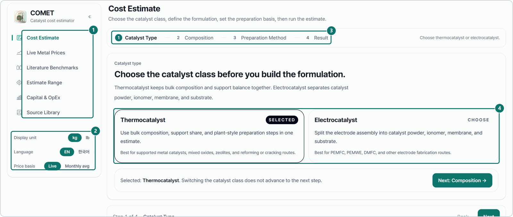
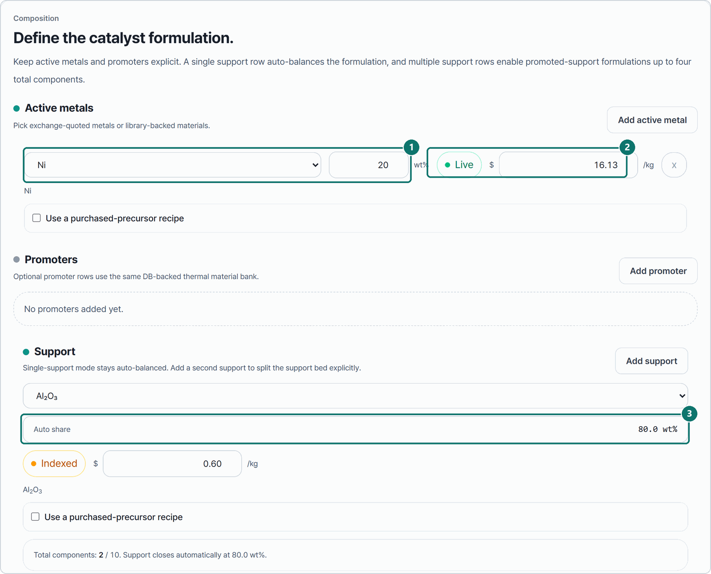
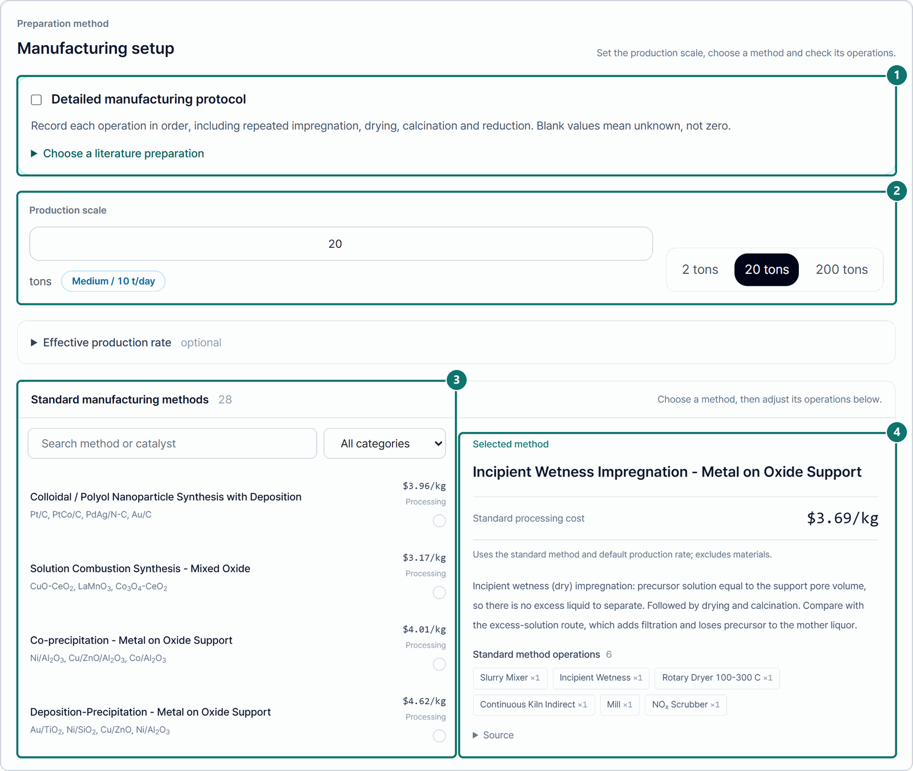
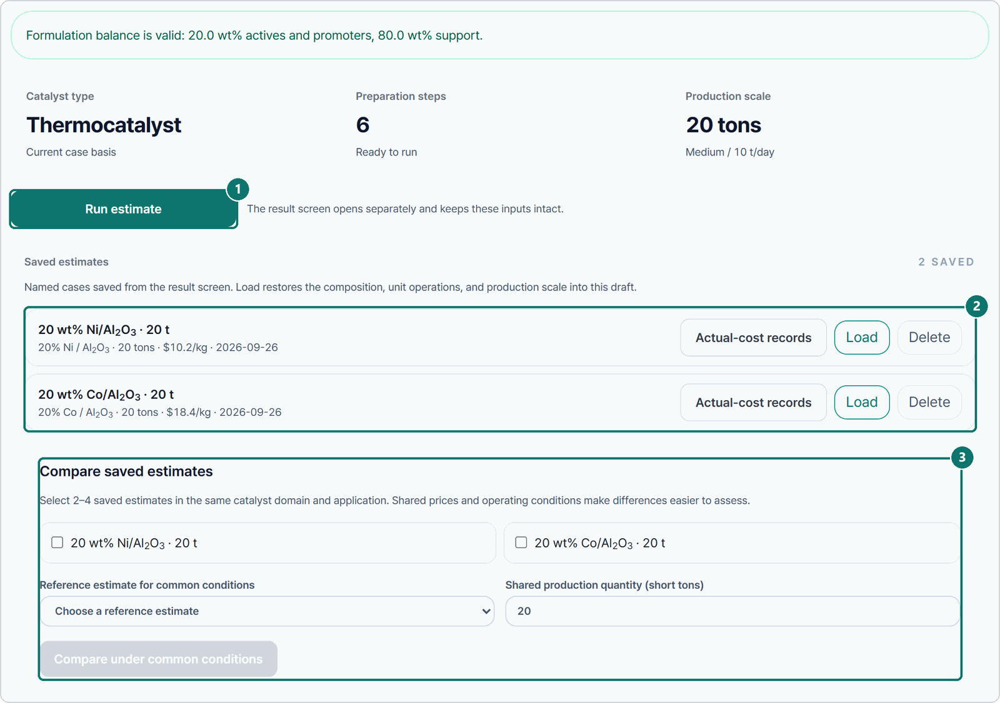
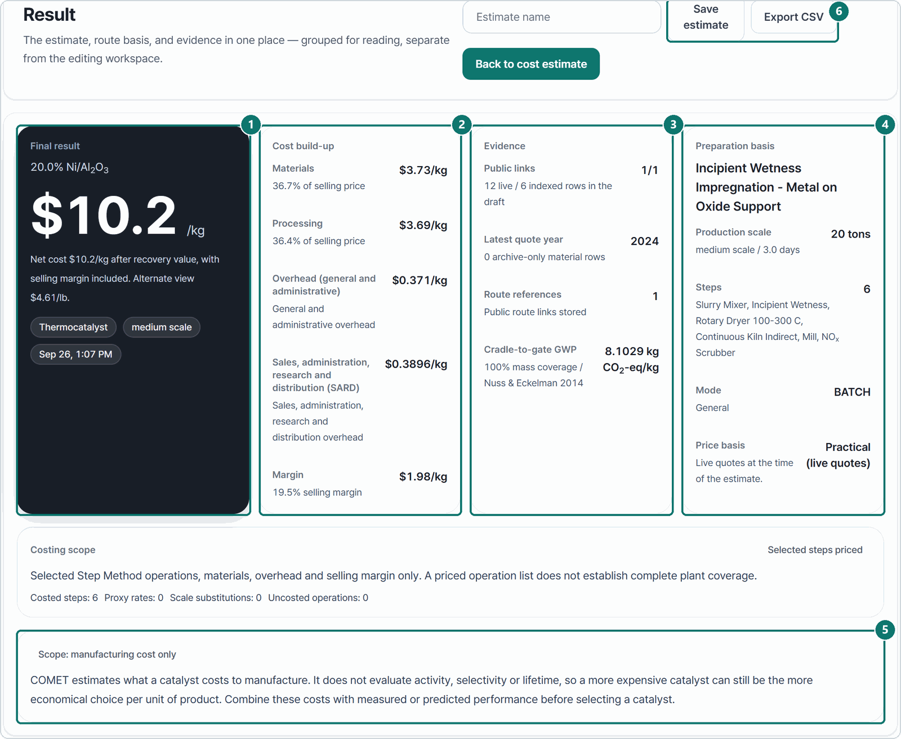
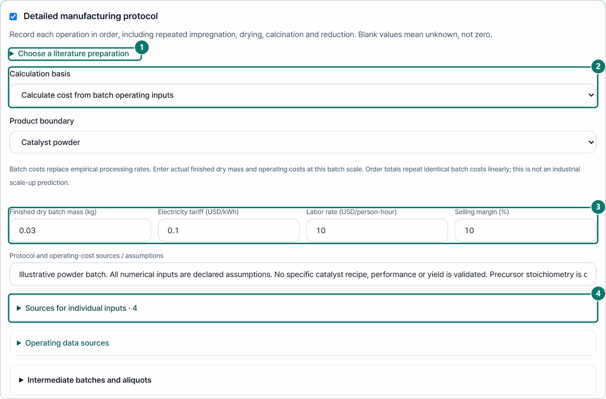
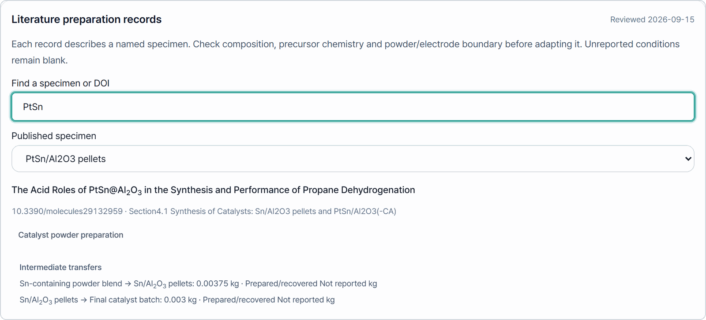
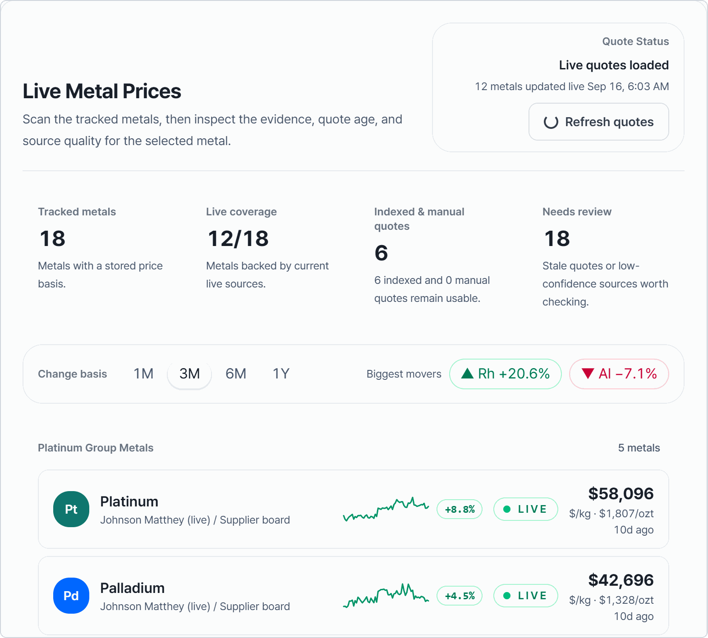
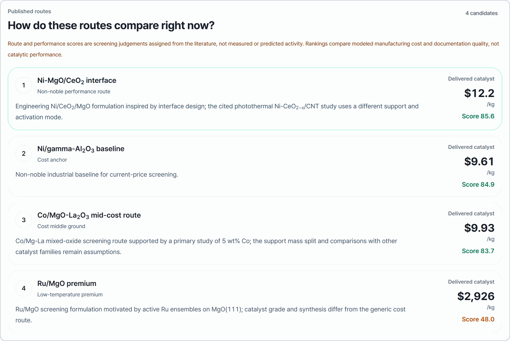
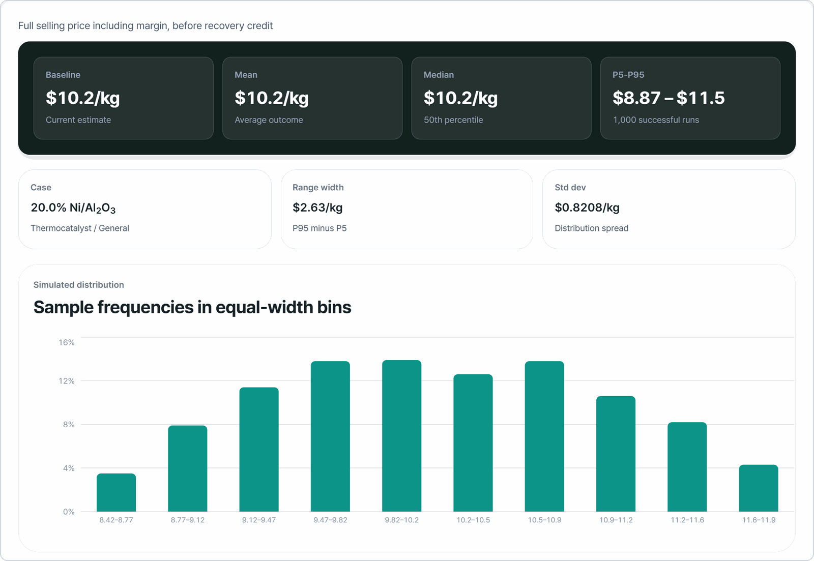

# User guide

A short walk through one session. The screenshots use the English interface.
Switch to Korean from the sidebar at any time.

## 1. Find your way around

1. The six pages: Cost Estimate, Live Metal Prices, Literature Benchmarks, Estimate Range, Capital & OpEx and Source Library.
2. Display unit, language and price basis. **Live** uses current quotes. **Monthly avg** uses IMF and Johnson Matthey monthly averages, so a result can be tied to a citable month.
3. A cost estimate takes four steps.
4. Start by picking a thermocatalyst or an electrocatalyst.

## 2. Enter the composition

1. Pick an active metal and set its loading in wt%.
2. Every price shows where it came from. `LIVE` is a current quote, `INDEXED` is an older price brought forward with a price index, and `MANUAL` is a value you typed. You can overwrite any price.
3. With one support, the support takes the rest of the mass, here 80 wt%.

Promoters, a second support and purchased precursors are optional.

## 3. Choose a preparation method and a production scale

1. Tick **Detailed manufacturing protocol** to cost a real synthesis instead. See step 6.
2. Set the production scale. It decides whether small, medium or large equipment is costed.
3. Pick one of the 28 standard manufacturing methods. Search by method or by catalyst.
4. The selected method shows its processing cost and its operations. Further down, untick any operation your route does not use.

## 4. Run and save

1. Run the estimate. The result opens on its own page and your inputs stay in the draft.
2. Saved estimates can be loaded back. **Actual-cost records** keeps real purchase or production costs next to them.
3. Compare two to four saved estimates under the prices of one reference estimate and a shared production quantity.

## 5. Read the result

1. Selling price per kg, margin included.
2. Cost build-up: materials, processing, general and administrative overhead, SARD and margin.
3. Evidence behind the prices: live and indexed rows, the latest quote year and a cradle-to-gate carbon footprint.
4. Preparation method, production scale and price basis.
5. What the number covers. COMET estimates manufacturing cost only. It does not evaluate activity, selectivity or lifetime.
6. Save the estimate or export it to CSV.

Scroll down for the costed manufacturing steps, the environmental inventory and the source of every material price.

## 6. Cost your own batch

With **Detailed manufacturing protocol** ticked, COMET costs the batch you actually made.

1. Start from a published preparation, or build the operations yourself.
2. Choose **Calculate cost from batch operating inputs**.
3. Enter the finished dry mass, electricity tariff, labor rate and margin. The dry mass turns the batch cost into a cost per kg.
4. Attach a source to each number.

Then add each operation with its temperature program, equipment time, gases and purchases. Blank fields stay unknown, and a missing required value stops the calculation. [Detailed manufacturing protocols](manufacturing-protocol.md) explains every field.

A published preparation record carries its DOI and the section it came from.
Quantities are kept as reported. Anything the paper did not report stays blank.

## 7. Check metal prices

Live Metal Prices lists every tracked metal with its source, quote age and
recent change. **Refresh quotes** fetches new prices when you are online. Open a
metal to see its price history.

## 8. Compare published catalysts

Literature Benchmarks ranks the candidates of one reaction family by modeled
cost and documentation quality. The route and performance scores are screening
judgments taken from the literature. They are not measured activity. Open a
candidate and load it into the cost estimate as a starting point.

## 9. See the cost range

Estimate Range reruns the current estimate many times with prices varied inside
set bands. It reports the median and the 5th to 95th percentile range. Set the
number of runs, the metal price band and a random seed. The same seed gives the
same result.

---

Screenshots taken on 2026-09-26 from the 1.4.0 source build, in an isolated
database with no API keys. The prices in them are stored example quotes from
mid-September 2026. Open the app for current prices.
